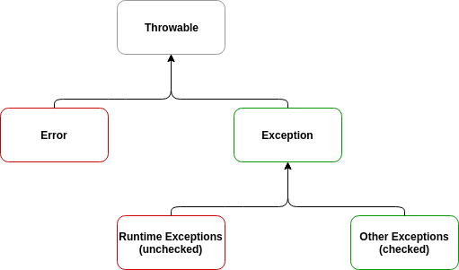

# 예외 처리
<hr>

## 예외 클래스
* 프로그램에서 오류는 두가지 ( 컴파일 오류(compile error) , 실행오류(runtime error))
* 비정상 종료를 줄이기 위한 다양한 예외처리 가 중요
* 예외가 발생했을때 로그를 남겨 두면 예외 상황을 파악하고 버그를 수정하는데 도움을 받을 수 있음

## 오류와 예외
* 오류
  * 시스템 오류
    * 동적 메모리 부족, 스택 오버플로우 발생한 경우 
  * 예외
    * 파일을 읽어 사용하려는데 팡리이 없는 경우, 네트워크로 데이터를 전송하려는데 연결이 안된경우 ,등등


## 예외 클래스의 종류
* 최상의 클래스 : Exception
* IOExecption : 입출력에 대한 예외 처리
* RuntimeException : 프로그램 시랭 중 발생 할 수 있는 오류에 대한 예외

<hr>

# 예외 처리하기

## try-catch문
* try 블록 안에 예외가 발생할 가능성이 있는 코드 작성
* try 안에서 예외가 발생 하면 catch 블록이 수행
```java
int[] arr= new int[5];

try{
    for(int i=0; i <=5 ; i++){
        arr[i] = o;
        System.out.println(arr[i]);
        }
}catch (ArrayIndexOutOfBoundException e){
    System.out.println(e);
    System.out.println("예외 처리 부");
}

```

## 파일 입출력에서의 예외 처리
```java
try{
            FileInputStream fis = new FileInputStream("a.txt");
        }catch (FileNotFoundException e){
            System.out.println(e);
        }

```

## try-catch-finally문
* try 블록이 시작되면 finally 블록은 어떤 경우에도 반드시 수행
* try나 catch 블록안에 return 문이 있더라도 finally 는 실행
```java
FileInputStream fis = null;

        try {
            fis = new FileInputStream("a.txt");
        } catch (FileNotFoundException e) {
            System.out.println(e);
            return;
        } finally {
            if (fis != null) {
                try {
                    fis.close();
                } catch (IOException e) {
                    e.printStackTrace(); // 쫒아감
                }
            }
            System.out.println("항상 수행");

        }
```

<hr>

# 예외 처리 미루기
<hr>

## 예외 처리를 미루는 throws 사용하기
* 예외를 해당 메서드에서 처리하지 않고 미룬후 메서드를 호출하여 사용하는 부분에서 예외를 처리
```java
public class ThrowException {
    public Class loadClass (String fileName, String className) throws FileNotFoundException, ClassNotFoundException {
        FileInputStream fileInputStream = new FileInputStream(fileName);
        Class c = Class.forName(className);
        return c;
    }

    public static void main(String[] args){
        ThrowException test = new ThrowException();
        try {
            test.loadClass("a.txt", "java.lang.String");
        }catch(FileNotFoundException | ClassNotFoundException e){ // 예외를 한 문장으로 처리
            e.printStackTrace();
        }
    }
}
```

```java
public static void main(String[] args){
        ThrowException test = new ThrowException();
        try {
            test.loadClass("a.txt", "java.lang.String");
        }catch(FileNotFoundException e){ // 예외를 한 문장으로 처리
            e.printStackTrace();
        } catch (ClassNotFoundException e){
            e.printStackTrace();
        } catch (Exception e){ // 상위클래스인 Exception 클래스로 그 외 예외 상황 처리
            e.printStackTrace();
        }
        
    }
```
<hr>
