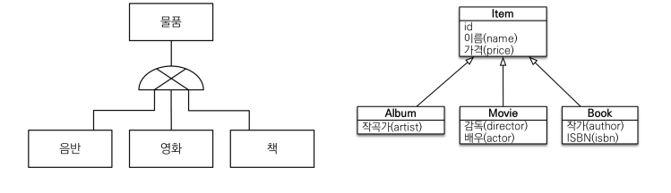
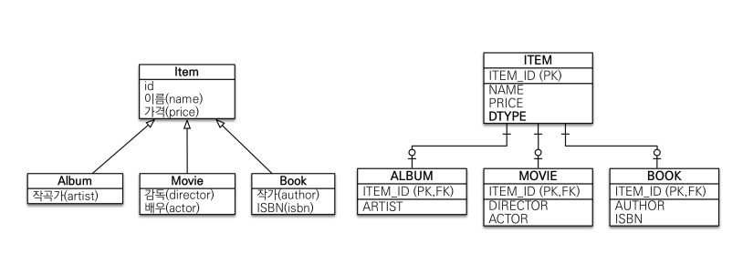
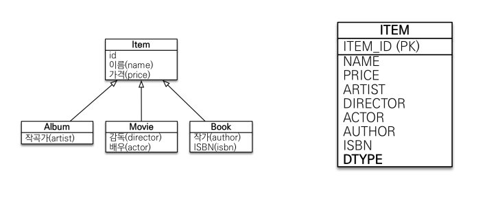
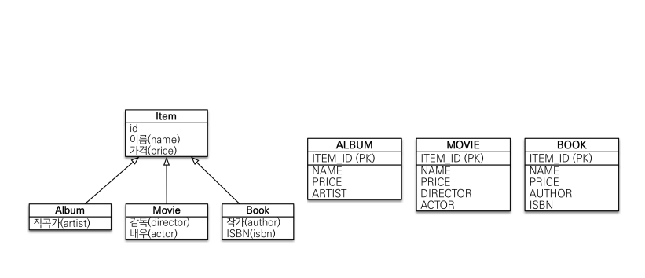
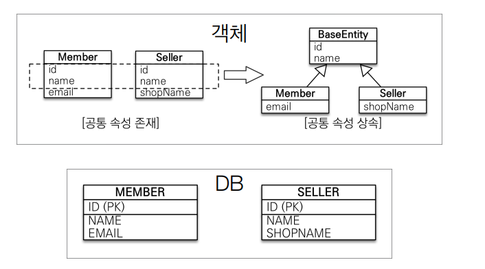

# 고급 매핑

## 목차
* 상속관계 매핑
* @MappedSuperclass

## 상속관계 매핑
* 관계형 데이터베이스는 상속 관계x
* 슈퍼타입 서브타입 관계라는 모델링 기법이 객체 상속과 유사
* 상속관계 매핑: 객체의 상속과 구조와 DB의 슈퍼타입 서브타입 관계를 매핑
  * 물리적으로 3가지 방법으로 구체화

  
* 슈퍼타입 서브타입 논리 모델을 실제 물리 모델로 구현하는 방법
  * 각각 테이블로 변환 -> 조인 전략
  * 통합 테이블로 변환 -> 단일 테이블 전략
  * 서브타입 테이블로 변환 -> 구현 클래스마다 테이블 전략

* 주요 어노테이션
* @Inheritance(strategy=InheritanceType.XXX)
  * JOINED: 조인 전략
  * SINGLE_TABLE: 단일 테이블 전략
  * TABLE_PER_CLASS: 구현 클래스마다 테이블 전략
* @DiscriminatorColumn(name="DTYPE")
  * 부모 클래스에 선언, 하위 클래스를 구분하는데 사용함
  * defualt는 DTYPE
* @DiscriminatorValue("XXX")
  * 하위 클래스에 선언, 엔티티를 저장할 때 슈퍼타입의 구분 컬럽에 저장할 값을 지정
  * annotation 선언하지 않을 경우 기본값으로 클래스 이름이 들어감

## 조인 전략

* Inheritance(strategy=InheritanceType.JOINED)
* pk가 같음, pk이면서 동시에 fk
* 기본적으로 가져가는 전략
* 장점
  * 테이블 정규화
  * 외래 키 참조 무결성 제약조건 활용가능
    * ex) 주문테이블에서 item테이블만 보면됨 -> 설계 깔끔
  * 저장공간 효율화
* 단점
  * 조회시 조인을 많이 사용, 성능 저하
  * 조회 커리가 복잡함
  * 데이터 저장시 INSERT SQL 2번 호출

## 단일 테이블 전략

* Inheritacne(strategy=InheritanceType.SINGLE_TABLE)
* DTYPE으로 구분
* 장점
  * 조인이 필요 없으므로 일반적으로 조회 성능이 빠름
  * 조회 쿼리가 단순함
* 단점
  * 자식 엔티티가 매핑한 컬럼은 모두 null 허용
  * 단일 테이블에 모든 것을 저장하므로 테이블이 커질 수 있다. 상황에 따라서 조회 성능이 오히려 느려질 수 있다.

## 구현 클래스마다 테이블 전략

* @Inheritance(strategy=InheritanceType.TALBE_PER_CLASS)
* 이 전략을 데이터베이스 설계자와 ORM 전문가 둘다 추천X
* 장점
  * 서브 타입을 명확하게 구분해서 처리할 때 효과적
  * not null 제약조건 사용 가능
* 단점 
  * 여러 자식 테이블을 함꼐 조회할 때 성능이 느림(UNION SQL 필요)
  * 자식 테이블을 통합해서 쿼리하기 어려움

## @MappedSuperClass
* 공통 매핑 정보가 필요할 때 사용(id, name)
* 
* 상속관계 매핑x
* 엔티티x, 테이블과 매핑x
* 부모 클래스를 상속 받는 자식 클래스에 매핑 정보만 제공
* 조회, 검색 불가(em.find(BaseEntity) 불가능) 
* 직접 생성해서 사용할 일이 없으므로 추상 클래스로 선언 권장
* 속성만 가져와서 사용하고 싶을 때
* 테이블과 관계 없고, 단순히 엔티티가 공통으로 사용하는 매핑정보를 모으는 역할
* 주로 등록일, 수정일, 등록자, 수정자 같은 전체 엔티티에서 공통으로 적용하는 정보를 모을 때 사용
* 참고 : @Entity 클래스는 @MappedSuperclass로 지정한 클래스만 상속 가능