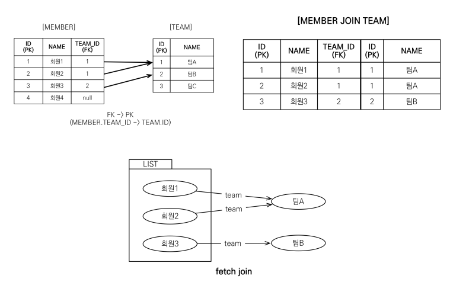
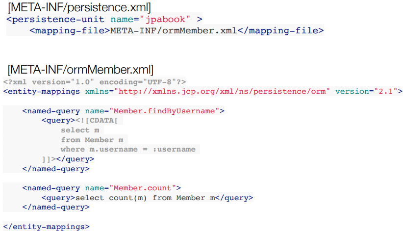

## JQPL

## 경로 표현식
* .(점)을 찍어 객체 그래프를 탐색하는 것
```java
    select m.usernmae -> 상태 필드
    from Member m
        join m.team t -> 단일 값 연관 필드
        join m.order o -> 컬렉션 값 연관 필드
    where t.name = '팀A'
```

## 경로 표현식 용어 정리
* 상태 필드(state field) : 단순히 값을 저장하기 위한 필드 (ex:m.username)
* 연관 필드(association field) : 연관관계를 위한 필드
  * 단일 값 연관 필드:<br>@ManyToOne, @OneToOne, 대상이 엔티티(ex: m.team)
  * 컬렉션 값 연관 필드:<br>@OneToMany, @ManyToMany, 대상이 컬렉션(ex: m.orders)

## 경로 표현식 특징
* 상태 필드(statue field) : 경로 탐색의 끝, 탐색 x
* 단일 값 연관 경로 : 묵시적 내부 조인(inner join (교집합)) 발생, 탐색O
* 컬렉션 값 연관 경로: 묵시적 내부 조인 발생, 탐색x
  * FROM 절에서 명시적 조인을 통해 별칭을 얻으면 별칭을 통해 탐색 가능

## 상태 필드 경로 탐색
* JPQL : select m.username, m.age from Member m
* SQL : select m.username, m.age from Member m

## 단일 값 연관 경로 탐색
* JPQL : select o.member from Order o
* SQL :<br>select m.* <br> from Orders O<br>inner join Member m on o.member_id = m.id

## 명시적 조인, 묵시적 조인
* 명시적 조인 : join 키워드 직접 사용
  * select m from Member m join <strong>m.team t</strong>
* 묵시적 조인 : 경로 표현식에 의해 묵시적으로 SQL 조인 발생
  * select m.team from Member m

## 경로 표현식 - 예제
* select o.member.team from Order o -> 성공
* select t.members from Team -> 성공
* select t.members.username from Team t -> 실패 //컬렉션 값 연관 경로
* select m.username from Team t join t.members m -> 성공

## 경로 탐색을 사용한 묵시적 조인 시 주의사항
* 항상 내부 조인
* 컬렉션은 경로 탐색의 끝, 명시적 조인을 통해 별칭을 얻어야함<br> select m.username from Team t join t.members
* 경로 탐색은 주로 select, where 절에서 사용하지만 묵시적 조인으로 인해 sql의 from (join)절에 영향을 줌

## 실무 조언
* 가급적 묵시적 조인 대신에 <strong>명시적 조인</strong> 사용
* 조인은 sql 튜닝에 중요 포인트
* 묵시적 조인은 조인이 일어나는 상황을 한눈에 파악하기 어려움

## JPQL - 페치 조인(fetch join)

## 페치 조인(fetch join)
* SQL 조인 종류 x 
* JPQL에서 성능 최적화를 위해 제공하는 기능
* 연관된 엔티티나 컬렉션을 SQL 한 번에 조회하는 기능
* join fetch 명령어 사용
* 페치 조인 ::=[ LEFT[OUTER] | INNER ] JOIN FETCH 조인경로

## 엔티티 페치 조인
* 회원을 조회하면서 연관된 팀도 함께 조회(SQL 한 번에)
* SQL을 보면 회원 뿐마 아니라 팀(T.*)도 함께 SELECT
* [JPQL]
  * select m from Member m join fetch m.team
* [SQL]
  * select m.* t.* from Member m inner join team t on m.team_id = t.id


## 페치 조인 사용 코드
```java
    String jqpl = "select m from Member m join fetch m.team";
    List<Member> members = em.createQuery(jpql, Member.class).getResultList();
    // fetch join으로 회원과 팀을 함께 조회해서 지연 로딩x -> query 가 한번만 나감
    for(Member member : members){
        System.out.println("username = " + member.getUsername() + " " + 
                            "teamName = " + member.getTeam().getName());
        }
```

## 컬렉션 페치 조인
* 일대다 관계, 컬렉션 페치 조인
* [JPQL]<br>select t<br>from Team t join fetch t.members<br>where t.name='팀 A' 
* [SQl]<br>select t.*, m.* from Team t inner join Member m on t.id = m.team_id<br>where t.name = '팀 A'


## 컬렉션 페치 조인 사용 코드
```java
    String jpql = "select t from Team t join fetch t.members where t.name = '팀A'" 
    List<Team> teams = em.createQuery(jpql, Team.class).getResultList(); 
    for(Team team : teams) { 
    System.out.println("teamname = " + team.getName() + ", team = " + team); 
     for (Member member : team.getMembers()) { 
    //페치 조인으로 팀과 회원을 함께 조회해서 지연 로딩 발생 안함
    System.out.println(“-> username = " + member.getUsername()+ ", member = " + member); 
    }
```

## 페치 조인과 DISTINCT
* SQL의 DISTINCT는 중복도니 결과를 제거하는 명령
* JPQL의 DISTINCT 2가지 기능 제공
  1. SQL에 DISTINCT를 추가
  2. 애플리케이션에서 엔티티 중복 제거

## 페치 조인과 DISTINCT
* select distinct t <br>from Team t join fetch t.members<br>where t.name = '팀A'
* SQL에 DSITINCT를 추가하지만 데이터가 다르므로 SQL 결과에서 중복제거 실패

* 페치 조인은 객체 그래프를 SQL 한번에 조회하는 개념

## 페치 조인 실행 예시
* 페치 조인은 연관된 엔티티를 함께 조회함
* [JPQL]select t<br>from Team t join fetch t.members<br>where t.name='팀A'
* [SQL]select <strong>t.*, m.*<strong><br>from Team t<br>inner join member m on t.id=m.team_id<br>where t.name= '팀A'

## 페치 조인의 특징과 한계
* 페치 조인 대상에는 별칭을 줄 수 없다.
  * 하이버네이트는 가능, 가급적 사용x
* 둘 이상의 컬렉션은 페치 조인할 수 없다.
* <strong>컬렉션을 페치 조인함녀 페이징 API(setFirstResult, setMaxResult)를 사용할 수 없다.
  * 일대일, 다대일 같은 단일 값 연관 필드들은 페치 조인해도 페이징 가능
  * 하이버네이트는 경고 로그를 남기고 메모리에서 페이징(메우 위험)
  * 하이버네이트 @Batchsize 활용
    * 하이버네이트가 제공하는 org.hibernate.annotations.BatchSize 이용하면 연관된 엔티티를 조회할때 지정된 size만큼의 sql의 in절을 사용하여 조회
    * "hibernate.default_batch_fetch_size" value ="100 또는 
     
    ```@Entity
      class Member{
      @Id @GeneratedValue
      private Long id;
    
          @org.hibernate.annotations.BatchSize(size = 5)
          @OneToMany(mappedBy = "member", fetch = FetchType.EAGER)
          private List<Order> orders = new ArrayList<>();
      }
    ```


## 페치 조인의 특징과 한계
* 연관된 엔티티들을 SQL 한 번으로 조회 - 성능 최적화
* 엔티티에 직접 적용하는 글로벌 로딩전략보다 우선한
* 실무에서 글로벌 로딩 전략은 모두 지연 로딩
* 최적화가 필요한 곳은 페치 조인 적용

## 페치 조인 - 정리
* 모든 것을 페치 조인으로 해결할 수 는 없음
* 페치 조인은 객체 그래프를 유지할 때 사용하면 효과적
* 여러 테이블을 조인해서 엔티티가 가진 모양이 아닌 전혀 다른 결과를 내야 하면, 페치 조인 보다는 일반 조인을 사용하고 필요한 데이터들만 조회해서 DTO로 반환하는 것이 효과적

## JPQL- 다형성 쿼리

### Type
* 조회 대상을 특정 자식으로 한정
* ex) Item 중에 Book, Movie를 조회해라
* [JPQL]<br>select i from i<br>where type(i) IN (Book, Movie)
* [SQL]<br>select i from i<br>where i.DTYPE in ('B', 'M')

## TREAT 
* 자바의 타임 캐스팅과 유사
* 상속 구조에서 부모 타입을 특정 자식 타입으로 다룰 때 사용
* from, where, select 사용
* ex)부모인 Item과 자식 Book
* [JPQL]<br>select i from Item i<br>where treat(i as book).author = 'kim'
* [SQL]<br>select i from Item i where i.DTYPE = 'B' and i.author = 'kim'


## 엔티티 직접 사용 - 기본 키 값
* JPQL에서 엔티티를 직접 사용하면 SQL에서 해당 엔티티의 기본 키 값을 사용
* [JPQL]<br>select count(m.id) from Member m //엔티티의 아이디를 사용<br>select count(m) from Member m //엔티티를 직접 사용
* [SQL] - JPQL 둘다 같은 다음 SQL 실행<br>select count(m.id) as cnt from Member m

* 엔티티를 파라미터로 전달
```java
    String jpql = "select m from Member m where m = :member";
    List resultList = em.createQuery(jpql)
        .setParameter("member", member)
        .getResultList();
```
* 식별자를 직접 전달
```java
    String jpql = "select m from Member where m.id = :memberId";
        .setParameter("memberId", memberId)
        .getReusltList();
```
* 실행된 SQL
```java
    select m.* from Member m where m.id=?
```
## 엔티티 직접 사용 - 외래 키 값
```java
        Team team = em.find(Team.class 1L);
        String qlString = "select m from Member M where m.team = :team";
        List resultList = em.createQuery(qlString)
            .setParameter("team", team)
           .getResultList();
    
        ...
        String qlString = “select m from Member m where m.team.id = :teamId”;
        List resultList = em.createQuery(qlString)
        .setParameter("teamId", teamId)
        .getResultList(); 
```
* 실행된 SQL
```java
    select m.*from Member M where m.team_id = ?
```

## Named 쿼리 - 정적 쿼리
* 미리 정의해서 이름을 부여해두고 사용하는 JPQL
* 정적 쿼리
* 어노테이션, XML에 정의
* 어플리케이션 로딩 시점에 초기화 후 재사용
* 애플리케이션 로딩 시점에 쿼리를 검증
##### 어노테이션
```java
    @Entity
    @NamedQuery(
     name = "Member.findByUsername",
     query="select m from Member m where m.username = :username")
    public class Member {
     ...
    }
    List<Member> resultList = 
     em.createNamedQuery("Member.findByUsername", Member.class)
     .setParameter("username", 
    "회원1")
     .getResultList();
```

## Named 쿼리 - XML에 정의


## Named 쿼리 환경에 따른 설정
* XML이 항상 우선권을 가진다.
* 어플리케이션 운영 환경에 따라 다른 XML을 배포할 수 있음

## 벌크 연산
* 재고가 10개 미만인 모든 상품의 가격을 10% 상승하려면?
* JPA 변경 감지 기능으로 실행하려면 너무 많은 SQL 실행
  * 재고가 10개 미만인 상품을 리스트로 조회한다.
  * 상품 엔티티의 가격을 10% 증가한ㄷ.
* 변경된 데이터가 100건이라면 100번의 update sql 실행

## 벌크 연산 예제
* 쿼리 한 번으로 여러 테이블 로우 변경(엔티티)
* executeUpdate()의 결과는 영향받은 엔티티 수 반환
* UPDATE, DELETE 지원
* INSERT(insert into .. select, 하이버네이트 지원)
```java
    String qlString = "update Product p " +
     "set p.price = p.price * 1.1 " + 
     "where p.stockAmount < :stockAmount"; 
    int resultCount = em.createQuery(qlString) 
     .setParameter("stockAmount", 10) 
     .executeUpdate();
```

## 벌크 연산 주의
* 벌크 연산은 영속성 컨텍스트를 무시하고 데이터베이스에 직접 쿼리
  * 벌크 연산을 먼저 실행
  * 벌크 연산 수행 후 영속성 컨텍스트 초기화