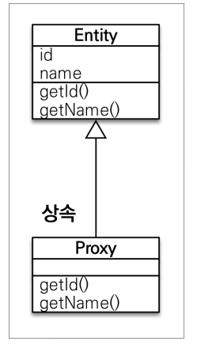

# 프록시와 연관관계 관리

## 목차
* 프록시
* 즉시 로딩과 지연 로딩
* 지연 로딩 활용
* 영속성 전이 : CASCADE
* 고아 객체
* 영속성 전이 + 고아 객체, 생명주기

## 프록시
#### 어떤 객체Member)를 조회할때 연관된 객체(Team)도 함꼐 조회해야 할까? 의문

## 프록시 기초
* em.find vs em.getReference()
* em.find() : 데이터베이스를 통해서 실제 엔티티 객체 조회
* em.getreference(): 데이터베이스 조회를 미루는 가짜(프록시) 엔티티 객체 조회
  * db에 query는 안나가는데 객체는 조회가 됨


## 프록시 특징
* 실제 클래스를 <strong>상속</strong> 받아서 만들어짐
* 실제 클래스와 겉 모양이 같다.
* 사용자 입장에서는 진짜 객체인지 프록시 객체인지 구분하지 않고 사용하면됨(이론상)

* 프록시 객체는 실제 객체의 참조(target)를 보관
* 프록시 객체를 <strong>호출</strong>하면 프록시 객체는 실제 객체의 메소드 호출


## 프록시 객체의 초기화

```java
Member member = em.getReference(Member.class, "id1");
member.getName();
```


## 프록시의 특징
* 프록시 객체는 처음 사용할 때 한번만 초기화
* 프록시 객체를 초기화 할 때, 프록시 객체가 실제 엔티티로 바뀌는 것은 아님, 초기화되면 <strong>프록시 객체를 통해서</strong> 실제 엔티티에 접근 가능
* 프록시 객체는 원본 엔티티를 </strong>상속</strong>받음, 따라서 타입 체크시 주의해야함( == 비교 실패, 대신 instance of 사용)
* 영속성 컨텍스트에 찾는 엔티티가 이미 있으면 em.getReference()를 호출해도 실제 엔티티 반환(proxy 객체가 아니라)
* 영속성 컨텍스트의 도움을 받을 수 없는 준영속 상태일 때, 프록시를 초기화하면 문제 발생
  * em.clear() -> 영속선 컨텍스트 초기화 / 프록시 초기화하면 문제 발생

## 프록시 확인
* 프록시 인스턴스의 초기화 여부 확인
  * PersistenceUnitUtil.isLoaded(Object entity)
* 프록시 클래스 확인 방법
  * entity.getClass().getName() 출력 (..javasist or HibernateProxy)
* 프록시 강제 초기화
  * org.hibernate.Hibernate.initialize(entity); 
* 참고 : JPA표준은 강제 초기화 없음
  * member.getName() 등을 통해서 강제 호출

## 지연로딩과 즉시로딩

### 지연로딩 LAZY를 사용해서 프록시로 조회

```java
public class Member{
    @Id
    @GeneratedValue
    private Long id;
    
    @Column(name = "USERNAME")
    private String name;
    
    @ManyToOne(fetch = FetchType.LAZY) //**
    @JoinColumn(name = "TEAM_ID")
    private Team team;
 ..
    
}
```


### 즉시로딩 EAGER를 사용해서 함꼐 조회
```java
@Entity
 public class Member {
  @Id
  @GeneratedValue
  private Long id;
  @Column(name = "USERNAME")
  private String name;
  @ManyToOne(fetch = FetchType.EAGER) //**
  @JoinColumn(name = "TEAM_ID")
  private Team team;
 ..
}
```
* member class만 db에서 조회
* 프록시로 가져온 후 실제로 사용하는 시점에 query가 날라감


## 즉시 로딩(EAGER), Member 조회시 항상 Team도 조회


## 프록시와 즉시로딩 주의
* 가급적 지연 로딩만 사용(특시 실무에서)
* 즉시 로딩을 적용하면 예상하지 못한 SQL이 발생
* 즉시 로딩은 JPQL에서 N+1 문제를 일으킴
* @ManyToOne, @OneToOne은 기본이 즉시 로딩 -> LAZY로 설정해줘야함
* @OneToMany, @ManyToMany는 기본이 지연 로딩

## 지연 로딩 활용
* Member와 Team은 자주 함께 사용 -> 즉시 로딩
* Member와 Order는 가끔 사용 -> 지연 로딩


## 지연 로딩 활용 - 실무
* 모든 연관관계에 지연 로딩을 사용해라!
* 실무에서 즉시 로딩을 사용하지 마라!
* JPQL fetch 조인이나, 엔티티 그래프 기능을 사용
* 즉시 로딩은 상상하지 못한 쿼리가 나갈 수 있음

## 영속성 전이: CASCADE
* 특정 엔티티를 영속 상태로 만들 때 연관된 엔티티도 함께 영속상태로 만들고 싶을 때
* ex) 부모 엔티티를 저장할 떄 자식 엔티티도 함께 저장
```java
public class Parent {

  OneToMany(mappedBy="parent", cascade=CascadeType.PERSIST)
  private List<Child> childList = new ArrayList<>();
}
```


* parent persist시 child는 자동으로 persist

## 영속성 전이: CASCADE - 주의!
* 영속성 전이는 연관관계를 매핑하는 것과 아무 관련이 없음
* 엔티티를 영속화할 때 연관된 엔티티도 함께 영속화하는 편리함을 제공할 뿐
* Cascade 밑에 있는 속성들도 모두 persist
* 소유자가 하나일 때 쓰는걸 권장(단일 소유자)
* 단일 엔티티에 종속적일 경우 씀(LifeCycle이 같을 경우,ex)등록 삭제 같이되는 경우)
## CASCADE의 종류
* ALL: 모두 적용
* PERSIST: 영속
* REMOVE: 삭제
* MERGE: 병합
* REFRESH: REFRESH
* DETACH: DETACH

## 고아 객체
* 고아 객체 제거: 부모 엔티티와 연관관계가 끊어진 자식 엔티티를 자동으로 삭제
* orphanRemoval = true
```java
    Parent parent1 = em.find(Parent.class, id);
    parent1.getChildren().remove()
    // 자식 엔티티를 컬렉션에서 제거
```

## 고아 객체 - 주의
* 참조가 제거된 엔티티는 다른 곳에서 참조하지 않는 고아 객체로 보고 삭제하는 기능
* 참조하는 곳이 하나일 때 사용해야함
* 특정 엔티티가 개인 소유할 때 사용
* @OneToOne, @OneToMany만 가능
* 참고: 개념적으로 부모를 제거하면 자식은 고아가 된다. 따라서 고아 객체 제거 기능을 활성화 하면, 부모를 제거할 때 자식도 함께 제거된다. 이것은 CascadeType.REMOVE 처럼 동작

## 영속성 전이 + 고아 객체, 생명주기
* CascadeType.ALl + orphanRemoval= true
* 스스로 생명주기를 관리하는 엔티티느 em.persist()로 영속화, em.remove()로 제거
* 두 옵션을 모두 활성화 하면 부모 엔티티를 통해서 자식의 생명주기를 관리 할 수 있음
* 도메인 주도 설계(DDD)의 Aggregate Root개념을 구현할 때 유용

## 실전 예제 영속성 전이 설정
* 모든 연관관계를 지연 로딩으로
  * @ManyToOne, @OneToOne은 기본이 즉시 로딩 -> (fetch= fetchType.LAZY) 변경
* Order -> Delivery를 영속성 전이 ALL 설정
```java
    @OneToOne(fetch = FetchType.LAZY, cascade = CascadeType.ALL) // order 생성시 delivery 자동 생성
    @JoinColumn(name="DELIVERY_ID")
    private Delivery delivery;
```
* Order -> OrderItem을 영속성 전이 ALL 설정
```java
    @OneToMany(mappedBy = "order", cascade = CascadeType.ALL)
    private List<O
        rderItem> orderItems = new ArrayList<>();
    private LocalDateTime orderDate;
```