# 다양한 연관관계 매핑

## 연관관계 매핑시 고려사항 3가지
* 다중성
* 단방향, 양방향
* 연관관계의 주인

## 다중성
* 다대일:@ManyToOne
* 일대다:@OneToMany
* 일대일:@OneToOne
* 다대다:@ManyToMany 
  * 실무에서 거의 사용x

## 단방향, 양방향
* 테이블
  * 외래 키 하나로 양쪽 조인 가능
  * 사실 방향이라는 개념이 없음
* 객체
  * 참조용 필드가 있는 쪽으로만 참조 가능
  * 한쪽만 참조하면 단방향
  * 양쪽이 서로 참조하면 양방향

## 연관관계의 주인
* 테이블은 외래 키 하나로 두 테이블이 연관관계를 맺음
* 객체 양방향 관계는 A->B, B->A 처럼 참조가 2군데
* 객체 양방향 관계는 참조가 2군데 있음. 둘중 테이블의 외래키를 관리할 곳을 지정해야함
* 연관관계의 주인 : 외래키를 관리하는 참조!
* 주인의 반대편: 외래 키에 영향을 주지 않음, 단순 조회만 가능

## 다대일 단방향
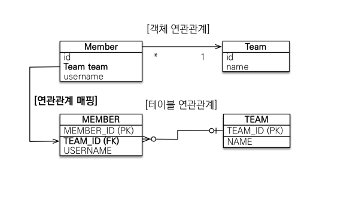
* 가장 많이 사용하는 연관과녜
* 다대일의 반대는 일대다

## 다대일 양방향
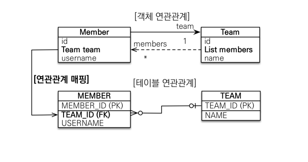
* 외래키 MEMBER에 있음
* Member.team // 연관관계의 주인
* 다(N)쪽이 연관관계의 주인 
* 외래키 관리하는 쪽 JoinColumn
* 외래 키가 있는 쪽이 연관관계의 주인
* 양쪽을 서로 참조하도록 개발

## 일대다 단방향!
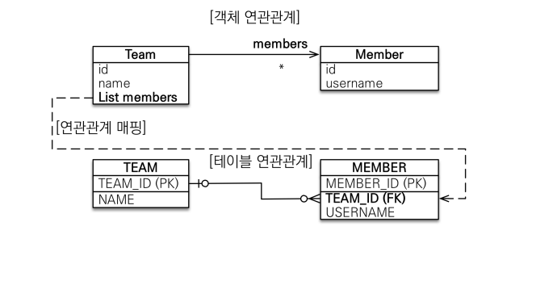
* MEMBER테이블에서 team_id 외래키를 가짐(전과는 반대)
* 일대다 단방향은 일대다(1:N)에서 일(1)이 연관관계의 주인
* 테이블 일대다 관계는 항상 다(N)쪽에 외래 키가 있음
* 객체와 테이블의 차이 떄문에 반대편 테이블의 외래키를 관리하는 특이한 구조
* @JoinColumn을 꼭 사용해야함. 그렇지 않으면 조인 테이블 방식 사용(중간에 테이블 하나 추가)

## 일대다 단방향 정리
* 일대다 단방향 매핑의 단점
  * 엔티티가 관리하는 외래 키가 다른 테이블에 있음
  * 연관관계 관리를 위해 추가로 UPDATE SQL 실행
* 일대다 단방향 매핑보다는 다대일 양방향 매핑을 사용하자!

## 일대다 양방향
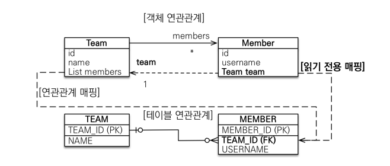

## 일대다 양방향 정리
* 이런 매핑은 공식적으로 존재x
* @JoinColumn(insertable=false, updatable=false)
* 읽기 전용 필드를 사용해서 양방향 처럼 사용하는 방법
* 다대일 양방향을 사용하자

## 일대일 관계
* 일대일 관계는 그 반대도 일대일
* 주 테이블이나 대상 테이블 중에 외래 키 선택 가능
  * 주 테이블에 외래 키
  * 대상 테이블에 외래 키
* 외래 키에 데이터베이스 유니크(unique) 제약조건 추가

## 일대일:주 테이블에 외래 키 단방향
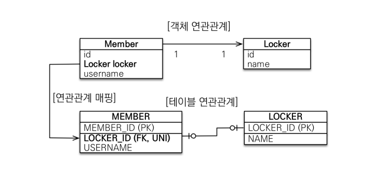
* 다대일(@ManyToOne) 단방향 매핑과 유사

## 일대일: 주 테이블에 외래 키 양방향

* 다대일 양방향 매핑 처럼 외래 키가 있는 곳이 연관관계의 주인
* 반대편은 mappedBy 적용(주인객체 변수명)

## 일대일: 대상 테이블에 외래 키 단방향
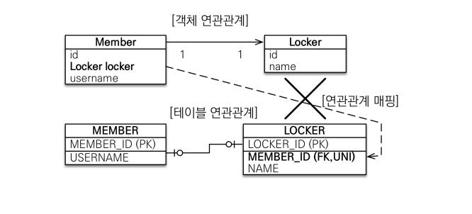

* 단방향 관계는 JPA 지원x
* 양방향 관계는 지원

## 일대일: 대상 테이블에 외래 키 양방향
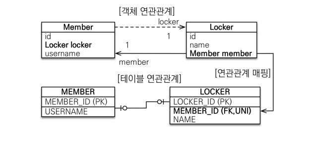
* 사실 일대일 주 테이블에 외래 키 양방향과 매핑 방법은 같음

## 일대일 정리

* 주 테이블에 외래 키
  * 주 객체가 대상 객체의 참조를 가지는 것 처럼 주 테이블에 외래 키를 두고 대상 테이블을 찾음
  * 객체지향 개발자 선호
  * JPA 매핑 편리
  * 장점: 주 테이블만 조회에도 대상 테이블에 데이터가 있는지 확인 가능
  * 단점: 값이 없으면 외래 키에 null 허용
* 대상 테이블에 외래 키
  * 대상 테이블에 외래 키 존재
  * 전통적인 데이터베이스 개발자 선호
  * 장점: 주 테이블과 대상 테이블을 일대일에ㅓ 일대다 관계로 변경할 때 테이블 구조 유지
  * 단점: 프록시 기능의 한계로 지연 로딩으로 설정해도 항상 즉시 로딩됨

## 다대다
* 관계형 데이터베이스는 정규화된 테이블 2개로 다대다 관계를 표현할 수 없음
* 연결 테이블을 추가해서 일대다, 다대일 관계로 풀어내야함
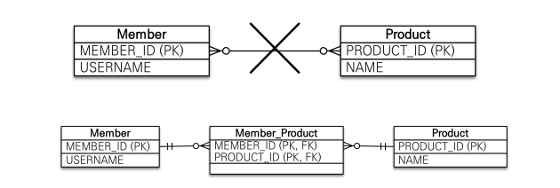

* 객체는 컬렉션을 사용하여 객체 2개로 다대다 관계 표현 가능
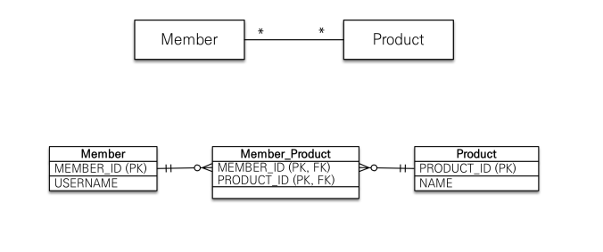
* @ManyToMany 사용
* @JoinTable로 연결 테이블 지정
* 단방향, 양방향 가능

## 다대다 매핑의 한계
* 편리해 보이지만 실무에서 사용x
* 연결 테이블이 단순히 연결만 하고 끝나지 않음
* 주문시간, 수량 같은 데이터가 들어올 수 있음
  * 새로운 테이블 생성(일대다 다대일 관계로 표현)
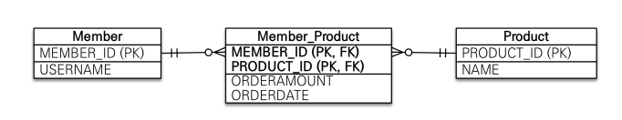

## 다대다 한계 극복
* 연결 테이블용 엔티티 추가(연결 테이블을 엔티티로 승격)
* @ManyToMany -> @OneToMany, @ManyToOne
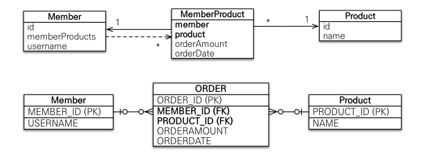

## N:M 관계는 1:N, N:1로
* 테이블의 N:M관계는 중간 테이블을 이용해서 1:N, N:1
* 실전에서는 중간 테이블이 단순하지 않음
* @ManyToMany는 제약: 필드 추가x, 엔티티 테이블 불일치
* 실전에서는 @ManyToMany 사용x

## @JoinColumn
* 외래 키를 매핑할 때 사용

| 속성                                                                              | 설명                                           | 기본값                       |
|---------------------------------------------------------------------------------|----------------------------------------------|---------------------------|
| name                                                                            | 매핑할 외래 키 이름                                  | 필드명 +_+참조하는 테이블의 기본 키 컬럼명 |
| referencedColumnName                                                            | 외래 키가 참조하는 대상 테이블의 칼럼명                       | 참조하는 테이블의 기본키 칼럼명         |
| foreginKey(DDL                                                                  | 외래 키 제약조건을 직접 지정할 수 있음. 이 속성을 테이블의 생성할 때만 사용 ||
| unique nullable insertable updatable columnDefiniton table  | @Column의 속성과 같다.                             ||

## @ManyToOne- 주요 속성
* 다대일 관계 매핑

| 속성           | 설명                                                                  | 기본값                                                        |
|--------------|---------------------------------------------------------------------|------------------------------------------------------------|
| optional     | false로 설정하면 연관된 entity가 항상 있어야함                                     | True                                                       |
| fetch        | 글로벌 페치 전략을 설정한다                                                     | -@ManyToOne=FetchType.EAGER -@OneToMany=FetchType.LAZY |
| cascade      | 영속성 전이 기능을 사용                                                       ||
| targetEntity | 연관된 엔티티의 타입 정보를 설정한다. 이 기능은 거의 사용하지 않음.컬렉션을 사용해도 제네릭으로 타입 정보를 알수 있음 ||

## OneToMany - 주요 속성
* 다대일 관계 매핑

| 속성           | 설명                                                                  | 기본값                                                         |
|--------------|---------------------------------------------------------------------|-------------------------------------------------------------|
| mappedBy     | 연관관계의 주인필드를 선택                                                      ||
| fetch        | 글로벌 페치 전략을 설정                                                       | -@ManyToOne=FetchType.EAGER  -@OneToMany=FetchType.LAZY |
| cascade      | 영속성 전이 기능을 사용                                                       ||
| targetEntity | 연관된 엔티티의 타입 정보를 설정한다. 이 기능은 거의 사용하지 않음.컬렉션을 사용해도 제네릭으로 타입 정보를 알수 있음 ||
