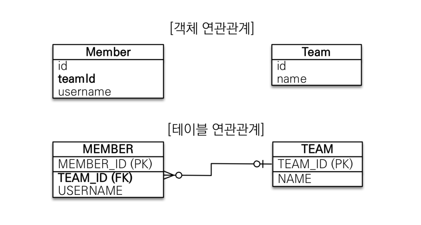
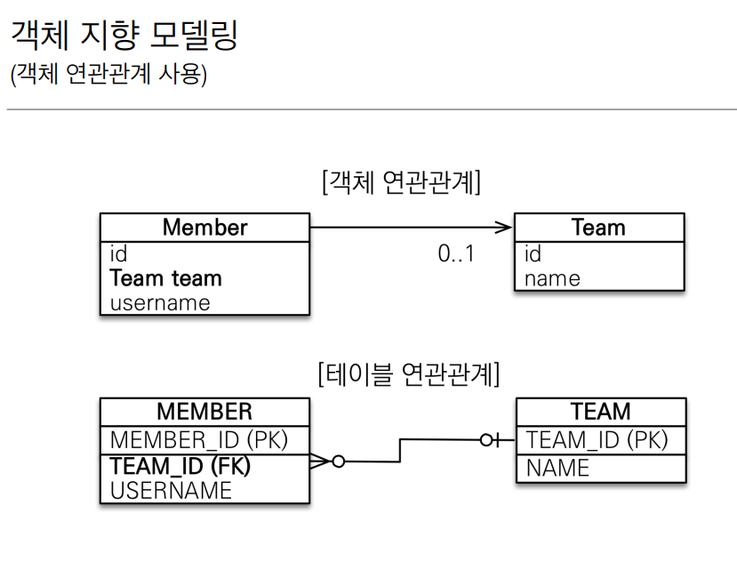
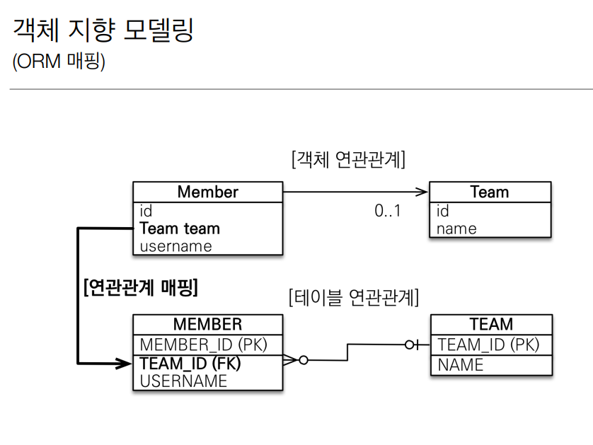
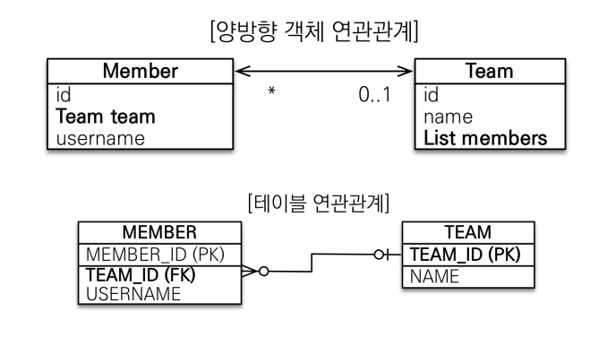
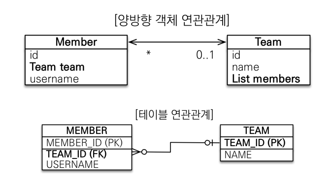
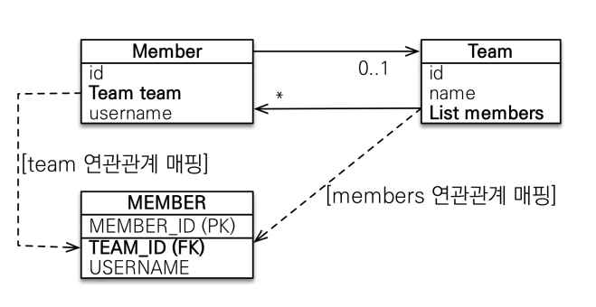
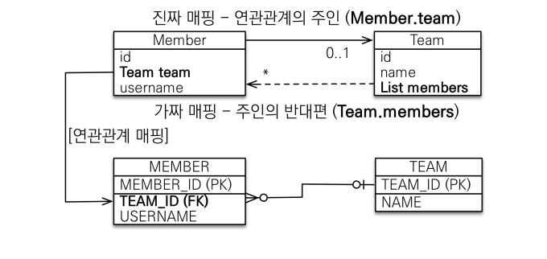

# 연관관계 매핑 기초
## 학습목표
* 객체와 테이블 연관관계의 차이를 이해
* 객체의 참조와 테이블의 외래 키를 매핑
* 용어 이해
  * 방향(Direction) : 단방향, 양방향
  * 다중성(Multiplicity) : 다대일(N:1), 일대다(1:N), 일대일(1:1)
  * 연관관계의 주인(Owner) : 객체 양방향 연관관계는 관리 주인

## 연관관계가 필요한 이유
* 객체지향 설계의 목표는 자율적인 객체들의 협력 공동체를 만드는 것이다'

## 예제 시나리오
* 회원과 팀이 있다
* 회원은 하나의 팀에만 소속될 수 있다.
* 회원과 팀은 다대일 관계다.

## 객체를 테이블에 맞추어 모델링(연관관계가 없는 객체)


## 객체를 테이블에 맞추어 모델링(참조 대신에 외래 키를 그대로 사용)
```
@Entity
public class Member {
@Id @GeneratedValue
private Long id;
@Column(name = "USERNAME")
private String name;
@Column(name = "TEAM_ID")
private Long teamId;
…
}
@Entity
public class Team {
@Id @GeneratedValue
private Long id;
private String name;
…
}
```
 * 외래 키 식별자를 직접다룸
 * 
```dtd
//팀 저장
 Team team = new Team();
 team.setName("TeamA");
 em.persist(team);
 //회원 저장
 Member member = new Member();
 member.setName("member1");
 member.setTeamId(team.getId());
 em.persist(member);
```

## 객체를 테이블에 맞추어 데이터 중심으로 모델링하면, 협력 관계를 만들 수 없다.
* 테이블은 외래 키로 조인을 사용해서 연관된 테이블을 찾음
* 객체는 참조를 사용해서 연관된 객체를 찾음
* 테이블과 객체 사이에는 이런 큰 간격이 존재

## 단방향 연관관계

* Team의 참조값을 그대로 가져옴
```dtd
@Entity
 public class Member { 
 @Id @GeneratedValue
 private Long id;
 @Column(name = "USERNAME")
 private String name;
 private int age;
// @Column(name = "TEAM_ID")
// private Long teamId;
 @ManyToOne
 @JoinColumn(name = "TEAM_ID")
 private Team team;
```
* team과 team_id(FK)를 연관관계 매핑

## 양방향 연관관계와 연관관계의 주인
<hr>
## 양방향 매핑



```
# (Member 엔티티는 단방향과 동일)
@Entity
 public class Member { 
 @Id @GeneratedValue
 private Long id;
 @Column(name = "USERNAME")
 private String name;
 private int age;
 @ManyToOne
 @JoinColumn(name = "TEAM_ID")
 private Team team;
```

```dtd
#Team 엔티티는 컬렉션 추가
@Entity
 public class Team {
 @Id @GeneratedValue
 private Long id;
 private String name;
 @OneToMany(mappedBy = "team")
 List<Member> members = new ArrayList<Member>();
 … 
 
```
## 양방향 매핑(반대 방향으로 객체 그래프 탐색)
```dtd
//조회
 Team findTeam = em.find(Team.class, team.getId()); 
 int memberSize = findTeam.getMembers().size(); //역방향 조회
```
## 객체와 테이블이 관계를 맺는 차이
* 객체 연관관계 = 2개
  * 회원 -> 팀 연관관계 1개(단방향)
  * 팀 -> 회원 연관관계 1개(단방향)
* 테이블 연관관계 = 1개
  * 회원 <-> 팀의 연관관계 1개(양방향) 

## 객체의 양방향 관계
* 객체의 양방향 관계는 사실 양방향 관계가 아니라 서로 다른 단방향 관계 2개임
* 객체를 양방향으로 참조하려면 단방향 연관관계 2개를 만들어야 함
* A -> B (a.getB());
* B -> A (b.getA());
```dtd
class A{
    B b;
}
class B{
    A a;
}
```
## 테이블의 양방향 연관관계
* 테이블은 외래 키 하나로 두 테이블의 연관관계를 관리
* MEMBER.TEAM_ID 외래 키 하나로 양방향 연관관계르 가짐(양쪽으로 join 가능)
```dtd
SELECT * 
FROM MEMBER M
JOIN TEAM T ON M.TEAM_ID = T.TEAM_ID

SELECT *
FROM TEAM T
JOIN MEMBER M ON T.TEAM_ID = M.TEAM_ID
```
## 둘 중 하나로 외래 키를 관리해야 한다

## 연관관계의 주인(Owner)
### 양방향 매핑 규칙
* 객체의 두 간계중 하나를 연관관계의 주인으로 지정
* 연관관계의 주인만이 외래 키를 관리(등록, 수정)
* 주인이 아닌쪽은 읽기만 가능
* 주인은 mappedBy 속성 사용x
* 주인이 아니면 mappedBy 속성으로 주인 지정
## 누구를 주인으로하지?
* 외래 키가 있는 곳을 주인으로 정해라
* db에 N(다)쪽이 무조건 연관관계의 주인
* 여기서는 Member.team이 연관관계의 주인
* 
## 양방향 매핑시 가장 많이 하는 실수(연관관계의 주인에 값을 입력 x)
```dtd
Team team = new Team();
        team.setName("TeamA");
        em.persist(team);
        Member member = new Member();
        member.setName("member1");
        //역방향(주인이 아닌 방향)만 연관관계 설정
        team.getMembers().add(member);
        em.persist(member);
```
* 양방향 매핑시 양쪽에 다 값을 넣어주는게 맞음
## 앙뱡향 매핑시 연관관계의 주인에 값을 입력해야 함(순수한 객체 관리를 고려하면 항상 양쪽다 값을 입력)
```dtd
Team team = new Team(); 
 team.setName("TeamA");
 em.persist(team);
 Member member = new Member();
 member.setName("member1");
 team.getMembers().add(member); 
 //연관관계의 주인에 값 설정
 member.setTeam(team); //**
 em.persist(member);
```
## 양방향 연관관계 주의
* 순수 객체 상태를 고려해서 항상 양쪽에 값을 설정
  * 순수 1차 캐시일 때 고려 
* 연관관계 편의 메소드를 생성 (한쪽에만)
```dtd
public void setTeam(Team team){ //member.team 세팅하는 점에 양방향으로 셋팅됨
    this.team =team
    team.getMembers().add(this);
        }
```
* 앙뱡향 매핑시에 무한 루프를 조심
  * toSting, lombok, JSON 생성 라이브러리
    * stackoverflow 가능성
    * entity를 JSON으로 바꾸는 순간 무한루프 가능
    * controller에서 entity를 직접 반환 xx
    * lombok 에서 toString 만들기 x 
    
```dtd
@Override
public String toString(){
    return "Member{" +
            "id=" + id +
            ", username='" + username + '\' +
            ", team=" + team + //team.toString 호출
            "}";
}
```

## 양방향 매핑 정리
* 단방향 매핑만으로도 이미 연관관계 매핑은 완료
* 최대한 단방향으로 설계
* 양방향 매핑은 반대방향으로 조회(객체 그래프 탐색) 기능이 추가된 것 뿐
* JPQL에서 역방향으로 탐색할 일이 많음
* 단방향 매핑을 잘 하고 양방향은 필요할 떄 추가해도됨(테이블에 영향을 주지 않음)
## 연관관계의 주인을 정하는 기준
* 비즈니스 로직을 기준으로 연관관계의 주인 설정x
* <strong>연관관계의 주인은 외래 키의 위치를 기준으로 정해야함</strong>
