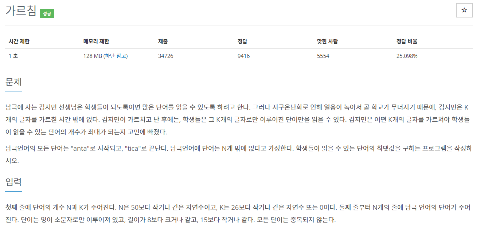

## https://www.acmicpc.net/problem/1062

# (백준) : 1062 가르침 



## 풀이
* 완전탐색, 재귀, 조합
* 알파벳 26 개중 a,n,t,i,c 5개의 알파벳은 단어에 필수로 포함됨
  * k<5 (k가 5이하) 이면 읽을 수 있는 단어 0
  * k == 26 이면 n개의 단어를 읽을 수 있음

boolean visited[26] 선언하여 글자 포함여부 체크 <br>
a,n,t,i,c는 초기에 true로 설정 <br>
```
            visited['a' - 97] = true;
            visited['n' - 97] = true;
            visited['t' - 97] = true;
            visited['i' - 97] = true;
            visited['c'- 97] = true;
```
26개의 알파벳을 순회하면서 방문하지 않았다면 방문처리를 해준뒤에 깊이+1, idx+1 로 재귀탐색 시작<br>
```
    for(int i= start ; i<26 ; i++){
                if(!visited[i]){ //방문하지 않았다면
                    visited[i] = true;
                    comb(idx+1, i+1); // 깊이 +1 ,시작점 + 1부터 시작
                    visited[i] = false; // 다시 false 로 바꿔줌
                }
            }
```
k-5개의 조합을 선택하여 depth가 k-5개가 되면 저장되어있는 단어들을 순회하여<br>
단어가 글자를 모두 포함하고 있는지 체크 -> 포함하고 있다면 count++<br>
체크가 끝난뒤에 최댓값 갱신
```java
    if(idx == k-5){ //5자리가 되었다면,,,
                int count = 0 ;
                // true -> 가르침을 받았다는 뜻
                for(int i=0 ; i< n; i++){
                    boolean isValid = true;
                    for(int j = 0 ; j <list[i].length(); j++){ //한단어 cycle
                        if( !visited[list[i].charAt(j) - 97]) { //가르침을 받지 않음,,,
                            isValid = false;
                            break; // stop
                        }
                    }
                    if(isValid){
                        count++;
                    }
                }
                result = Math.max(result, count);
                return;
            }
```

## 전체 코드
```java
package baekjoon;

import java.io.BufferedReader;
import java.io.IOException;
import java.io.InputStreamReader;
import java.util.StringTokenizer;

public class Main {

    public static String[] list;
    public static boolean[] visited = new boolean[26];
    public static int k;
    public static int n;
    public static int result = 0;

    public static void main(String[] args) throws IOException {


        BufferedReader br = new BufferedReader(new InputStreamReader(System.in));

        StringTokenizer st = new StringTokenizer(br.readLine());
        n = Integer.parseInt(st.nextToken());
        k = Integer.parseInt(st.nextToken()); // k개의 글자

        list = new String[n];
        for (int i = 0; i < n; i++) {

            String str = br.readLine();
            list[i] = str.substring(4, str.length() - 4);

        }
        if (k <  5) { //보다 작으면 단어 자체 읽기 불가능
            System.out.println(0);
        } else if (k == 26) {
            System.out.println(n);
        } else {

            // a, n ,t ,i c 는 방문처리
            visited['a' - 97] = true;
            visited['n' - 97] = true;
            visited['t' - 97] = true;
            visited['i' - 97] = true;
            visited['c'- 97] = true;
            comb(0,0);
            System.out.println(result);
        }
    }

    public static void comb(int idx, int start){ // 깊이, 시작점

        // k - 5 자리의 조합 계산,,,
        // k개의 글자에서 필수로 들어가야하는 antic 5글자를 제외한 조합을 구함
        if(idx == k-5){ //5자리가 되었다면,,,
            int count = 0 ;
            // true -> 가르침을 받았다는 뜻
            for(int i=0 ; i< n; i++){
                boolean isValid = true;
                for(int j = 0 ; j <list[i].length(); j++){ //한단어 cycle
                    if( !visited[list[i].charAt(j) - 97]) { //가르침을 받지 않음,,,
                        isValid = false;
                        break; // stop
                    }
                }
                if(isValid){
                    count++;
                }
            }
            result = Math.max(result, count);
            return;
        }

        for(int i= start ; i<26 ; i++){
            if(!visited[i]){ //방문하지 않았다면
                visited[i] = true;
                comb(idx+1, i+1); // 깊이 +1 ,시작점 + 1부터 시작
                visited[i] = false; // 다시 false 로 바꿔줌
            }
        }

    }
}

```


