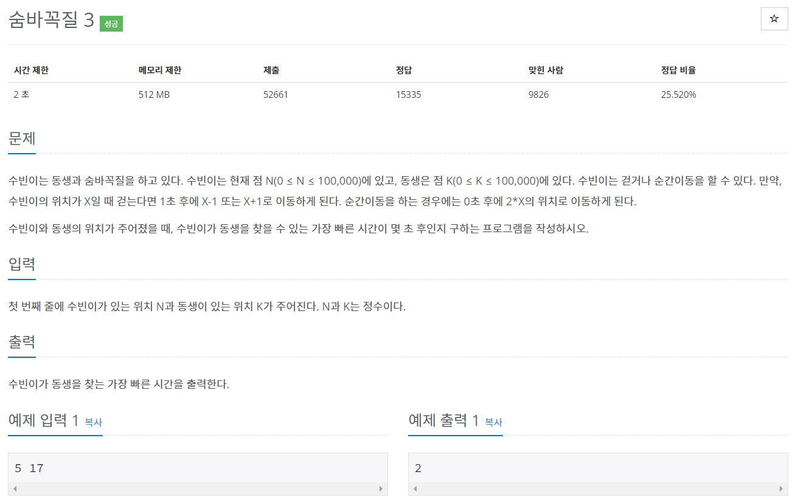

## https://www.acmicpc.net/problem/13549

# (백준) : 13549 숨바꼭질3


## 풀이
* 숨바꼭질2 문제와 유사하나 순간이동시에는 0초에 이동하므로 조건이 다름
* 순간이동하는 부분은 시간이 걸리지 않기 떄문에 먼저 방문체크 해주어야함
* 위치와 시간 데이터를 모두 담기위해 human class생성하여 queue에 추가함
* 방문체크 하는이유?
  * 이미 bfs로 탐색했기때문에 이미 방문했다면 늦었다는 뜻,,,! 최소값을 만족하지 않음

```java
import java.io.BufferedReader;
import java.io.IOException;
import java.io.InputStreamReader;
import java.util.LinkedList;
import java.util.Queue;
import java.util.StringTokenizer;

public class Main {

    public static int n,k;
    public static int min = Integer.MAX_VALUE;
    public static boolean[] visited = new boolean[100001];

    public static void main(String[] args) throws IOException {
        BufferedReader br = new BufferedReader(new InputStreamReader(System.in));
        StringTokenizer st = new StringTokenizer(br.readLine());

        n = Integer.parseInt(st.nextToken());
        k = Integer.parseInt(st.nextToken());

        bfs();
        System.out.println(min);
    }

    public static class Human{
        int loc;
        int time;

        public Human(int loc, int time) {
            this.loc = loc;
            this.time = time;
        }
    }

    public static void bfs(){

        Queue<Human> queue = new LinkedList<>();

        queue.add(new Human(n, 0));
        int next;

        while(!queue.isEmpty()){

            Human poll = queue.poll();
            int now = poll.loc;
            int time = poll.time;

            if(now==k){ //잡았을경우
                min = Math.min(min, time);
            }

            next = now *2; // 0초후 2*X 위치로 이동
            if(next < 100001 && !visited[next]){
                visited[next] = true;
                queue.add(new Human(next, time));
            }

            next = now -1; // 0초후 x-1 위치로 이동
            if( next >= 0 && !visited[next]){
                visited[next] = true;
                queue.add(new Human(next, time+1));
            }

            next = now +1; // 0초후 x+1 위치로 이동
            if( next < 100001 && !visited[next]){
                visited[next] = true;
                queue.add(new Human(next, time+1));
            }

            }
        }
 }

```