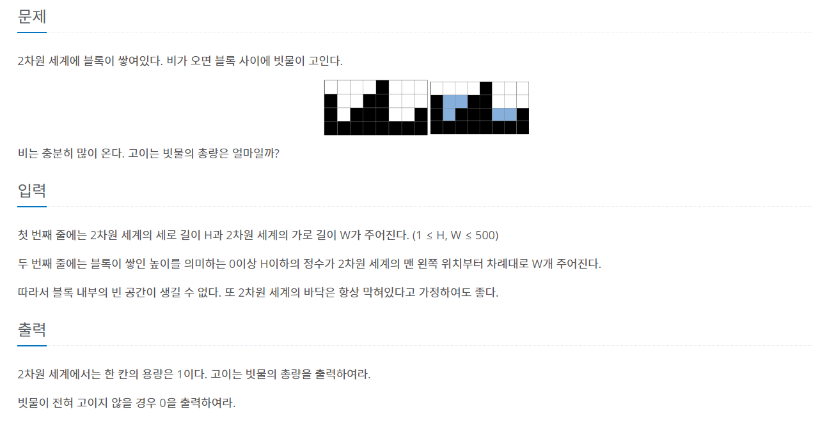

## https://www.acmicpc.net/problem/14719

# (백준) : 14719 빗물



### 접근 방법
<br>

##### 초기 

* 처음에는 스택을 활용해서 왼쪽 가장 높은 벽보다 높거나 같은 값을 가지는 벽이 나오면 스택에서 요소들을 pop 하면서 높이차이를 계산하려고했는데<br>
테스트 케이스는 통과하나 계속 틀렸습니다로 나와서 다른 풀이 참고함

#### 다른 풀이

* 현재 벽을 기준으로 왼쪽 최대벽과 오른쪽 최대 벽 탐색
* 현재 벽이 두벽(왼쪽 오른쪽) 보다 작으면 작은값(작은벽) - 현재벽 의 높이차이를 sum 에 추가

#### 코드
```java
public class Main {

    public static void main(String[] args) throws IOException {
        Scanner sc= new Scanner(System.in);
//        BufferedReader br = new BufferedReader(new InputStreamReader(System.in));
        StringTokenizer st = new StringTokenizer(sc.nextLine());
        int h = Integer.parseInt(st.nextToken());
        int w = Integer.parseInt(st.nextToken());
        int[] arr = new int[w];

        st = new StringTokenizer(sc.nextLine());
        for (int i = 0; i < w; i++) {
            int N = Integer.parseInt(st.nextToken());
            arr[i] = N;
        }

        int sum = 0;
        for(int i =1; i < w-1; i++){ //첫번째 벽은 물을 채울 수 없음 마지막 한칸 전까지 탐색

            int now = arr[i];
            int left = now;
            int right = now;
            // 왼쪽 최대벽 탐색
            for(int j=0; j < i; j++) {
                if(arr[j]> now) {
                    left = Math.max(arr[j], left);
                }
            }

            // 오른쪽 최대벽 탐색
            for(int j= i +1; j < w; j++){
                if(arr[j]> now) {
                    right = Math.max(arr[j], right);
                }
            }

            // now가 둘보다 작으면
            if(now < Math.min(right, left)){
                sum += (Math.min(right, left) - now);
            }

        }
        System.out.println(sum);

    }
}
```