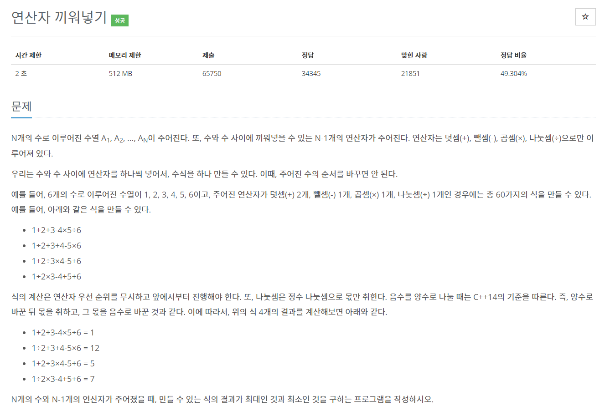
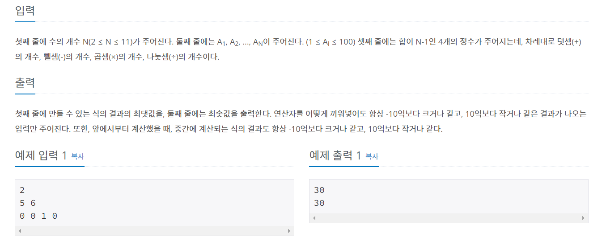

## https://www.acmicpc.net/problem/14888

# (백준) : 14888번 연산자 끼워넣기
<hr>




##### 백트래킹 문제

##### 접근 방법  

- 연산자의 개수가 담겨 있는 배열,숫자가 담긴 배열 선언

```java
private static void dfs(int num, int idx){

        if(idx == n){ //호출끝
            max = Math.max(max,num);
            min = Math.min(min,num);
            return;
        }

        for(int i = 0; i< 4 ; i++){
            if(op[i] > 0) {
                op[i] --;
                if (i == 0) {
                    dfs(num + number[idx], idx+1);
                } else if (i == 1) {
                    dfs(num - number[idx], idx+1);
                } else if (i == 2) {
                    dfs(num * number[idx], idx+1);
                } else if (i == 3) {
                    dfs(num / number[idx], idx+1);
                }
                op[i] ++;
            }

        }
    }
```

* 반복문안에서 재귀호출을 통하여 max값과 min값을 찾음 <br>
* 해당 연산자의 개수가 0이상일때 해당 연산자의 개수를 1감소시키고 재귀호출<br>
* 호출이 증가할때마다 idx에 idx+1값을 넘겨줌
* 재귀 호출이 끝나면 해당 연사자의 개수 다시 1증가


##### 전체 코드
