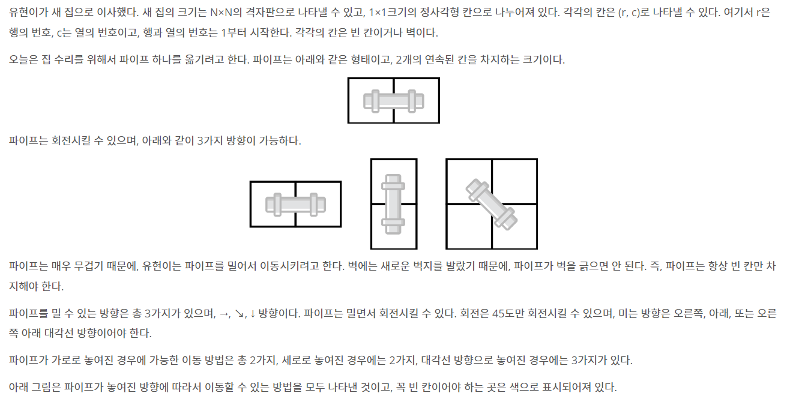

## https://www.acmicpc.net/problem/17070

# (백준) : 17070 파이프 옮기기 1



## 접근 방법
문제를 보자마자 dfs문제라고 생각하고 풀어나갔는데 <br>
처음에는 head와 tail의 x,y좌표모두 신경써서 풀고 방향을 그때그떄 계산해서 풀었는데<br>
코드가 너무 길어지고 문제가 해결되지 않음

## 풀이
* dfs 재귀 탐색
* 머리의 x,y좌표만 신경쓰면됨
* 머리의 x,y 좌표가 n이되면 ans++
```java
public static void dfs(int x, int y, int dir){
        ...
        //가로일때
        
        //세로일때
        
        //대각선일때
        }
```
dfs탐색에 방향을 매개변수로 넣어줌으로써 방향의 따른 case를 분류하여 탐색함<br>

#### 풀이
```java
package baekjoon;

import java.io.BufferedReader;
import java.io.IOException;
import java.io.InputStreamReader;
import java.util.StringTokenizer;

public class Main{


    public static int board[][];
    public static int ans = 0;
    public static int n;


    public static void main(String[] args) throws IOException {
        BufferedReader br = new BufferedReader(new InputStreamReader(System.in));
        StringTokenizer st;
        n = Integer.parseInt(br.readLine());


        board = new int[n+1][n+1];
        for(int i=1; i <= n ; i++){
            String str = br.readLine();
            st = new StringTokenizer(str);
            for(int j=1; j<=n ; j++){
                board[i][j] = Integer.parseInt(st.nextToken());
            }
        }

        // 머리만 신경써도 되는군,,,

        //초기엔 가로로 놓여있음
        dfs(1,2,0);

        System.out.println(ans);
    }
    // direction 0 가로 1 세로 2 대각선
    public static void dfs(int x, int y, int dir){

        if (x == n & y == n) { //종료조건
            ans++;
            return;
        }


        //가로로 놓여져있고, 조건 만족
        if(dir == 0 ){
            if( y+1 <= n && board[x][y+1] ==  0 ){ //가로로이동
                dfs(x,y+1, 0);
            }
            if( y+1 <=n && x+1 <= n && (board[x][y+1] == 0 && board[x+1][y] == 0 && board[x+1][y+1] == 0)){
                dfs(x+1,y+1, 2); //대각선 이동
            }
        }else if(dir == 1){       //세로로 놓여져 있을때
            if( x+1 <= n && board[x+1][y] == 0){
                dfs(x+1,y,1);
            }
            if( y+1 <=n && x+1 <= n && (board[x][y+1] == 0 && board[x+1][y] == 0 && board[x+1][y+1] == 0)){
                dfs(x+1,y+1,2);
            }
        }else{ // 대각선
            if( y+1 <= n && board[x][y+1] ==  0 ){ //가로로이동
                dfs(x,y+1, 0);
            }
            if( x+1 <= n && board[x+1][y] == 0){
                dfs(x+1,y,1);
            }
            if( y+1 <=n && x+1 <= n && (board[x][y+1] == 0 && board[x+1][y] == 0 && board[x+1][y+1] == 0)){
                dfs(x+1,y+1,2);
            }
        }
    }
}

```
