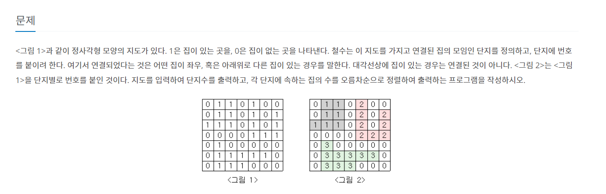

## https://www.acmicpc.net/problem/2667

## (백준) : 2267 단지번호 붙이기



## 접근 방법
* 초기에 상하좌우 값을 정하지 않고 dfs 함수 내에서 상 하 좌 우 별로 <br> 나누어서 dfs탐색 진행했으나 test case는 통과하나 문제는 틀림
* 블로그 참조하여 dx, dy 4방향 탐색

## 풀이
```aidl
for(int i =0 ; i < n ; i++){
            for(int j = 0 ; j< n ; j++){
                if(house[i][j] == 1 && !check[i][j]){
                    houseNumber++;
                    dfs(i,j);
                }
            }
        }
```
* house 1(집이 있거나) check가 false(아직 방문하지 않음)인 경우에 <br> dfs 탐색

```
//x  상 하 좌 우
public static int[] dx = {0,0,-1,1};
//y 상 하 좌 우
public static int[] dy = {1,-1,0,0};
```
* 상 하 좌 우
  * 좌표값과 행렬의 기준이 다르므로 주의
  * dx -> row 
  * dy -> col

```aidl
public static void dfs(int x, int y){
        check[x][y] = true; // 방문처리 
        houses[houseNumber]++; //해당 hosue 의 단지수 ++

        for(int i= 0; i <4 ; i++){ //상하좌우 체크
            int nx = x + dx[i];
            int ny = y + dy[i];
            if(nx >= 0 && nx < n && ny >= 0 && ny < n){
                if(house[nx][ny] == 1 && !check[nx][ny]){
                    dfs(nx,ny);
                }
            }
        }

    }
```
## 전체 코드
```aidl
import java.io.BufferedReader;
import java.io.IOException;
import java.io.InputStreamReader;
import java.util.ArrayList;
import java.util.Arrays;
import java.util.Collections;
import java.util.List;

public class Main {


    public static int house[][];
    public static boolean check[][];
    public static int houses[] = new int[25*25];
    public static int houseNumber = 0;

    public static int n;
    //x  상 하 좌 우
    public static int[] dx = {0,0,-1,1};
    //y 상 하 좌 우
    public static int[] dy = {1,-1,0,0};

    public static void main(String[] args) throws IOException {

        BufferedReader bf = new BufferedReader(new InputStreamReader(System.in));
        n = Integer.parseInt(bf.readLine());
        house = new int[n][n];
        check = new boolean[n][n];

        List result = new ArrayList();

        for(int i =0 ; i < n ; i++){
            for(int j = 0 ; j< n ; j++){
                check[i][j] = false;
            }
        }

        for(int i =0 ; i < n ; i++){
            String s = bf.readLine();
            for(int j = 0 ; j< n ; j++){
                house[i][j] = Character.getNumericValue(s.charAt(j));
            }
        }


        for(int i =0 ; i < n ; i++){
            for(int j = 0 ; j< n ; j++){
                if(house[i][j] == 1 && !check[i][j]){
                    houseNumber++;
                    dfs(i,j);
                }
            }
        }

        System.out.println(houseNumber);
        Arrays.sort(houses);
        for (int i : houses) {
            if(i == 0){

            }else {
                System.out.println(i);
            }
        }

    }
    public static void dfs(int x, int y){
        check[x][y] = true;
        houses[houseNumber]++;

        for(int i= 0; i <4 ; i++){ //상하좌우 체크
            int nx = x + dx[i];
            int ny = y + dy[i];
            if(nx >= 0 && nx < n && ny >= 0 && ny < n){
                if(house[nx][ny] == 1 && !check[nx][ny]){
                    dfs(nx,ny);
                }
            }
        }

    }

}

```
