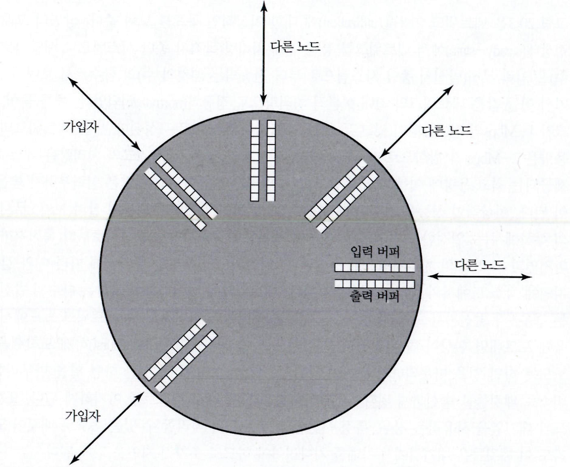
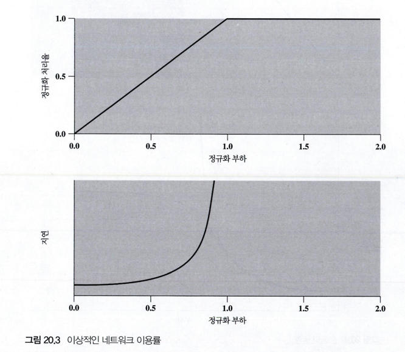

# 혼잡제어

# 혼잡의 영향

- 특정 노드에는 여러 개의 1/0 포트(port)가 접속되어 있으며, 다른 노드와 종단 시스템과 연결됩니다.
- 각 포트는 패킷의 도착과 출발을 처리하기 위해 입력 버퍼와 출력 버퍼를 가지고 있습니다.
- 실제로는 각 포트에는 고정 크기의 2개 버퍼 또는 가변 크기의 메모리 공간이 있습니다.
- 패킷이 도착하면 해당 포트의 입력 버퍼에 저장되고, 노드는 입력 패킷을 조사하고 경로 결정 후 출력 버퍼로 이동시킵니다.
- 출력 대기열에 저장된 패킷은 가능한 빠르게 전송됩니다 (통계적 TDM 방식 사용).
- 패킷의 도착 속도가 처리 속도나 출력 버퍼의 출발 속도보다 더 빠르면 가용 메모리가 고갈될 수 있습니다.
- 메모리 포화 상태에 도달하면 입력 패킷을 폐기하거나 흐름 제어를 통해 트래픽 흐름을 관리합니다.
- 흐름 제어는 전체 네트워크의 트래픽 관리에 사용되는 강력한 도구입니다.

# 이상적 성능

- 그림 20.3은 이상적인 네트워크 이용율을 보여줍니다.
- 상위 그래프는 안정 상태에서의 전체 처리량을 입력 부하의 함수로 나타내며, 이 값들은 최대 이론적 처리량으로 정규화되었습니다.
- 이상적인 경우에는 네트워크 처리량은 최대 용량에 이를 때까지 증가하며, 정규화된 처리량은 입력 부하가 높을 때 1.0이 됩니다.
- 종단간 패킷 지연은 전파 지연과 각 노드의 처리 지연으로 구성되며, 네트워크 부하가 증가하면 각 노드에서의 큐잉 지연이 추가됩니다.
- 데이터를 공급하는 다수의 발신지가 있는 경우, 각 노드에서 입력률에 오르내림 현상이 발생할 수 있습니다.
- 버스트 형태로 패킷이 도착하면 노드는 일을 마무리하기 위해 시간이 소요되며, 일을 마무리한 후 버스트 패킷을 송신합니다.
- 노드가 대기열을 사용하는 경우, 대기열에 대기하는 패킷들은 추가적인 지연을 겪게 됩니다.
- 부하가 네트워크 용량을 초과하면 지연은 무한대로 증가하게 됩니다.
- 그림 20.3은 이상적인 상황을 나타내며, 실제로는 이 그래프에서 나타난 성능을 초과할 수 없습니다.

## 혼잡제어

### 후면압박
- 후면압박은 혼잡 제어의 한 방법으로, 흐름의 반대 방향으로 압력을 가하여 유체나 데이터의 흐름을 제어합니다.
- 혼잡이 발생하면 해당 노드는 트래픽을 제한하여 흐름을 조절하고, 이러한 제약이 역방향으로 전파됩니다.
- 후면압박은 링크나 논리적 연결에서 선택적으로 적용되며, 일부 연결에서만 흐름 제한이 이루어집니다.
  - 제한된 흐름은 발신지까지 전파되어 새로운 패킷의 흐름에 제약을 줍니다.

### 초크패킷

- 초크패킷은 혼잡노드에서 생성되는 제어패킷으로 트래픽 흐름을 제한합니다.
- 발신지 억제 메시지를 수신한 발신지 호스트는 트래픽 전송을 줄입니다.
- 버퍼가 포화되어 데이터그램이 폐기될 때도 발신지 억제 메시지를 보낼 수 있습니다.
- 버퍼가 용량에 가까워질 때는 미리 혼잡을 예상하여 발신지 억제 메시지를 보낼 수 있습니다.
- 발신지 억제 메시지를 수신한 것은 해당 데이터그램이 배달되지 않았다는 것을 의미하지 않습니다.

### 묵시적 혼잡 신호방식

- 네트워크 혼잡 시 두 가지 현상 발생: 전송 지연시간 길어짐, 패킷 손실 가능
- 묵시적 신호는 혼잡 감지의 증거로 활용 가능
- 종단 시스템은 묵시적 신호를 바탕으로 혼잡 제어에 참여
- 비연결형 네트워크에서 묵시적 신호를 효과적인 혼잡 제어 방법으로 사용
- TCP를 통해 연결된 시스템 간에 데이터 흐름을 제어할 수 있음
- 프레임 릴레이 네트워크의 LAPF 제어 프로토콜도 묵시적 신호를 사용하여 흐름 제어 가능

### 명시적 혼잡 신호방식
- 이진(Binary): 이진 (Binary): 혼잡 노드가 데이터 패킷을 전달할 때 데이터 패킷의 한 비트를 설정한 다. 발신지가 논리적 연결 상에서 혼잡을 나타내는 이진 표시 비트를 받으면 트래픽 흐름을 줄인다.
- 신용 기반 : 신용 기반 (Credit based)은 논리적 연결에 신용(credit)을 명시적으로 부여하는 방법입니다. 신용은 발신지가 얼마나 많은 옥텟 또는 패킷을 전송할 수 있는지를 가리키는 값입니다.
- 전송율 기반 (Rate based): 이 기법은 발신지에게 논리적 연결 상의 데이터 전송율을 명시적으로 제한하는 방식이다. 발신지는 제한된 전송율까지 데이터를 전송할 수 있다. 연결 경로 상의 어떤 노드는 혼잡 제어를 위해 데이터 전송율의 제한을 낮추는 제어 메시지를 발신지에게 보낼 수 있다.

## 트래픽 관리

### 공정성

- 혼잡이 증가하면 패킷 흐름은 지연시간 증가와 분실 발생을 겪는다.
- 모든 흐름들은 동일한 혼잡 수준을 원한다면, 마지막에 온 패킷을 먼저 폐기하는 단순한 방법은 공정하지 않을 수 있다.
- 공정성을 개선하기 위해, 각 노드는 논리적 연결이나 발신지-목적지 쌍마다 상호 분리된 대기열을 유지하는 방법을 사용할 수 있다.
- 대기열 버퍼의 크기가 동일하다면, 높은 트래픽 부하를 가진 대기열 패킷을 더 자주 폐기하므로, 트래픽 부하가 낮은 연결은 용량을 공정하게 사용할 수 있다.

### 서비스 품질
- 음성 및 비디오와 같은 응용은 지연에 민감하지만 패킷의 분실에는 둔감하다.
- 파일 전송이나 전자 메일은 지연에는 둔감하지만 분실에는 민감하다.
- 대화형 그래픽이나 대화형 계산 시스템과 같은 경우는 지연과 패킷 분실에 모두 민감하다.
- 다양한 트래픽의 흐름은 서로 다른 우선 순위를 가진다.
- 네트워크 관리 트래픽은 혼잡이나 장애시 일반 데이터 트래픽보다 더 중요하게 취급되어야 한다.
- 특히 혼잡 기간 동안 서로 다른 요구사항을 갖는 트래픽을 다르게 취급하고, 서비스 품질(QoS, Quality of Service)을 제공하는 것이 매우 중요하다.
- 동일한 대기열에 있는 높은 우선순위의 패킷은 낮은 우선순위의 패킷보다 먼저 보내질 수 있다.
- 또는 서비스 품질 수준마다 다른 대기열을 별도로 관리하여 높은 수준의 대기열을 우대할 수도 있다.

### 예약
- 예약 (reservation) 기법은 혼잡을 방지하고 응용에 적합한 서비스를 보장하기 위한 방법이다.
- 예약 기능은 ATM 네트워크의 필수적인 부분이다. 논리적 연결이 설정될 때 네트워크와 사용자는 데이터 전송율과 기타 트래픽 특성을 규정하는 트래픽 협정을 맺는다.
- 네트워크는 트래픽 흐름이 협정한 파라미터의 범위를 준수하는 한정된 QoS를 보장한다. 협정을 초과한 트래픽은 폐기되거나 최선 (best effort) 방법으로 처리된다.
- 만약 현재 네트워크의 자원 예약 상태가 새로운 예약을 충족시키기에 부적합하다면, 새로운 자원 예약은 거부된다.

