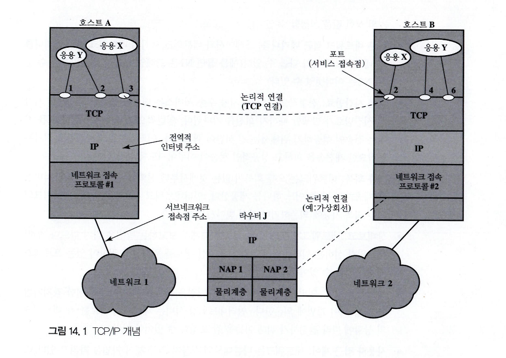
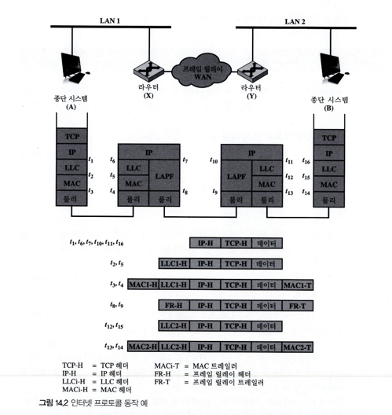
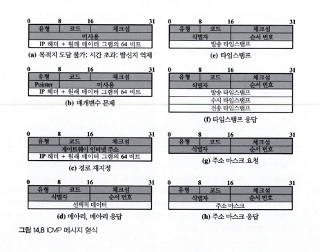

# 인터넷 프로토콜

### 인터넷 네트워킹의 원리

#### 네트워킹 용어
* 통신 네트워크 : 네트워크에 부착된 장치들에 전송 서비스를 제공하는 설비 
* 인터넷 : 브리지와 라우터로써 상호 연결된 통신 네트워크의 집합
* 인트라넷 : www같은 중요한 인터넷 응용들을 제공하는 기관에서 사용하는 인터넷 
* 서브 네트워크 : 인터네트워크를 구성하는 부분 네트워크 
* 종단 시스템 : 사용자 응용이나 서비스를 지원하는 종단 장치로 인터네트워크를 구성하는 네트워크에 부착되어 있어야 한다.
* 종간 시스템 : 두 네트워크를 연결하거나 다른 네트워크에 부착된 종단 시스템의 통신을 지원하는 장치
* 브리지 : 유사한 LAN 프로토콜을 사용하는 두 LAN을 연결하는데 사용하는 중간 시스템
* 라우터 : 어떤 종류의 두 네트워크를 연결하는데 사용하는 중간 시스템, 라우터는 다른 라우터 또는 네트워크의 종단 시스템과의 연결에 인터넷 프로토콜 사용, OSI모델의 3계층에서 동작

### 인터넷 설비에 대한 요구사항

1. 네트워크 사이의 링크 제어, 적어도 물리와 링크 제어 연결이 필요
2. 다른 네트워크에 있는 프로세스 사이에서 경로배정을 하고 데이터를 전달함
3. 다양한 네트워크와 라우터의 사용을 추적하는 계정 서비스를 제공하고 상태 정보를 유지한다,
4. 위에 나열한 서비스를 제공하기 위해서 어떤 구성원 네트워크에서도 네트워크 구조의 변경을 요구해서는 안됨, 이는 인터넷 네트워킹 설비가 네트워크들의 많은 차이를 수용해야함을 뜻함 아래의
   * 다른 주소지정 방식 : 네트워크마다 다른 종점 이름과 주소 및 디렉터리 유지 방식을 사용할 수 있음, 어떤 형태로든지 전역 네트워크 주소지정과 디렉터리 서비스를 제공해야함
   * 다른 패킷 최대 크기 : 어떤 네트워크로부터 온 패킷은 다른 네트워크를 위해 작은 조각들로 나누어질 수 있음, 이러한 과정을 단편화라고 함
   * 다른 네트워크 접근 메커니즘 : 스테잉션과 네트워크 사이의 네트워크 접근 메커니즘이 네트워크에 따라 다를 수 있음
   * 다른 시간만료 : 전형적으로 연결-지향 수송 서비스는 데이터 블록을 재전송할 시간인 시간만료가 발생할 때까지 회신을 기다리므로 일반적으로 다수의 네트워크를 거치는 전송이 성공하기 위해서는 긴 시간이 필요
   * 오류 회복 : 네트워크는 오류 회복이 없는 것에서부터 신뢰할 수 있는 종단간 서비스를 제공하는 것 중 어느 하나를 제공, 인터네트워크 서비스는 개별 네트워크의 오류 회복 기능에 의존하거나 간섭 받아서는 안됨
   * 상태보고 : 인터네트워킹 설비는 인터네트워킹 활동에 관한 정보를 원하면서 권한이 있는 프로세스에게 전달할 수 있어야함
   * 경로배정 기법 : 인터네트워크에서의 경로배정은 각 네트워크 고유의 결함 감지기법과 혼잡 제어 기법에 의존, 인터네트워킹 설비는 데이터의 경로를 각 네트워크의 상황에 따라 결정하기 위해 이들을 잘 조정해야함
   * 사용자 접근 제어 : 인터네트웤는 필요할때 사용자 접근 제어 기법을 사용할 수 있어야함, 더 나아가서 인터네트워크 접근 제어 기법 또한 필요
   * 연결, 비연결 : 인터네트워크 서비스는 개별 네트워크 본연의 연결 서비스에 의존하지 않는 것이 바람직

### 비연결 동작
모든 네트워크 프로토콜 단위는 독립적으로 취급되며, 발진시 ES로부터 목적지 ES로 라우터와 네트워크를 통해 전달됨

### 인터넷 프로토콜 동작

#### 비연결 인터네트워킹 방식의 동작

IP는 비연결 또는 데이터그램 서비스를 종단 시스템 사이에 제공하는데 다음과 같은 장점이 있음
* 비연결 인터넷 설비는 유연함, 이것은 자체적으로 비연결인 네트워크를 포함하여 다양한 네트워크를 다룰 수 있음. 본질적으로 IP는 구성 네트워크로부터 거의 아무것도 요구하지 않음
* 비연결 인터넷 서비스를 매우 튼튼하게 만들 수 있음
* 불필요한 추가 부담이 없기 때문에 비연결 수송 프로토콜에 가장 좋음

이 그림은 한 LAN(네트워크 1)의 호스트 A와 다른 LAN(네트워크 2)의 호스트 B 사이에 WAN을 통한 데이터 교환을 위한 인터넷 프로토콜(IP)의 동작을 그리고 있습니다. 그림은 프로토콜 구조와 데이터 단위의 형식을 단계별로 보여줍니다.

* IP는 LAN 1의 호스트 A에 있는 소프트웨어의 상위 계층(예: TCP 또는 UDP)으로부터 B로 보낼 데이터 블록을 받습니다.
* IP는 B의 전역 인터넷 주소를 포함한 헤더를 추가합니다.
* IP 헤더와 상위 계층 데이터의 결합을 "인터넷 프로토콜 데이터 단위(PDU)"라고 합니다.
* 이 데이터그램을 LAN 프로토콜로 캡슐화(1에서 LLC 헤더, 5에서 MAC 헤더와 트레일러)하고, 라우터에게 보냅니다.
* 라우터는 LAN 필드를 벗기고 IP 헤더를 읽기 위해 데이터그램을 프레임 릴레이 프로토콜 필드로 캡슐화합니다(1g).
* 데이터그램은 WAN을 거쳐 다른 라우터로 전송되며, 해당 라우터는 프레임 릴레이 프로토콜 필드를 벗겨 데이터그램을 복원합니다.
* 그 후, 적절한 LAN 2의 LAN 필드로 다시 싸여 B로 전송됩니다.
이 예시를 자세히 살펴보면:

* 종단 시스템 A는 종단 시스템 B로 전송할 데이터그램을 가지고 있습니다. A의 IP 모듈은 목적지 B가 다른 네트워크에 있다는 것을 인식하고, 라우터 X로 데이터를 보내는 것이 첫 번째 단계입니다.
* 데이터그램은 이를 위해 IP가 라우터 X로 전송하라는 지시와 함께 다음 하위 계층(여기서는 LLC)으로 보내집니다.
* LLC는 받은 정보를 MAC 계층으로 내려보내고, 라우터 X의 MAC 계층 주소를 MAC 헤더에 추가합니다.
* 따라서 LAN 1로 옮겨진 데이터 블록은 TCP 상위 계층의 데이터에 TCP 헤더, IP 헤더, LLC 헤더, MAC 헤더와 트레일러를 포합합니다.

### 설계 쟁점
IP가 제어하는 인터네트워 동작의 간단한 묘사와, 몇가지 설계 쟁점
* 경로배정
* 데이터그램 수명
* 단편화와 재조립
* 오류 제어
* 흐름 제어

#### 경로배정
* 경로배정의 목적을 위해 모든 종단 시스템과 라우터는 각 목적지 네트워크에 대해 다음으로 인터넷 데이터그램을 보낼 라우터를 열거하고 있는 경로배정 표를 유지함
* 경로배정표는 정적이거나 동적
  * 정적인 표는 라우터가 동작하지 않을 경우를 대비하여 대쳏할 라우터를 가지고 있어야함
  * 동적인 표는 오류와 혼잡 상황에 대한 대처가 유연
* 경로배정표는 보안과 우선수위 같은 다른 인터네트워킹 서비스를 지원하는데 사용가능
  * 개별 네트워크는 주어진 보안 등급까지의 데이터만을 처리할 수 있도록 분류
* 발신지 경로배정
  * 발신지 스테이션은 일련의 라우터 목록을 데이터그램에 넣어 경로를 지정
* 경로 기록 서비스 
  * 경로를 기록하기 위해 각 라우터는 자신의 인터넷 주소를 데이터그램의 주소 목록에 추가

#### 데이터그램 수명
* 동적이거나 또는 대체 경로배정을 사용할 경우, 데이터그램이 무한히 인터넷을 떠돌 가능성이 존재
  * 바람직 하지 않음
    * 끝없이 순환하는 데이터그램은 네트워크 자원을 낭빕
    * 수송 프로토콜은 데이터그램 수명의 상한 값에 의존

#### 단편화와 재조립
* 인터넷에서 모든 네트워크는 패킷의 최대 크기 명시
  * 전체 네트워크에서 동일한 패킷 크기를 사용하게 하는 것은 비효율, 비현실적
* 라우터는 들어오는 데이터그램을 다음 네트워크로 전송하기 전에 세그먼트 또는 프레그먼트라 불리는 작은 조각들로 쪼갬
* 경우에 따라 단편해를 해야하는 이유가 있음
  * 통신 네트워크는 특정 크기의까지의 데이터 블록만을 받아들일 수 있음
  * 오류제어는 작은 PDU사이즈가 더욱 효과적일 수 있음
  * 짧은 지연으로 공유 전송설비에 대해 더 공평한 접근이 제공될 수 있음
  * 작은 PDU의 크기는 수신 개체가 작은 버퍼만을 할당해도 된다는 것을 의미
* 단편화에는 몇가지 단점이 존재해 가능한 큰 PDU를 만들어야 한다는 논쟁도 존재
  * 각 PDU는 일정 양의 제어 정보를 포함하고 있기 때문에 더 작은 블록은 오버헤드가 큰 비율을 차지함
  * PDU의 도착은 서비를 받아야 하는 인터럽트를 생성할 수 있음, 더 작은 블록 -> 더 많으 인터럽트
  * 양은 적으나 수량이 많은 PDU를 처리하는데 많은 시간이 걸림

만약 데이터 그램이 전송중에 단편화 된다면 어떻게 재조립할 것인지에 대한 의문?
 
가장 쉬운 방법은 목저지에서만 재조립
 
단점
* 인터넷은 경유하면서 계속 작아짐
* 어떤 네트워크의 효율을 손상할 수도 있음

중간 라우터에서의 재조립을 허용한다면?
 
다음과 같은 단점
* 라우터에 큰 버퍼가 있지만 모든 버퍼 공간이 부분적인 데이터그램들로 가득 찰 수 있음
* 데이터그램의 단편들은 반드시 같은 라우터를 통과해야함, 이것은 동적인 경로배정을 금지

IP에서는 데이타그램의 단편들이 목적지 종단 시스템에서 재조립됨,IP 단편화 기법은 IP헤더에 들어있는 다음곽 같은 정보 사용
* 데이터 단위 식별자
* 데이터 길이
* 오프셋
* 계속 플래그(More Flag)

#### 오류 제어
인터네트워크 설비는 모든 데이터그램의 성공적인 배달은 보장하지 않음, 라우터가 데이터그램을 버릴때, 라우터는 가능하면 발신지로 어떤 정보를 돌려주려고 시도함
 
데이터그램은 수명이 다하거나, 혼잡상황이거냐, FCS오류가 발생하는 동안 많은 이유에서 버려짐  
FCS 오류의 경우 발신자 주소 필드가 손상을 입어 열리는 것이 불가능할 수도 있음

#### 흐름 제어
* 인터넷 흐름제어는 라우터 또는 수신 스테이션이 데이터 수신율을 제한할 수 있도록 함
* 가장 좋은 접근방법은 다른 라우터 또는 발신지 스테이션으로 흐름 제엉용 패킷을 데이터 흐름을 줄이라는 요청을 보내는 것

### 인터넷 프로토콜

#### IP 서비스
원시함수 : 수행되는 기능 정의  
매개변수 : 데이터와 제어 정보를 전달하는데 사용  
두 가지 원시 함수( Send, Deliver) 와 연관된 매개변수
* 발신지 주소 : 발신지 IP개체의 인터네트워크 주소
* 목적지 주소 : 목적지 Ip개체의 인터네트워크 주소
* 프로토콜 : 수신 프로토콜 개체( TCP 같은 IP 사용자 )
* 서비스 유형 표시자 : 각 네트워크를 통과하는 데이터 단위를 어떻게 다룰지를 규정하는데 사용됨
* 식별자 : 발신지와 목적지 주소 및 사용자 프로토콜과의 조합으로 데이터 단위를 유일하게 식별하는 데 사용됨
* 단편화 금지 식별자 : 전송을 하기 위해 IP가 데이터를 단편화할 수 있는지를 나타냄
* 수명(TTL) : 초 단위로 측정
* 데이터 길이 : 전송할 데이터 길이
* 선택 사항 데이터 : IP사용자가 요구하는 선택 사항
* 데이터 : 전송할 사용자 데이터
* 보안 : 데이터 그램에 보안 레이블을 붙일 수 있게함
* 발신지 경로배정 : 전달할 경로에
* 경로 기록 : 데이터그램이 방문하는 라우터들의 순서를 기록하기 위한 필드
* 흐름 식별자 : 흐름 서비스를 사용하기 위해 예약한 자원들의 이름, 저장할 수 없는 주기적인 트래픽(ex: 음성)에 대해 특별한 처리 제공
* 타임스탬프 : 발신지 IP 개체와 데이터 단위가 통과한 모든 또는 그 중 몇몇의 중간 라우터는 타임스탬프을 데이터에 추가함

#### 인터넷 프로토콜
* 버전 : 프로토콜의 진화가 가능하도록 버전을 나타냄, 값은 4
* 인터넷 헤더 길이(IHL): 32비트 단어 단위로 나타낸 헤더 길이
* DS(6비트) : 차등 서비스 기능
* ECN : 명시적 혼잡 알림 필드로, 최종 노드에게 혼잡의 경험을 알려줌
* 전체 길이(16비트) : 헤더와 데이터를 포함한 전체 데이터그램 길이를 옥텟으로 표시함
* 식별자(16비트) : 순서 번호는 발신지 주소와 목적지 주소 및 사용자 프로토콜과의 조합으로 데이터그램을 유일하게 식별해줌
* 플래그(3비트) : 목적지에서 재조립이 가능한지 불가능한지 모를 때 유용
* 단편 오프셋(13비트) : 원래 데이터그램에서 이 단편이 어디에 위치하는지 64비트 단위로 나타냄, 이것은 마지막 단편을 제외한 모든 단편은 데이터 필드를 64비트의 배수로 가지고 있어야 한다는 것을 의미
* TTL(8비트) : 초 단위로 데이터그램이 인터넷이 얼마나 오래 머무를 수 있는지를 나타냄
* 프로토콜(8비트) : 목적지에서 데이터 필드를 받을 다음 상위계층 프로토콜을 나타냄
* 해더 체크셈(16비트) : 헤더에만 적용하는 오류 검출 코드, 라우터에서 다시 검증되고 계산해야함
* 발신지 주소(32비트) : 네트워크와 그 네트워크에 붙어 있는 특정 종단 시스템을 규정하는 32비트 주소
* 수신지 주소(32비트) : 발신지 주소와 같은 특성
* 패딩 : 데이터그램 ㄴ헤더의 길이가 32비트의 배수가 되도록 매워 넣음
* 데이터(가변) : 데이터 필드는 길이가 반드시 8비트의 정수배여야함

#### IP주소
IP 헤더의 발신지와 목적지 주소 필드는 일반적으로 각각 네트워크 식별자와 호스트 식별자로 구성된 32비트 전역 인터넷 주소를 가지고 있음

##### 인터넷 제어 메시지 프로토콜(ICMP)
ICMP는 라우터로 또는 호스트로부터 다른 호스트로 메시지를 전달하는 수단을 제공함.  
본질적으로 ICMP는 통신 환경의 문제에 대한 반응을 제공하며 이것의 사용 예는 데이터그램이 목적지에 도착하지 못할 때나, 데이터 그램을 전달하기 위한 버퍼가 부족할 때나, 라우터가 스테이션에게 더 짧은 경로로 트래픽을 전달하라고 지실경우
 
ICMP 메시지 헤더
* 유형(8비트) : ICMP 메시지의 유형을 규정
* 코드(8비트) : 하나나 몇 개의 비트로 부호활 수 있는 메시지의 매개변수를 규정하기 위해 사용
* 체크섬(16비트) : ICMP 메시지 전체의 체크셈이다. IP와 같은 알고리즘을 사용
* 매개변수(32비트) : 좀 더 긴 매개변수를 규정하기 위해 사용

##### 주소 해결 프로토콜
IP 주소를 서브네트워크로 연결하기 위한 접근방법
* 모든 시스템은 IP주소와 일치하는 서브네트워크의 주소의 표를 유지함. 이 접근 방법은 서브네트워크에 새로 접속하는 호스트를 쉽게 그리고 자동적으로 수용하지 못하낟.
* 서브네트워크 주소는 IP 주소의 네트워크 부분의 부분 집합일 수 있다. 그러나 인터넷 주소의 총 길이는 32비트이며, 대부분의 서브네트워크 유형에서 호스트 주소필드는 32비트보다 김
* IP-하부 네트워크 주소 연게를 포함하는 중앙집중식 디렉터리를 각 서브네트워크에 유지할 수가 있다. 이것은 많은 네트워크에서 합리적인 해결책이다.
* 주소 해결 프로토콜을 사용할 수 있다. 이것은 중앙집중식 디렉터리보다 단순화된 방법이며 ,LAN에 적합

##### ARP 동작방식
1. LAN이 모든 시스템은 알려진 IP-서브네트워크 주소의 변환 표를 유지
2. IP 주소에 대한 서브네트워크 주소가 필요할 때에 시스템의 표에 해당 내용이 없으면, 시스템은 LAN 프로토콜 위에서 요청을 브로드캐스트 하도록 ARP를 사용함. 브로드 캐스트 메시지는 서브네트워크 주소를 필요로 하는 IP주소를 포함한다.
3. 서브네트워크의 다른 호스트들은 ARP 메시지를 듣고, 일치하 응답에는 응답하는 호스트의 IP주소와 서브네트워크 주소를 모두 포함함
4. 원본 요청은 요청하는 호스트의 IP 주소와 서브네트워크 주소를 포함한다. 이러한 정보에 관심이 있는 호스트는 차후 ARP 메시지 사용을 줄이기 위해 이 정보를 자신의 표에 복사가능
5. 또한 ARP 메시지는 호스트의 IP주소와 서브네트워크 주소를 서브네트워크의 다른 호스트가 이용하도록 브로드캐스트 하는데도 사용할 수 있다.