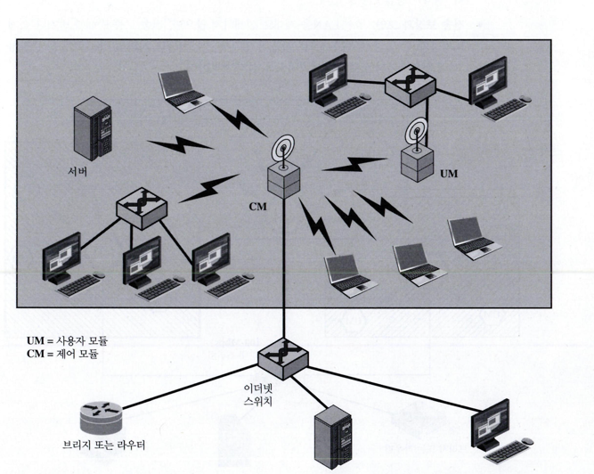
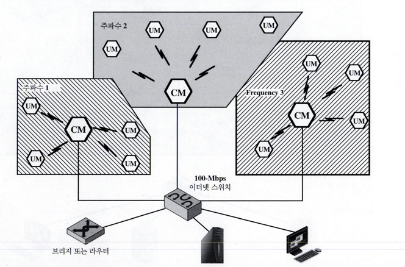
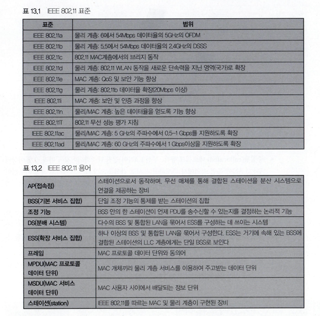
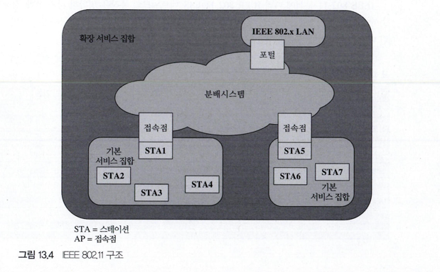
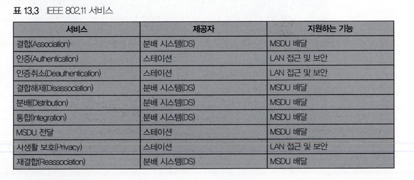

# 무선 LAN

### 무선랜이란?
* 무선 신호 전달 방식을 이용하여 두 대 이상의 장치를 연결하는 기술
* 사용자는  근거리 지역에서 이동하면서도 지속적으로 네트워크에 접근 가능
* IEEE 802.11 표준에 기반
* 와이파이라는 마케팅 네임으로 알려져 있음

#### 무선 LAN 구성
* 백본 유선 LAN
  * 1개 이상의 브리지나 라우터를 지원
  * ex) 이더넷
* 제어 모듈(CM: control module)
  * 무선 LAN의 인터페이스로서 동작
  * 라우터 기능 ( 백본에 무선 LAN을 연결하기 위한 )
* 사용자모듈(UM : user module)

단일 셀 무선 LAN 구성

다중 무선 셀 LAN구성의 예

#### 무선 LAN 요구 사항

높은 용량, 근거리 통신 지원, 부착된 스테이션 간의 완전한 연결, 브로드캐스트 기능 포함하는 LAN의 요구사항을 만족시켜야할 뿐만 아니라
WLAN 환경에 국한된 요구사항도 만족 시켜야함

##### WLAN에 대한 요구사항
* 처리율(throughput): 매체 접근 제어(MAC) 프로토콜은 용량의 극대화를 위해서 무선 매체를 가능한 효율적으로 사용해야함
* 노드 수 : 다수의 셀에 걸쳐서 수백 개의 노드를 지원할 수 있어야 함
* 백본 LAN에 연결 
  * 대부분의 경우 유선 백본 LAN에 있는 스테이션과의 상호 연결을 요구
  * 인프라를 가진 무선 LAN에서는 제어 모듈을 사용하여 쉽게 구현 가능
  * 이동 사용자나 훅 네트워크에 대해서도 요구사항을 고려해야함
* 서비스 지역: 무선 LAN은 직경 100~300m 지역 서비스
* 전지 전력(battery power) 소모
  * 긴 전지 수명이 필요
    * 베이스 스테이션과 같은 MAC 프로토콜은 이에 적합 X
  * 무선 LAN 구현은 일반적으로 네트워크를 사용하지 않을 때 수면 모드로 동작하는 것과 같은 전력 절약 기능이 있음
* 전송 보장과 보안
  * 신뢰성있는 전송, 도청으로부터의 보안을 제공하도록 설계해야함
* 중첩된(collocated) 네트워크 동작
  * 2개 이상의 무선 LAN이 동일 지역에 존재하거나 서로 간섭을 일으킬 지역에서 동작할 가능서우존재
  * 이런 간섭은 MAC 알고리즘의 정상적인 동작을 방해
  * 특정 LAN에 인가받지 않은 접속 허용 가능
* 무면허 동작: 사용자들은 LAN에서 사용하는 주파수 대역에 대해 어떤 면허도 필요 없는 무선 LAN 제품을 사서 운용하길 희망
* 핸드오프/로밍 : 무선 LAN에서 사용하는 MAC프로토콜은 이동 스테이션이 하나의 셀에서 다른 셀로 이동가능하도록 해야 함
* 동적 구성 : MAC 주소지정과 네트워크 관리에 있어서, 다른 사용자에게 방해를 주지 않고 종단 시스템을 동적, 자동적으로 추가, 삭제, 재배치 할 수 있어야함

### IEEE 802.11

#### IEEE 802.11의 목적
* WLAN의 MAC 프로토콜 및 물리적 매체 명세를 개발하기 위해
* 초기 관심사 ISM 주파수 대역에서 동작하는 WLAN 개발이였으나 다양한한 주파수와 데이터율 지원을 위한 요구사항에 의해서 확작 가능한 표준목록을 발표함

#### IEEE 802.11 구조
##### BSS(basic service set) 
  * 일반적으로 셀에 해당되며, WLAN에서 가장 작게 만들 수 있는 동작 단위
  * 동일한 MAC 프로토콜 사용
  * 공유하는 무선 매체에 접근하기 위해 경쟁하는 스테이션으로 구성
  * BSS는 AP(access point)를 통해 백본 DS(distribution system)에 연결 될 수도 있고, 단독으로도 존재 가능

##### AP : 브리지 및 리피터로서의 기능, 분배시스템으로의 접근 서비스 제공
##### DS : 스위치, 유선네트워크, 무선 네트워크

##### BSS 통신
* 내부
  * BSS에서 클라이언트 스테이션들을 서로 직접 통신X
  * MAC 프레임을 AP로 전송 -> AP가 수신할 프레임을 목적지 스테이션으로 보냄
* 외부
  * 지역스테이션이 AP로 데이터프레임 전송 -> AP가 목적지 방향의 연결된 DS로 중계

##### IBSS(Independent BSS)
* BSS내 모든 스테이션이 이동스테이션, 다른 BSS와의 연결 X
* 독립 BSSS(Independent BSS)
* 에드 훅 네트워크
* 모든 스테이션은 AP의 개입없이 독립적으로 통신

각 스테이션의 하나의 BSS에 속해 있는 구성도 (STA= 스테이션, AP= 접속점)

##### ESS(extended service set)
* 분배 시스템이 연결한 둘 이상의 BSS로 구성
* ESS를 LLC계층에서는 하나의 논리적 LAN으로 인식

#### IEEE 802.11 서비스

###### MSDU : MAC 사용자 간 전달되는 데이터 블록
 * MSDU의 크기가 너무 커서 하나의 MAC 프레임으로 전달 할 수 없으면 다수의 MAC프레임으로 단편화하여 전송

##### DS에서의 메시지 분배
* 분배
  * 한 BSS에 속한 스테이션이 DS를 통해 다른 BSS에 속한 스테이션으로 MAC 프레임을 보낼 때  MAC 프레임 교환을 위해 사용하는 서비스
  * 서로 통신하는 두 스테이션이 같은 BSS -> 분배 서비스는 하나의 AP만 거쳐 이루어짐
* 통합
  * IEE 802.11 LAN의 스테이션과 통합된 IEE 802.x LAN의 스테이션사이에서 데이터를 교환할때
  * 통합이란 DS에 물리적으로 연결되어 있는 유선  LAN
    * 이 유선 LAN의 스테이션들은 통합 서비스를 위해 IEE 802.11 LAN에 논리적으로 연결 가능
##### 결합 관련 서비스
MAC 계층의 주된 목적은 MAC 개체 간에 MSDU를 주고 받는 것 -> 분배 서비스에서 이루어짐
 

분배 서비스를 동작을 위해서는 결합 관련 서비스를 통해 ESS에 속한 스테이션 정보를 알아야 힘

##### 이동성에 기반한 세 가지 전이 유형
* 전이 없음 : 스테이션이 고정되어 있거나 단일 BSS의 스테이션들과 직접 통신하는 범위 내에서만 움직이는 유형
* BSS 전이 : BSS에서 같은 ESS에 있는 다른 BSS로 옮겨가는 스테이션의 움직임으로 정의
  * 주소지정 기능이 필요 ( 해당 스테이션으로 데이터 분배를 위해 )
* ESS 전이 : 하나의 ESS에 있는 BSS에서 다른 ESS에 있는 BSS로 옮겨가는 스테이션의 움직임으로 정의
  * 서비스 중단우려가 있음 ( 스테이션이 움직였다는 것만을 감지할뿐 )

DS 내에서 메시지 배달을 위해서는 분배 서비스는 목적지 스테이션이 어디에 있는지 알아야함 ( 목적지가 속한 AP 파악 )
 
위 요구 사항과 관련된 3가지 서비스
* 결합 : 스테이션과 AP 사이의 초기 결합 설정
  * 무선 LAN에서 프레임을 송수신하려는 스테이션은 자신의 신분과 주소를 알려야함
  * 스테이션은 특정 BSS에 있는 AP와 결합 설정
  * AP는 ESS에 있는 다른 AP들에게 이 정보를 알림 (배달가능)
* 재결합 : 하나의 AP에서 이미 설정된 결합을 다른 AP로 옮기도록해주어, 이동 스테이션이 하나의 BSS에서 다른 BSS로 이동 가능하도록해줌
* 결합해제 : 스테이션이나 AP가 기존의 결합을 종료한다고 알리는 통지
  * 스테이션은 ESS를 떠나거나 끄기 전에 이 통지를 보내야 함
  * But MAC관리 기능은 스테이션이 통지 없이 사라지는 경우에 자신을 보호함

#### IEEE 802.11 매체 접근 제어
MAC 계층의 세가지 주요기능
* 신뢰성 있는 데이터 배달
* 접근 제어
* 보안

##### 신뢰성 있는 데이터 배달
* 무선 랜 특성상 잡음, 간섭, 다른 전파 효과로 인해 많은 프레임이 손실되기 때문에 신뢰성이 낮음
* 오류 정정 코그다 있어도 많은 MAC프레임이 성공적으로 수신x

이러한 이유로 <strong>프레임교환 프로토콜</strong>을 사용  

스테이션
* 데이터 프레임 수신 -> 송신자에게 ACK 프레임 전송
* 데이터 프레임 전송과 ACK 프레임 수신은 다른 스테이션으로부터 방해받지 않은 기본적인 프로토콜 동작 단위
* ACK받지 못하면 프레임 전송

IEEE 802.11의 기본적인 데이터 전송 기법은 두 프레임을 교환하는 것
* 4개의 프레임 교환

             RTS (전송요청) 
           --------------->  
           <---------------  
             CTS (전송승낙)    
      송신자 데이터 프레임 전송   수신자 
           ---------------> 
           <--------------- 
                 ACK 

#### IEEE 802.11 보안 고려 사항

