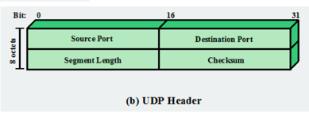

# 프로토콜 구조의 필요성

## 데이터 전송로가 필요
* <strong>발신 시스템</strong> 은 데이터 전송로를 직접 가동하든 목적지 시스템의 식별자를 통신망에 알려야함
* 발신시스템은 목적지 시스템이 <strong>데이터를 받을 준비가 되어 있는지 확인</strong> 
* 발신시스템의 파일 전송 응용 프로그램은 목적지 시스템의 파일관리 프로그램이 파일을 받아 저장할 준비가 되어 있는가를 확인
* 두 시스템에서 사용되는 파일형식이 다른 경우 형식변환기능이 필요

## 상호 협려과정을 여러 모듈
* 프로토콜구조에서 모듈은 수직구조
* 각계층은 다른 시스템과 통신하는데 필요한 기능들 중 자신과 관련된 부분만 수행
* 하부계층의 자세한 내용을 알필요가 없음
* 각 게층은 바로 위 상위 계층에게 서비스
* <strong>각 게층이 변경되더라도 다른 게층에는 전혀 영향을 주지 않도록 정의</strong>

## 프로토콜의 핵심
* 구문론(syntax) : 데이터 블록의 형식
* 의미론(semantics) : 조정과 오류 관리를 위한 제어정보
* 타이밍(timing) : 속도조절과 순서조정

## PDU (Protocol Data unit)
* 네트워크 구조에서 정보를 실어 나르는 기본 단위

## 헤더(header): 프로토콜 제어정보
* 세그먼트(segment) : 전송계층
  * 발신지 / 목적지 포트
  * 순서번호(sequence number)
  * 오류검출코드(checksum)

## 패킷(packet) : 네트워크 계층
* 발신지 / 목적지 컴퓨터 구조
* 서비스 요청

##### 전송계층 헤더는 네트워크 계층에서는 보이지 않으며 네트워크 계층은 전송계츠의 세그멘트 내용에 관한 관심을 둘 필요가 없음

## TCP/IP 란?
* 컴퓨터간 통신을 위해서 컴퓨터와 컴퓨터간의 지역 네트워크(LAN) 혹은 광역네트워크(WAN)에서 원할한 통신을 가능하도록 하기 위한 통신규약(protocol)으로 정의
* WWW, EMAIL, TELNET, FTP등 대부분이 TCP/IP 기반
* 개방성
* 하드웨어, 운영체제, 접속매체에 관계없이 동작할 수 있음

## TCP/IP 각 계층과 예제 프로토콜
* 응용계층
  * TCP/IP 환경의 <strong>사용자 접속 제공</strong>
  * 분산정보서비스를 제공
  * SMTP, FTP, SSH, HTTP
* 전송계층
  * 종단간 <strong>데이터 전달을 수행</strong>
  * TCP, UDP
* 인터넷 계층
  * 상위계층을 네트워크의 <strong>물리적 구성</strong>의 세부사항을 차단
  * <strong>경로지정</strong> 담당, 서비스 품질과 혼잡제어를 제공
  * IPv4, IPv6
* 네트워크 접속 / 데이터 링크
  * 실제 네트워크 하드웨어에 대한 <strong>논리적 인터페이스 담당</strong>
  * 스트림, 패킷 지향적이며 신뢰성기반 전송제공
  * IPv4, IPv6
* 물리게층
  * 물리 매체상의 비트 스트림 전송을 담당
  * 신호부호화 기술, 데이터률, 대역폭, 물리접 접속 등 세부사항
  * Ipv4, IPv6

## TCP/IP와 OSI7 계층

* Application Layer
  * 네트워크를 사용하는 응용프로그램(FTP, Telnet, SMTP) 등으로 이루어짐
  * OSI 계층의 Application Layer 와 presentation layer, session layer 를 모두 포함
* Transport Layer
  * 사용자 데이터그램 프로토콜(UDP)
  * 전송제어 프로토콜(TCP)
  * 비연결형 서비스
    * <strong>연결을 설정하고 해제하는 절차 없이<strong> 바로 데이터를 주고 받는 방식
    * 목적지 주소만을 가지고 통신하기때문에 항상 동일 경로를 사용하지 않음
    * 데이터그램의 손실 확인이나 순서유지를 보장해 주지 않기 때문에 (상위의) 응용 프로그램에서 필요하면 이를 처리
    * 그러나 프로토콜 헤더 처리에 필요한 오버헤드(연결설정 지연 등) 가연결형 서비스보다 적어 <strong> 간단한 패킷을 주고 받는 경우에 유리
    * 이더넷 등의 LAN, X.25이 데이터그램 서비스, IP 패킷 전송, UDP 토콜 등이 해대ㅏㅇ
* Internet Layer
  * 인터넷 프로토콜(IP) : host-to-host protocol
  * 주소변환 프로토콜 (ARP)
  * 역주소변환 프로토콜 (RARP)
  * 인터넷 제어 메시지 프로토콜 (ICMP)
  * 인터넷 그룹 메시지 프로토콜 (IGMP)
  * 인터넷 프로토콜(IP: internet Protocol)을 처리하는 계층
  * 서브네트워크에 무관하게 데이터그램 패킷을 임의의 호스트 사이에 주고 받기 위한 프로토콜로 OSI이 네트워크 계층에 해당하는 기능을 수행
  * 모든 IP패킷은 송신지와 수신지의 주소로서, 각각 32비트의 IP주소를 항상 포함하고 있어야 하며 전송 효율이 그만큼 떨어지게 됨
  * 32비트의 IP 주소의 사용, IP 주소는 인터켓에 접속된 모든 호스트에 대하여 전세계적으로 유일하게 배정되는 주소이어야 함
    * 32비트 IP 주소 10000001 00001010 0000110 0000111를
    dotted decimal IP 주소로 표현하면
* Physical Layer
  * 물리적 계층 즉 이더넷 카드와 같은 하드웨어

## TCP/IP 동작

* TCP 세그먼트
  * 목적지 포트
  * 순서번호
  * 체크섬
* IP 데이터그램
  * 목적지 호스트 주소
* 네트워크 계층 패킷
  * 서브네트워크 정보

## TCP/UDP
* TCP
  * TCP는 <storng> 신뢰성 있는 종점간 데이터 전달</strong>을 책임지며 스트림(stream)형의 서비스를 제공함으로써 상위 게층의 통신 엔티티 사이에 투명한 (transparent) 데이터 전달 환경을 제공
  * TCP에서는 종점 장비간의 연결 설정을 위하여 three-way handshake를 사용
  * 한 번에 전송할 데이터가 UDP 최대 데이터그램 크기보다 크면 뒷 부분이 전송되지 않음
  * TCP는 한번의 명령으로 보낼 수 있는 <strong>데이터의 크기가 제한되지 않으므로 임의의 길이의 큰 파일</strong>을 전송할 수 있다
  * 흐름제어를 패킷 단위가 아니라 데이터 분량(바이트 단위)으로 수행
* UDP
  * UDP(User Datagram Protocol)의 오버헤드는 TCP보다 작다
  * 송신지 및 목적지의 포트번호(16비트), 데이터그램 길이(16비트), Checksum 그리고 사용자 데이터로 구성
  * UDP는 신뢰할 수 있는 종점간 데이터 송수신을 보장하지 않으므로 파일 전송, 메일 서비스 등에는 적합하지 않다
  * 도메인 네임 서비스나, time 서비스와 같이 한 패킷의 송수신으로 어떤 서비스가 이루어지는 경우 많이 사용됨
  * LAN과 같이 전송 오류가 거의 업속 패킷의 전달 순서가 바뀌지 않는 환경에서는 TCP보다 처리 속도가 빠른 UDP가 유리할 수 있다.
  * LAN에서 제공되는 NFS(Network File System)는 UDP를 사용

### TCP 헤더

### UDP 헤더

## IPv4 헤더
* Version number(4bits) : IP 버전 번호
* IHL(internet Header Length) : IP 헤더의 길이 표시
* TOS(Type of service:8bits)= DS + ECN : IP 프로토콜 장치에 대한 입력을 닫음
* Length(16bits) : 프로토콜 헤더를 포함한 패킷의 길이를 담음
* Identification(16bits) : 송신 호스트에 의해 생성되는 유일한 식별자, 단편들의 연결조각을 식별하는데 사용
* Flag(3ibt)
  * bit 0 : Reserved 반드시 0이여함
  * bit 1 : 프래그먼트 되어있지 않음 
  * bit 2 : 프래그먼트 뒤에 있음
* Fragment offset(13bits)
* Time to live(8bits) : 데이터그램이 인터넷 시스템에 남아있도록 허락되어진 최대의 시간을 나타냄
* Protocol(8bits) : 인터넷 데이터그램이 데이터의 위치로 이용된 다음 단계 Protocol을 나타냄
* header Checksum(16bits) : 프로토콜 헤더에 대한 체크섬을 갖는다.
* Source Address (32) : 출발지 IP 주소
* Destination Address(32bits) : 목적지 IP 주소

## IPv6 헤더
* Version(4bits) : IP 버전을 나타낸다(IPv4와 필드명, 역할이 동일함
* Traffic Class(8bits) : IPv4의 ToS. 서비스 클래스(CoS)와 패킷 우선순위를 정의함
* FlowLabel(20bits) : 새롭게 추가된 필드, End-to-End까지 상위 데이터 참조 없이
흐름을 제어하는 것이 가능
* Payload Length(16bits) : 기본 헤더크기를 제외한 확장 헤더 크기를 표시.
* Next Header(8bits) : 확장 헤더 및 상위 프로토콜을 알려주는 필드
* Hot Limit(8bits) : 패킷이 라우터를 통과 할 수 있는 홉수를 알려주는 필드(IPv4의 TTL 필드와 유사)
* Source address(128bits) : 출발지 IP 주소를 알려주는 필드
* Destination address(128bits) : 목적지 IP 주소를 알려주는 필드 Version(4bits) : IP 버전을 나타낸다(IPv4와 필드명, 역할이 동일함

## IPv4, IPv6 비교
* IPv4에서 IHL(헤더 길이) 4bits는 IPv6에서 삭제
  * IPv6에서 헤더의 길이가 40바이트로 고정되었기 때문
* IPv4에 있는 Identification, Flags, Fragmentation Offset 필드는 IPv6헤더에 없음
  * IPv6 Datagram Extension headers 라는 곳에 별도 정의
* IPv4의 header Checksum(16bits)는 삭제
  * IPv6패킷의 비트레벨 오류 감지는 링크 계층에 의해 수행되기 때문

