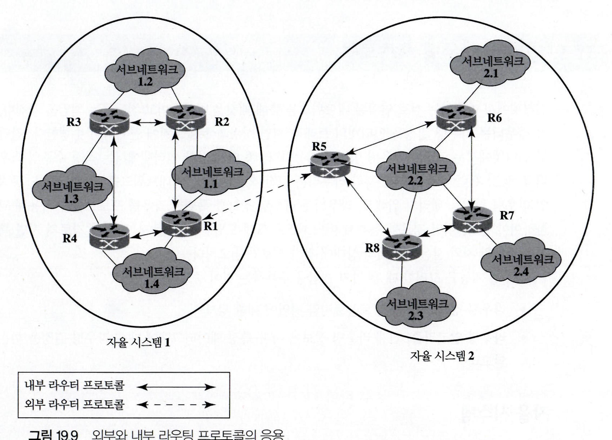
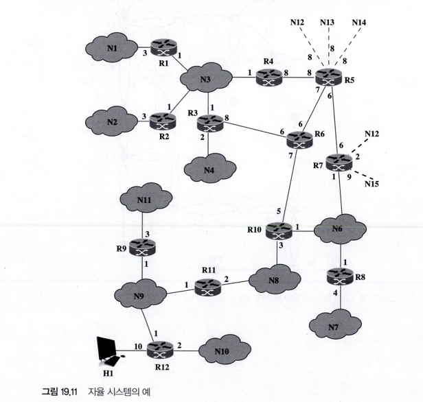
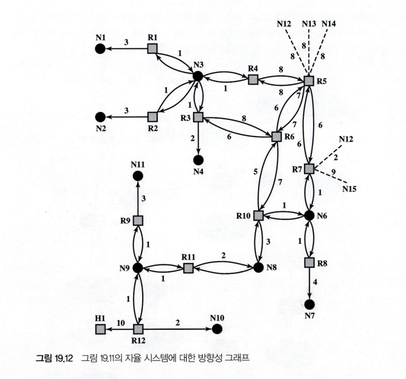
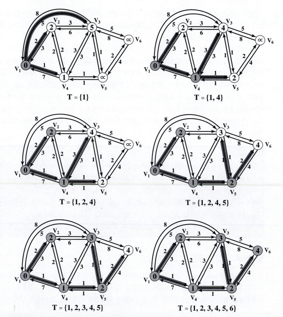
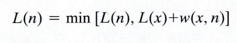
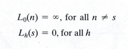
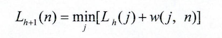
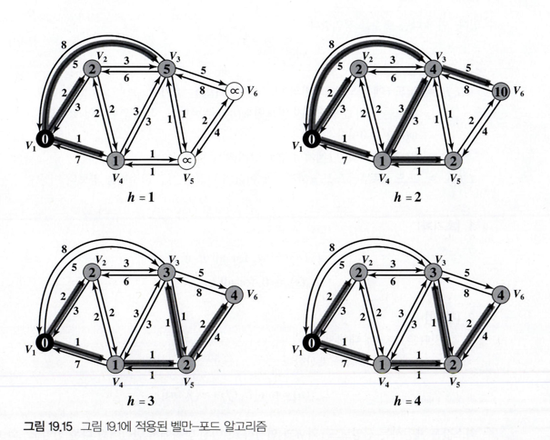

# 라우팅

19.3의 OSPF, 19-4의 Dijkstra, Bellman-Ford 알고리즘 위주로 

## 라우팅이란? 
네트워크의 효율적 이용을 위하여 서로 통신하는 개별 종단 노드 쌍들 사이에 네트워크를 통과하는 경로를 찾는 것

### 라우팅기능의 요구사항
* 정확성
* 단순성
* 견고성
  * 네트워크의 국부적인 실패나 과중한 부하가 걸린 상황에서도 어떤 경로를 통해 패킷을 전달할 수 있는 능력
* 안전성
* 공정성
* 최적성
* 효율성

### 인터넷 라우팅 프로토콜
어떤 경로를 통해서 어느 네트워크에 도달할 수 있는지, 다양한 경로의 지연 특성은 어떠한지 인터넷 상태에 관한 정보가필요

* 라우팅 정보 : 인터넷의 토폴로지와 지연에 대한 정보
* 라우팅 알고리즘 : 현재 라우팅 정보에 따라 특정 데이터그램에 대해 라우팅 결정을 하는 알고리즘

### 자율시스템 (AS: Autonomous System)
* AS는 단일 기관이 관리하는 라우터와 네트워크의 집합
* AS는 동일한 라우팅 프로토콜을 사용해 정보를 교환하는 라우터들의 그룹으로 구성되어 있음
* 고장이 났을 경우를 제외하고, 하나의 AS는 연결되어 있다. 즉 어떤 노드 사이에도 경로가 존재

IRP(내부 라우터 프로토콜)
* AS의 라우터 간의 정보를 교환하는 데 사용

ERP(외부 라우터 프로토콜)
* 서로 다른 AS에 위치한 라우터들 사이에서 라우팅 정보를 전달하기 위해 사용하는 프로토콜

### 라우팅에 대한 접근방법
라우팅 정보를 수집하고 사용하는 세 가지 접근방법
* 거리벡터 라우팅
  * 각 노드에게 이웃노드와 정보를 교환할 것을 요구
  * 모든 라우타가 상당한 양의 정보를 전송
  * 링크 비용에 중대한 변화가 있거나 링크가 사용 가능하지 않게 되면, 이러한 정보가 인터넷을 통해 전해지는 데 상당한 시간이 걸림
* 링크상태 라우팅
  * 라우터가 초기화 될 때 그 라우터의 각 네트워크 인터페이스에 대한 링크 비용 결정
  * 각 라우터는 모든 라우터들의 링크 비용을 받기 때문에 모든 라우터는 전체 구성에 대한 토폴롲지를 만들고, 각 목적지 네트워크의 최단 경로를 계산 가능
* 경로벡터 라우팅
  * 라우팅 지표를 분배하고 특정 라우터를 통해 어느 네트워크에 도달할 수 있는지에 대한 정보를 제공.
  * 경로-벡터는 데이터그램이 이 경로를 따라 전송될 때 중간에 거치는 AS의 목록을 가지고 있기 때문에, 이를 이용하여 정책적인 라우팅을 수행할 수 있음
  * 라우터가 특정 AS를 피하기 위해 특정 경로를 피할 수 있게 함

### 개방형 최단 거리 우선(OSPF) 프로토콜
OSPF 프로토콜은 TCP/IP 네트워크에서 IRP로 사용됨. OSPF는 사용자가 설정한 비용 지표를 바탕으로 최소 비용의 경로를 찾아냄.  
사용자는 비용으로 지연시간, 데이터율, 금전 비용, 또는 다른 요소를 사용 할 수 있음.  
OSPF는 같은 비용의 여러 경로에 대해 부하를 균등하게 배분 가능

 

그래프
* 두 유형의 정점이나 노드:  
  * 라우터
  * 네트어크, 다시 두 유형으로 구분
    * 통과, 이 네트워크의 종단 시스템에서 출발하지도 끝나지도 않는 데이터를 전달하는 네트워크
    * 종점. 통과 네트워크가 아닌 네트워크
* 두 유형의 선
  * 두 라우터가 직접 점-대-점링크로 연결될 때, 두 라우터에 대한 정점을 연결하는 선
  * 라우터가 네트워크에 직접 연결되어 있을 때 라우터 정점과 네트워크 정점을 연결하는 선

방향성 그래프에 대한 데아터베이스는 가 라우터가 유지.  
이 데이터베이스는 인터넷의 다른 라우터들로부터의 링크상태 메시지들을 조합으로 얻어짐.  
다익스트라 알고리즘을 사용해 라우터는 모든 목적지 네트워크에 대한 최소 비용 경로 찾아냄  

## 최소비용 알고리즘

### 다익스트라 알고리즘

한 개의 지정된 발신지 노드로부터 다른 모든 노드들까지의 최단경로들을 구하여 올림차순으로 정리하여 최단경로르구함

#### 알고리즘
* K번째 단게에는 발신지 노드에 가자 가까운 k개의 노드들까지의 최단 경로가 결정됨 ( 이 노드들을 집한 T에 있음)
* K+1 번째 단계에서 T에 포함되지 않는 노드 중에서 발신지 노드로부터 가장 가까운 경로를 가진 노드를 T에 추가
* 각 노드가 T에 추가될때 발신지로부터의 경로가 정의됨

다음과 같이 나타낼 수 있음
* N = 네트워크 내의 노드들의 집합
* s = 발신지 노드
* T = 알고리즘에 의하여 지금까지 편입된 노드의 집합
* w(i, j) = 노드 i에서 노드 j까지의 링크 비용, w(i, j)=0이다. 노드들이 직접 연결되어 있지 않으면 w(i, ㅓ) = 무한대, 직접 연결되어 있으면 w(i, j) >= 0
* L(n) = 현 시점에서 알고리즘이 인지한 s로부터 n까지의 최소비용 경로의 비용, 알고리즘이 종료되면 L(n)은 노드 s로부터 노드 n까지의 최소비용 경로의 비용이 된다.

1. [초기화]
 T = {s}   (즉, 편입된 노드는 발신지 노드 밖에 있다. )
 L(n) = w(s,n) (즉, 이웃 노드들까지의 초기 경로비용을 단순히 링크비용이다. )
 
2. [다음 노드를 찾는다] T에 편입되지 않는 이웃 노드 중에서 노드 s까지의 최소비용 경로를 가진 노드를 찾아서 T에 편입시킨다. 또한 그 노드와 T의 해당 노드를 잇는 링크도 편입시킴

3. [최소비용 경로를 갱신한다]

T에 편입되지 않는 모든 n에 대하여 후자가 최소이면, s에서 n까지의 경로는 s에서 x까지의 경로와 x에서 n가지 가는 선을 이은 것이 된다.
 
알고리즘은 모든 노드들이 T에 편입될 때 종료됨.   
종료시 각 노드 xh아 관련된 값 L(x)는 노드 s로부터 노드 x까지의 최소비용 경로의 비용이 된다.  
단계 2와3을 한번 수행하면 T에 새로운 노드가 하나 편입되고, s로부터 그 노드까지의 최소비용 경로가 정의되며  
이 경로는 T에 편입된 노드만을 통과함  
* k번 반복 후에는 집합 T에 k개의 노드가 존재하고, 노드s로부터 이 노드까지의 최소비용 경로가 정해짐
* 노드 s로부터 T에 편입되지 않은 노드들까지의 모든 가능한 경로 들 중 T에 편입된 노드들만을 통과하는 최소비용의 경로가 존재
* 이 경로는 T의 어떤 노드에서 T에 미편입된 어떤 노드까지의 직접 링크로 끝나게됨

### 벨만 포드 알고리즘
지정된 발신지 노드로부터 많아야 하나으 링크를 갖는 최단경로들을 찾고, 그 다음 많아야 2개의 링크를 가진 최단 경로들을 찾는 방식으로 계속됨

알고리즘에 사용되는 변수
* s = 발신지 노드
* w(i,j) = 노드 i에서 노드j까지의 링크 비용, w(i, j) = 0   노드들이 직접 연결되지 않으면 w(i,j ) = 무한대, 직접연결 w(i,j) >= 0
* h = 알고리즘의 현 단계에서 경로 상의 최대 링크 수
* L(n) = 노드 s로부터 노드 n까지 h개 이하의 링크를 가진 최소비용 경로의 비용

1. [초기화]

2. [갱신]
각 잇따른 h>=0 에 대해서 :  
각 n =/ s 에 대해 다음을 계산 

3.최소값을 제공하는 선임노드 j와 n과 연결하고, 이전 반복에서 만들어진 다른 선임노드와 x의 연결들을 제거,  
노드 s로부터 n까지의 경로는 j와 n을 잇는 링크로 끝남  
h = k 인 단계2의 반보게서는 각 목적지 노드 n에 대해 s로부터 n까지 가는 길이 k+1의 작재적 경로들과  
이전 반복의 끝에서 존재했던 경로를 비교함. 만약 이전의 더 짧은 경로가 더 적은 비용을 가지고 있으면 그 경로는 유지됨  
그렇지 않으면 길이 k + 1 을 가진 새로운 경로가 s로부터 n까지의 경로로 정의됨.이 경로는 s로부터 어떤 노드 j까지 가는 길이  
k의 경로와 노드 j와 노드n을 있는 직접 홈으로 이루어짐

