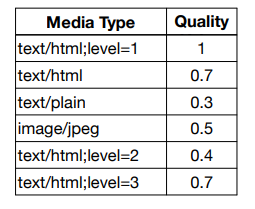

# http 메시지에 모든 것을 전송
* HTML, TEXT
* IMAGE, 음성, 영상, 파일
* JSON, XML(API)
* 서버간에 데이터를 주고 받을 때도 대부분 HTTP 사용

# http 특징
* 클라이언트 서버 구조
* 무상태 프로토콜(stateless), 비연결성
* HTTP 메시지
* 단순함, 확장 가능

# 클라이언트 서버 구조
* Request Response 구조
* 클라이언트는 서버에 요청을 보내고, 응답을 대기
* 서버가 요청에 대한 결과를 만들어서 응답
* 서버와 클라이언트 분리 / 독립적으로 진행 
  * 서버 : 복잡한 로직 , 클라이언트 : UI, 사용자 중심

# 무상태 프로토콜
### stateless
* 서버가 클라이언트 상태를 보존 X
* 장점 : 서버 확장성 높음
* 단점 : 클라이언트가 추가 데이터 전송

# stateful, stateless 차이 정리
* 상태 유지(stateful) : 중간에 다른 서버로 바뀌면 안됨, 항상 같은 서버 유지
* 무상태(stateless) : 중간에 다른 서버로 바뀌어도 됨
  * 갑자기 클라이언트 요청이 증가해도 서버를 대거 투입할 수 있음
  * 수평 확장 유리 (scale out)
* 무상태는 응답 서버를 쉽게 바꿀 수 있음 -> 무한한 서버 증설 가능

# Stateless의 실무 한계
* 모든 것을 무상태로 설계 할 수 있는 경우도 있고 없는 경우도 있음
* 무상태
  * ex)로그인 필요 없는 단순한 서비스 소개 화면
* 상태유지
  * ex)로그인
* 로그인한 사용자의 경우 로그인 했다는 상태를 서버에 유지
* 일반적으로 브라우저 쿠키와 서버 세션등을 사용해서 상태 유지
* 상태 유지는 최소한만 사용

# 비연결성
* HTTP는 기본이 연결을 유지하지 않는 모델
* 일반적으로 초 단위의 이하의 빠른 속도로 응답
* 1시간 동안 수천명이 서비슬ㄹ 사용해도 실제 서버에서 동시에 처리하는 요청은 수십개 이하로 매우 적음
  * ex)웹 브라우저에서 계속 연속해서 검색 버튼을 누르진 않음
  * 서버자원을 효율적으로 사용할 수 있음

## 비연결성 한계와 극복
* TCP/IP 연결을 새로 맺어야 함 - 3 way handshake 시간 추가
  * TCP SYN
  * TCP SYN ANK
  * TCP ANK
* 웹 브라우저로 사이트 요청시 HTML 뿐만 아니라 javascript, css, 등 많은 자원이 함께 다운로드
* 지금은 HTTP 지속 연결(Persistent Connections)로 문제 해결

# HTTP 메시지

#시작 라인
## 요청 메시지
* start-line = request-line / status-line
* request-line = method SP(공백) request-target SP HTTP-version CRLF(엔터)
* HTTP 메서드 (GET:조회)
* 요청 대상 (/search?q=hello&hl=ko)
* HTTP VERSION / 마지막
## 요청 메시지 -HTTP 메서드
* 종류 : GET, POST, PUT, DELETE 
* 서버가 수행해야 할 동작 지정
  * GET:리소스 조회
  * POST:요청 내역 처리

## 요청 메시지 -요청 대상
* absoulte-path[?query] (절대경로[?쿼리])
* 절대경로 = "/"로 시작하는 경로
## 요청 메시지 - HTTP 버전
* HTTP Version
# 시작 라인
## 응답 메시지
* start-line = request-line / <strong>status-line</strong>
* status-line = HTTP-version SP status-code SP reason-phrease CRLF ? 
* HTTP 버전
* HTTP 상태 코드 : 요청 성공, 실패 나타냄
  * 200 : 성공
  * 400 : 클라이언트 요청 오류
  * 500 : 서버 내부 오류
## HTTP 헤더

## HTTP 헤더 용도

* HTTP 전송에 필요한 모든 부가 정보
  * ex) body내용, 크기, 인증, 클라이언트 정보,서버 정보,,,etc
## HTTP 메시지 바디
* 실제 전송할 데이터
* HTML 문저, 이미지, 영상, JSON 등등 btye로 표한할 수 있는 모든 데이터 전송 가능