## HHTP 헤더2

## 캐시 기본 동작
* 캐시가 없을 때 
###### 첫번째 요청
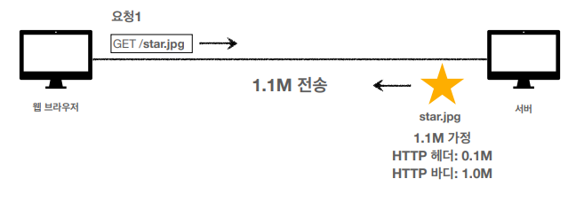
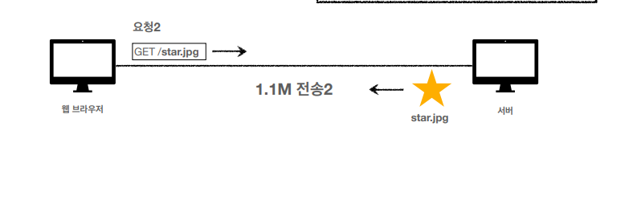
* 데이터가 변경되지 않아도 계속 네트워크를 통해서 데이터를 다운로드 받아야함
* 인터넷 네트워크는 매우 느리고 비쌈.
* 브라우저 로딩 속도가 느리다.
* 느린 사용자 경험

## 캐시 적용
##### 첫번째 요청
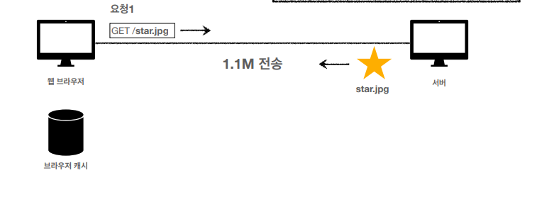
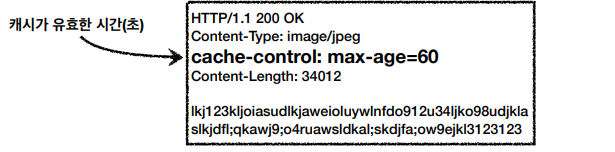
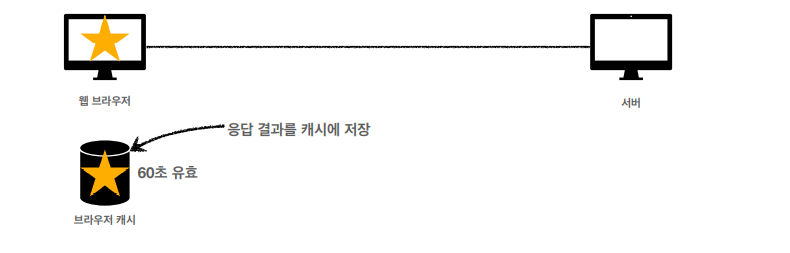
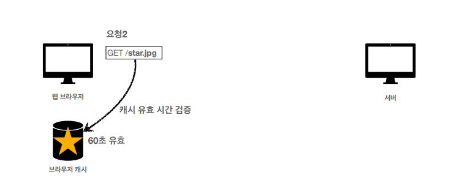
* 캐시 덕분에 캐시 가능 시간동안 네트워크를 사용하지 않아도 된다.
* 비싼 네트워크 사용량을 줄일 수 있다.
* 브라우저 로딩 속도가 매우 빠르다.
* 빠른 사용자 경험

## 캐시 적용
##### 세 번째 요청 - 캐시 시간 초과

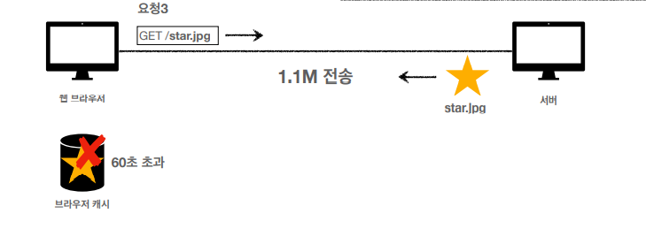
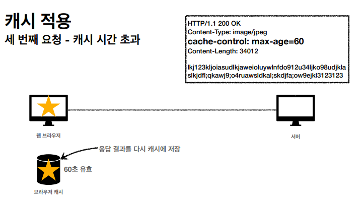
* 캐시 유효 시간이 초과하면, 서버를 통해 데이터를 다시 조회하고, 캐시를 갱신한다.
* 이때 다시 네트워크 다운로드가 발생한다.

## 검증 헤더아 조건부 요청1
##### 캐시 시간 초과
* 캐시 유효 시간이 초과해서 서버에 다시 요청하면 다음 두 가지 상황이 나타난다.
  1. 서버에서 기존 데이터를 변경함
  2. 서버에서 기존 데이터를 변경하지 않음

* 캐시 만료후에도 서버에서 데이터를 변경하지 않음
* 생각해보면 데이터를 전송하는 대신에 저장해 두었던 캐시를 재사용 할 수 있다.
* 단 클라이언트의 데이터와 서버의 데이터가 같다는 사실을 확인할 수 있는 방법 필요

## 검증 헤더 추가
#### 첫 번째 요청
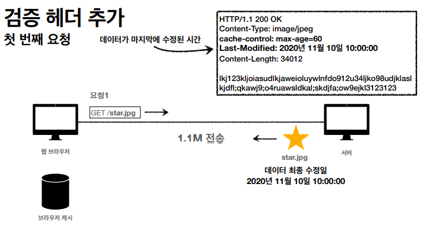
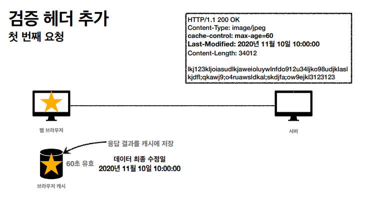
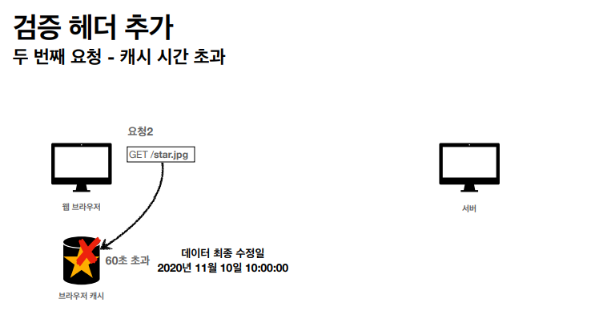
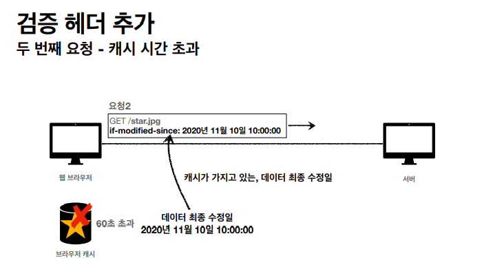
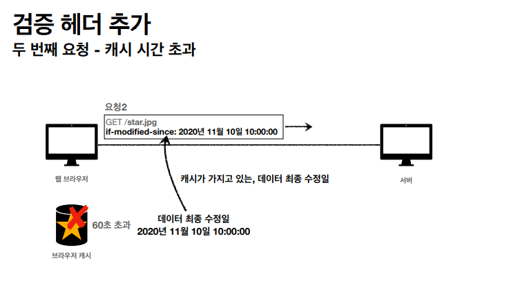
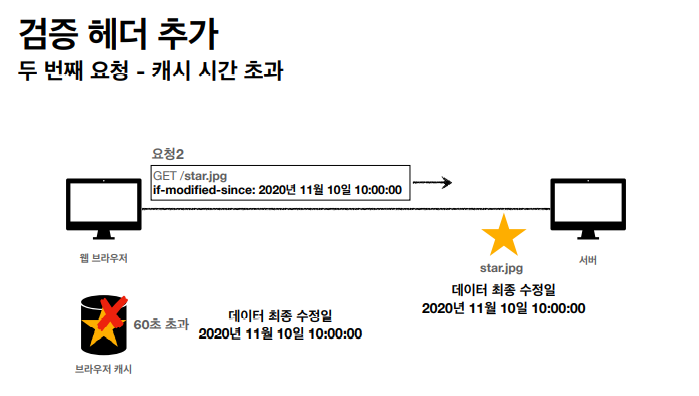
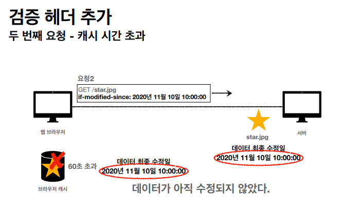
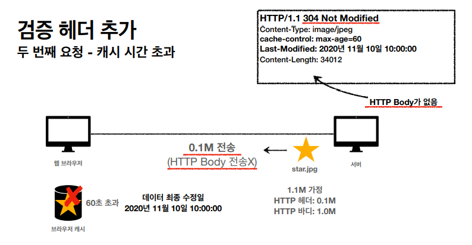
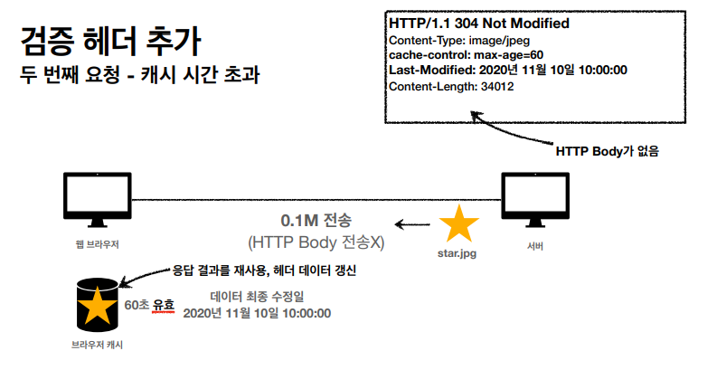
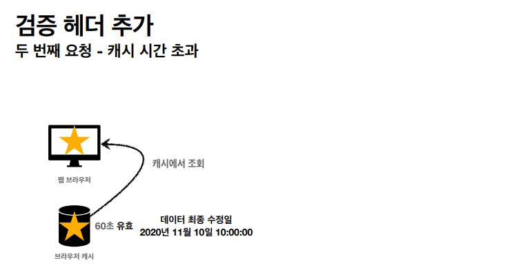
## 정리
* 캐시 유효 시간이 초과해도, 서버의 데이터가 갱신되지 않으면
* 304 Not Modified + 헤더 메타 정보만 응답(바디x)
* 클라이언트는 서버가 보낸 응답 헤더 정보로 캐시의 메타 정보를 갱신
* 클라이언트는 캐시에 저장되어 있는 데이터 재활용
* 결과적으로 네트워크 다운로드가 발생하지만 용량이 적은 헤더 정보만 다운로드
* 매우 실용적인 해결책

## 검증 헤더와 조건부 요청
* 검증 헤더
  * 캐시 데이터와 서버 데이터가 같은지 검증하는 데이터
  * Last-Modified, ETag
* 조건부 요청 헤더
  * 검증 헤더로 조건에 따른 분기
  * If-Modified-Since: Last-Modified 사용
  * If-None-Match:ETag 사용
  * 조건이 만족하면 200 OK
  * 조건이 만족하지 않으면 304 Not Modified

#### 예시
* If_Modified-Since: 이후에 데이터가 수정되었으면?
  * 데이터 미변경 예시
    * 캐시: 2020년 11월 10일 10:00:00 vs 서버: 2020년 11월 10일 10:00:00
    * 304 Not Modified, 헤더 데이터만 전송(BODY 미포함)
    * 전송 용량 0.1M
  * 데이터 변경 예시
    * 캐시: 2020년 11월 10일 10:00:00 vs 서버: 2020년 11월 10일 11:00:00
    * 200 OK, 모든 데이터 전송(BODY 포함)
    * 전송 용량 1.1M (헤더 0.1M 바디 1.0M)

## 검증 헤더와 조건부 요청
##### Last-Modified, If-Modified-Since 단점
* 1초 미만 단위로 캐시 조정이 불가능
* 날짜 기반의 로직 사용
* 데이터를 수정해서 날짜가 다르지만, 같은 데이터를 수정해서 데이터 결과가 똑같은 경우
* 서버에서 별도의 캐시 로직을 관리하고 싶은 경우
  * ex) 스페이스나 주석처럼 크게 영향이 없는 변경에서는 캐시를 유지하고 싶은 경우

##### ETag, If-None-Match
* ETag(Entity Tag)
* 캐시용 데이터에 임의의 고유한 버전 이름을 달아둠
  * ex) ETag: "v1.0", ETag: "a2jiodwjekjl3"
* 데이터가 변경되면 이 이름을 바꾸어서 변경함
  * ex) Etag: "aaaaa" -> ETag: "bbbbb"
* 진짜 단순하게 ETag만 보내서 같으면 유지, 다르면 다시 받기
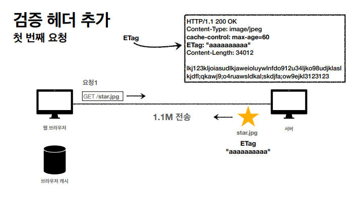
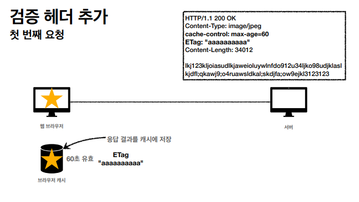
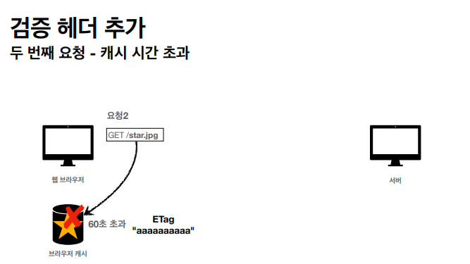
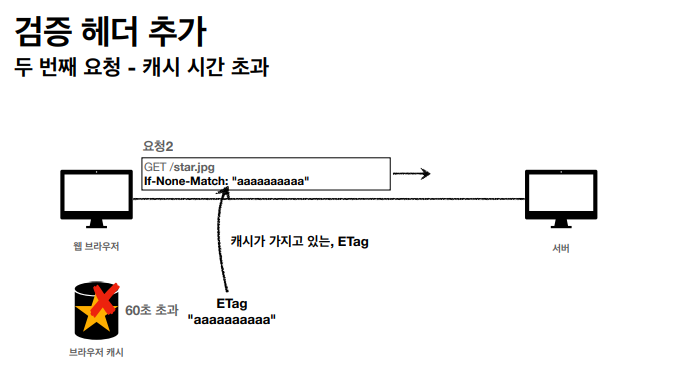

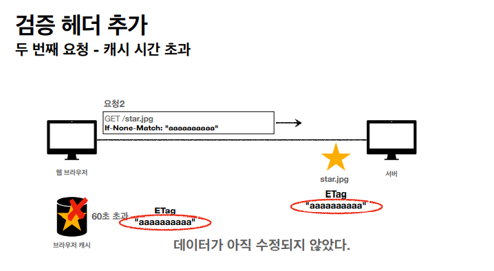
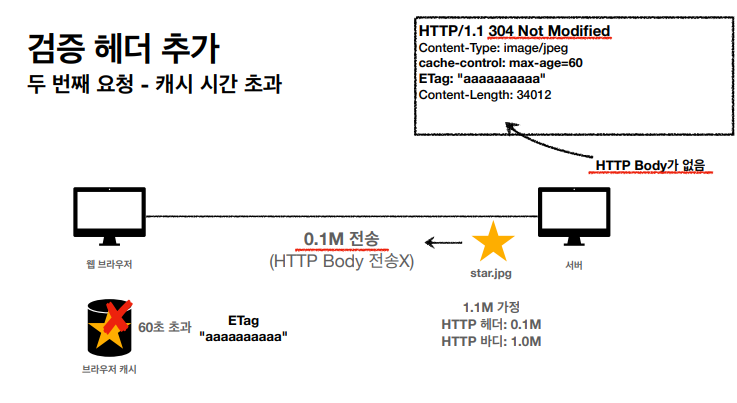
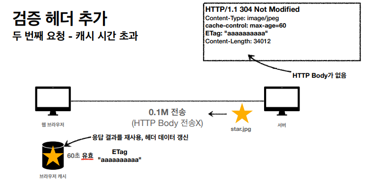
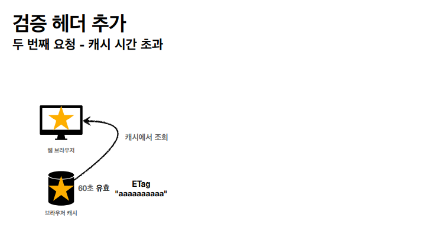
#### ETag, If-None-Match 정리
* 진짜 단순하게 ETag만 서버에 보내서 같으면 유지, 다르면 다시 받기
* 캐시 제어 로직을 서버에서 완전히 관리
* 클라이언트는 단순히 이 값을 서버에 제공(클라이언트는 캐시 매커니즘 모름)
* ex)
  * 서버는 베타 오픈 기간인 3일 동안 파일이 변경되어도 ETag를 동일하게 유지
  * 애플리케이션 배포 죽에 맞추어 ETag 모드 갱신

## 캐시 제어 헤더

## Cache-Control
##### 캐시 지시어(directives)
* Cache-Control: max-age
  * 캐시 유효 시간, 초 단위
* Cache-Control: no-cache
  * 데이터는 캐시해도 되지만, 항상 원(origin)서버에 검증하고 사용
* Cache-Control: no-store
  * 데이터에 민감한 정보가 있으므로 저장하면 안됨(메모리에서 사용하고 최대한 빨리 삭제)

## Pragma
##### 캐시 제어(하위 호환)
* Pragma: no-cache
* HTTP 1.0 하위 호한

## Expires
##### 캐시 만료일 지정(하위 호환)
* expires: Mon, 01 Jan 1990 00:00:00 GMT
* 캐시 만료일을 정확한 날짜로 지정
* HTTP 1.0 부터 사용
* 지금은 더 유연한 Cache-Control: max-age 권장
* Cache-Control: max-age와 함께 사용하면 Expires는 무시

## 검증 헤더와 조건부 요청 헤더
* 검증 헤더
  * ETag: "v1.0", ETag : "asid93jkrh2l"
  * Last-Modified: Thu, 04 Jun 2020 07:19:24 GMT
* 조건부 요청 헤더
  * If-Match, If-None-Match: ETag 값 사용
  * If-Modified-Since, If-Unmodified-Since: Last-Modified 값 사용

## 프록시 캐시
## 원 서버 직접 접근
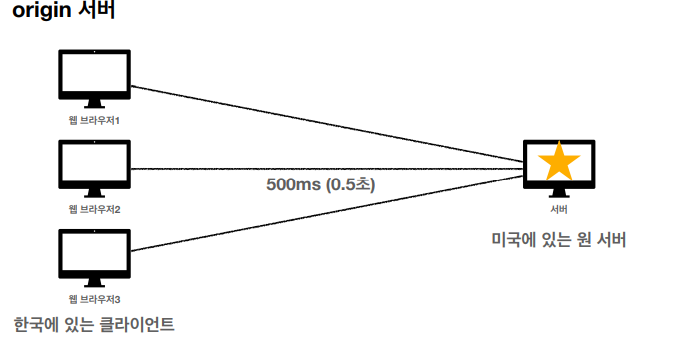
## 프록시 캐시 도입
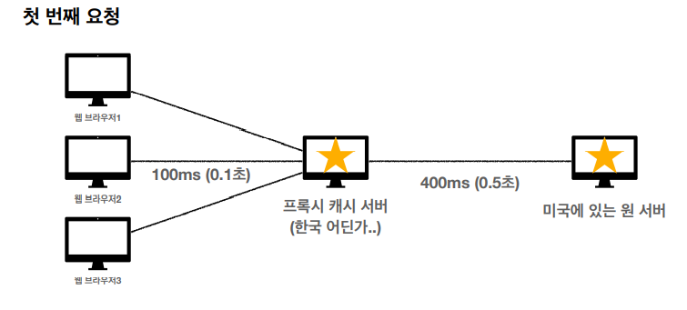
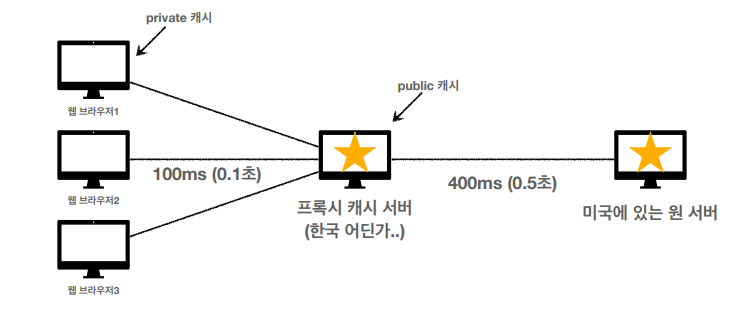

## Cache-Control
##### 캐시 지시이(directives) - 기타
* Cache-Control: public
  * 응답이 public 캐시에 저장되어도 됨
* Cache-Control: private
  * 응답이 해당 사용자만을 위한 것임, private 캐시에 저장해야 함
* Cache-Control: s-max-age
  * 프록시 캐시에만 적용되는 max-age
* Age: 60(HTTP헤더)
  * 오리진 서버에서 응답 후 프록시 캐시 내에 머문 시간(초)

## 무효화

## Cache-Control
##### 확실한 캐시 무효화 응답
* Cache-Control: no-cache, no-store, must-revalidate
* Pragma: no-cache
  * HTTP 1.0 하위 호환
* Cache-Control: no-cache
  * 데이터는 캐시해도 되지만, 항상 원 서버에 검증하고 사용
* Cache-Control: must-revalidate
  * 캐시 만료후 최초 조회시 원 서버에 검증해야함
  * 원 서버 접근 실패시 반드시 오류가 발생해야함 - 504(Gateway timeout)
* Cache-Control: must-revalidate
  * 캐시 만료후 최초 조회시 원 서버에 검증해야함
  * 원 서버 접근 실패시 반드시 오류가 발생해야함 - 504(Gateway Timeout)
  * must-revalidate는 캐시 유효 시간이라면 캐시를 사용함
* Pragma: no-cache
  * HTTP 1.0 하위 호환

## no-cache 기본 동작
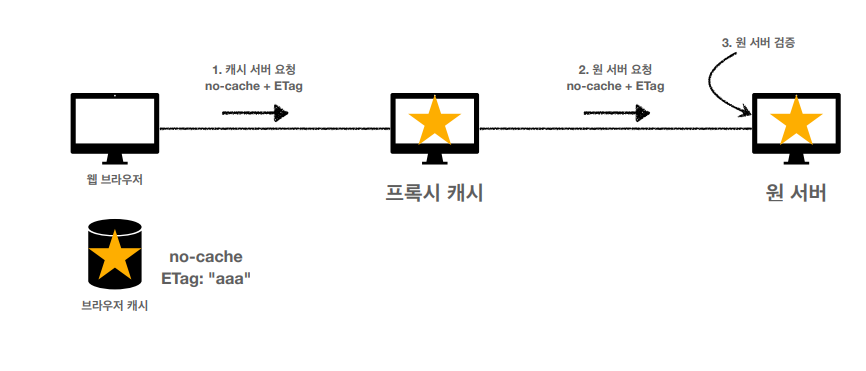
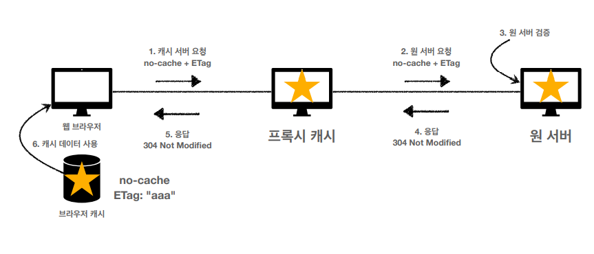
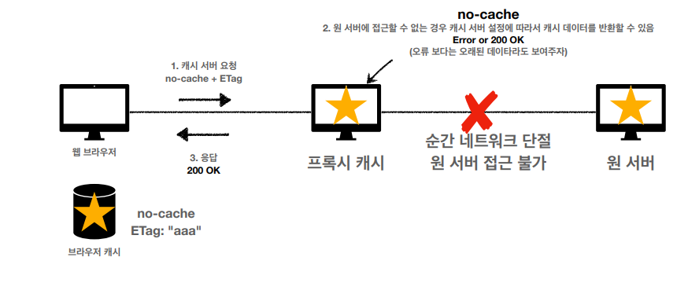

## must-revalidate
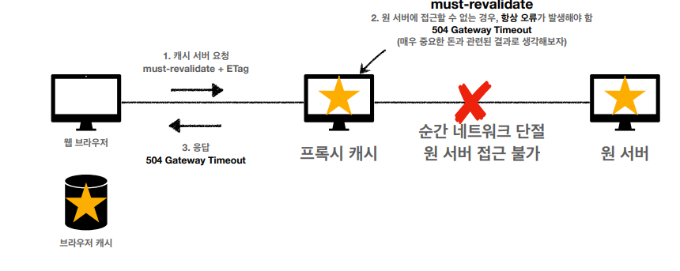
