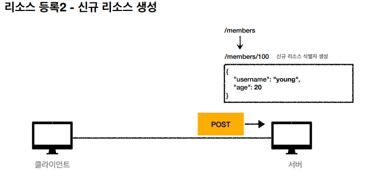

## HTTP 메서드

* HTTP API를 만들어보자
* HTTP 메서드 - GET, POST
* HTTP 메서드 - PUT, PATCH, DELETE
* HTTP 메서드의 속성

## 요구사항
#### 회원 정보 관리 API를 만들어라
* 회원 목록 조회
* 회원 조회
* 회원 등록
* 회원 수정
* 회원 삭제

## APU URI 설계
#### URI(Uniform Resource Identifier)

## 가장 중요한 것은 <strong>리소스 식별</strong>

* 리소스의 의미?
  * 회원을 등록하고 수정하고 조회하는것이 리소스가 아님
  * 예) 미네랄을 캐라 -> 미네랄이 리소스
  * 회원이라는 개념 자체가 바로 리소스
* 리소스를 어떻게 식별하는게 좋을까?
  * 회원을 등록하고 수정하고 조회하는 것을 모두 배제
  * 회원이라는 리소스만 식별하면 된다. -> 회원 리소스를 URI에 매핑

## API URI 설계
 * <strong>회원</strong> 목록조회
 * <strong>회원</strong> 조회
 * <strong>회원</strong> 등록
 * <strong>회원</strong> 수정
 * <strong>회원</strong> 삭제
### 리소스 식별, URI 계층 구조 활용
* 회원 목록 조회 /members
* 회원 조회 /members/{id}
* 회원 등록 /members/{id}
* 회원 수정 /members/{id}
* 회원 삭제 /members/{id}
* 참고 : 게층 구조상 상위를 컬렉션으로 보고 복수단어 사용 권장(member -> members)
## 리소스와 행위를 분리
#### 가장 중요한 것은 리소스를 식별하는 것
* URI는 리소스만 식별!
* 리소스와 해당 리소스를 대상으로 하는 행위를 분리
  * 리소스: 회원
  * 행위: 조회, 등록, 삭제, 변경
* 리소스는 명사, 행위는 동사(미네랄을 캐랑)
* 행위(메소드)는 어떻게 구분?

## HTTP 메서드 종류
#### 주요 메서드
* GET: 리소스 조회
* POST: 요청 데이터 처리, 주로 등록에 사용
* PUT: 리소스를 대체, 해당 리소스가 없으면 생성
* PATCH: 리소스 부분 변경
* DELETE: 리소스 삭제
#### 기타 메서드
* HEAD: GET과 동일하지만 메시지 부분을 제외하고, 상태 줄과 헤더만 반환
* OPTIONS: 대상 리소스에 대한 통신 가능옵션(메서드)를 설명(주로 CORS에서 사용 cors가뭐징?)

## GET

* 리소스 조회
* 서버에 전달하고 싶은 query(쿼리 파라미터, 쿼리 스트링)를 통해서 전달
* 메시지 바디를 사용해서 데이터를 전달할 수 있지만, 지원하지 않는 곳이 많아서 권장하지 않음

## POST

* 요청 데이터 처리
* 메시지 바디를 통해 서버로 요청 데이터 전달
* 서버는 요청 데이터를 처리
  * 메시지 바디를 통해 들어온 데이터를 처리하는 모든 기능을 수행함
* 주로 전달된 데이터로 신규 리소스 등록, 프로세스 처리에 사용

### 요청 데이터를 어떻게 처리한다는 뜻일까?
* 스펙: POST 메서드는 대상 리소스가 리소스의 고유한 의미 체계에 따라 요청에 포함 된 표현을 처리하도록 요청합니다.
* 에를 들어 POST는 다음과 같은 기능에 사용됩니다.
  * HTML 양식에 입력된 필드와 같은 데이터 블록을 데이터 처리 프로세스에 제공
    * ex)HTML FORM에 입력한 정보로 회원 가입, 주문 등에서 사용
  * 게시판, 뉴스 그룹, 메일링 리스트, 블로그 또는 유사한 기사 그룹에 메시지 게시
    * ex) 게시판 글쓰기, 댓글 달기
  * 서버가 아직 식별하지 않은 새 리소스 생성
    * ex)신규 주문 생성
  * 기존 자원에 데이터 추가
    * ex) 한 문서 끝에 내용 추가하기
* 정리: 이 리소스 URI에 POST 요청이 오면 요청 데이터를 어떻게 처리할지 리소스마다 따로 정해야 함 -> 정해진 것이 없음

### 정리
1. 새 리소스 생성(등록)
   1. 서버가 아직 식별하지 않는 새 리소스 생성
2. 요청 데이터 처리
   1. 단순히 데이터를 생성하거나, 변경하는 것을 넘어서 프로세스를 처리해야 하는 경우
   2. ex) 주문에서 결제완료-> 배달시작 -> 배달완료 처럼 단순히 값 변경을 넘어 프로세스의 상태가 변경되는 경우
   3. POST의 결과로 새로운 리소스가 생성되지 않을 수도 있음
   4. ex) POST /orders/{orderId}/start-delivery (컨트롤 URI라고 부름)
3. 다른 메서드로 처리하기 애매한 경우
   1. ex) JSON으로 조회 데이터를 넘겨야 하는데, GET 메서드를 사용하기 어려운 경우
   2. 애매하면 POST

## PUT
* 리소스를 대체
  * 리소스가 있으면 대체
  * 리소스가 없으면 생성
  * 쉽게 얘기해서 덮어버림
* 중요!
  * 클라이언트가 리소스를 식별함
    * 클라이언트가 리소스 위치를 알고 URI 지정
    * POST와의 차이점

## PATCH 
#### 리소스 부분 변경

## DELETE
* 리소스 제거

## HTTP 메서드의 속성
* 안전(Sate Methods)
* 멱등(Idempotent Methods)
* 캐시가능(Cacheable Methods)

## 안전
* 호출해도 리소스를 변경하지 않는다.
* 계속 호출해서 로그 같은게 쌓여서 발생하는 장애는?
  * 해당부분에 대해선 생각x

## 멱등
#### Idempotent
* f(f(x)) = f(x)
* 한 번 호출하든 두 번 호출하든 100번 호출하든 결과가 똑같음
* 멱등 메서드
  * GET: 한 번 조회하든, 두 번 조회하든 같은 결과가 조회됨
  * PUT: 결과를 대체, 따라서 같은 요청을 여러번 해도 최종 결과는 같음
  * DELETE: 결과를 삭제함, 같은 요청을 여러번 해도 삭제된 결과는 똑같음
  * <STRONG>POST</STRONG>: 멱등이 아님, 두 번 호출하면 같은 결제가 중복해서 발생할 수 있음
* 활용
  * 자동 복구 매커니즘
  * 서버가 TIMEOUT 등으로 정상 응답을 못줬을때, 클라이언트가 같은 요청을 해도 되는가? -> 판단의 근거가됨
* 외부 요인으로 중간에 리소스가 변경되는 것 까지는 고려하지 않음

## 캐시가능
#### Cacheable 
* 응답 결과 리소스를 캐시해서 사용해도 되는가?
* GET, HEAD, POST, PATCH 캐시가능
* 실제로는 GET, HEAD 정도만 캐시로 사용
  * POST, PATCH는 본문 내용까지 캐시 키로 고려해야 하는데, 구현이 쉽지 않음

