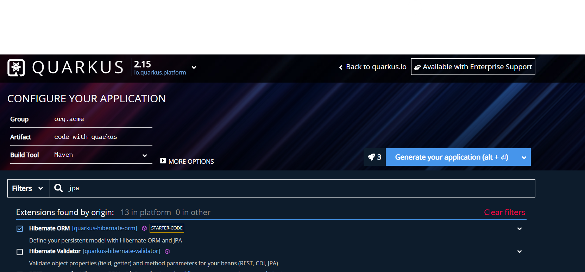

## what is quarkus?
<br>
컨테이너 사용을 전제로 개발된 프레임워크로 빌드 타임 메타데이터 처리, 기본 이미지 사전 부팅 등의 기능으로 적은 메모리 사용량, 빠른 시작시간 등의 이점이 있는 기능. 
spirng이 런타임에 수행하는 해결 프로세스를 빌드시간으로 이동

<br>

#### 환경
* JKD 11 버전 이상 (jdk 11 사용)
* Apahce Maven 3.6
* Optionally Quarkus CLI (maven, gradle 사용 가능)

## quarkus project를 맏는 방법

* CLI 에서 create 명령어를 통해 생성
* https://code.quarkus.io/ 를 통해 생성

#### CLI 에서 생성
<br>

quarkus cli install <br>
```
curl -Ls https://sh.jbang.dev | bash -s - trust add https://repo1.maven.org/maven2/io/quarkus/quarkus-cli/
curl -Ls https://sh.jbang.dev | bash -s - app install --fresh --force quarkus@quarkusio
```

quarkus create app  "project_name" --extension=',,'
```
quarkus create app org.acme:getting-started \
    --extension='resteasy-reactive'
```
##### quakrus에서 extension이란?
quarkus applicatio 에서 작동되는 간단한 모듈들,, <br>
ex) JDBC DRIVER - mysql, hibernate ORM, WebSockets,,etc

#### code.quakrus.io 에서 생성




#### JAX - rs 로 API 구현
 jax rx ?  <br>
 자바 플랫폼에서 경량화된 REST 방식의 웹 애플리케이션 구현을 지원하는 자바 API 이다


```
import javax.ws.rs.GET;
import javax.ws.rs.Path;
import javax.ws.rs.Produces;
import javax.ws.rs.core.MediaType;

@Path("/hello")
public class GreetingResource {

    @GET
    @Produces(MediaType.TEXT_PLAIN)
    public String hello() {
        return "Hello from RESTEasy Reactive";
    }
}
```

#### Running the application
* CLI
    * quarkus dev   
* Maven
    * /mvnw quarkus:dev
* gradle
    * ./gradlew --console=plain quarkusDev

#### injection 사용
<br>
quarkus 에는 ArC기반의 CDI(context and Dependcy Injection) 의존성 주입 (dependency injection) 방법으로  객체를 관리ㄹ함(https://quarkus.io/guides/cdi-reference)

<br>

#####  Arc in Quarkus?
* Quarkus ArC is a build-time oriented dependency injection based on CDI 2.0.


[spring 에서의 컨테이너와 bean](../springbasic/spring_container_bean.md)


* @ApplicationScoped annotaion 을 통해 bean으로 등록 
```
package org.acme;

import javax.enterprise.context.ApplicationScoped;

@ApplicationScoped
public class GreetingService {

    public String greeting(String name) {
        return "hello " + name;
    }

}
```
* @inject annotaio 을 통해 bean을 주입받음 (new 로 새로운 객체 생성x)
```
package org.acme;

import javax.inject.Inject;
import javax.ws.rs.GET;
import javax.ws.rs.Path;
import javax.ws.rs.Produces;
import javax.ws.rs.core.MediaType;

@Path("/hello")
public class GreetingResource {

    @Inject
    GreetingService service;

    @GET
    @Produces(MediaType.TEXT_PLAIN)
    @Path("/greeting/{name}")
    public String greeting(String name) {
        return service.greeting(name);
    }

    @GET
    @Produces(MediaType.TEXT_PLAIN)
    public String hello() {
        return "hello";
    }
}
```


```
$ curl -w "\n" http://localhost:8080/hello/greeting/quarkus
```
결과 hello quarkus <br>

### testing
* depedncy<br>
pom.xml
```
<dependency>
    <groupId>io.quarkus</groupId>
    <artifactId>quarkus-junit5</artifactId>
    <scope>test</scope>
</dependency>
<dependency>
    <groupId>io.rest-assured</groupId>
    <artifactId>rest-assured</artifactId>
    <scope>test</scope>
</dependency>
```
* quarkus 는 Junit 5 test를 지원하는데,  default verssion 에서는 Junit5을 지원하지 않기 때문에 Surefire Maven Plugin 셋팅이 필요함
```
<plugin>
    <artifactId>maven-surefire-plugin</artifactId>
    <version>${surefire-plugin.version}</version>
    <configuration>
       <systemPropertyVariables>
          <java.util.logging.manager>org.jboss.logmanager.LogManager</java.util.logging.manager>
          <maven.home>${maven.home}</maven.home>
       </systemPropertyVariables>
    </configuration>
</plugin>
```


src/test/java/org/acme/GreetingResourceTest.java
```
import io.quarkus.test.junit.QuarkusTest;
import org.junit.jupiter.api.Test;

import java.util.UUID;

import static io.restassured.RestAssured.given;
import static org.hamcrest.CoreMatchers.is;

@QuarkusTest
public class GreetingResourceTest {

    @Test    
    public void testHelloEndpoint() {
        given()
          .when().get("/hello")
          .then()
             .statusCode(200)    
             .body(is("hello"));
    }

    @Test
    public void testGreetingEndpoint() {
        String uuid = UUID.randomUUID().toString();
        given()
          .pathParam("name", uuid)
          .when().get("/hello/greeting/{name}")
          .then()
            .statusCode(200)
            .body(is("hello " + uuid));
    }

}
```
### 패키징
* CLI
    * quarkus build
    * ./mvnw isntall
    * ./gradlew build
* 수행시 /target에 파일 생성
    * quarkus-app directory에 quearkus-run.jar
* run application 
    * java -jar target/quearkus/app/quarkus-run.jar
