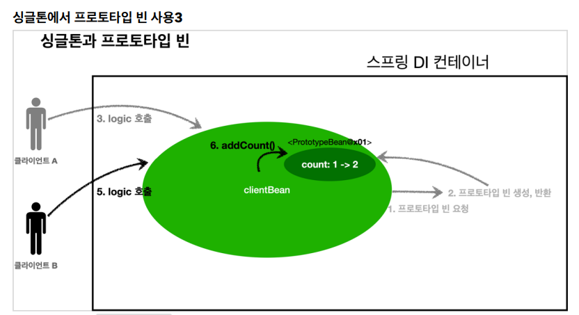

## 빈 스코프

#### 빈 스코프란?
* 스프링 빈 -> 스프링 컨테이너의 시작과 함꼐 생성되어 스프링 컨테이너가 종료될 떄까지 유지됨
  * 스프링 빈이 기본적으로 싱글톤 스코프로 생성되기 때문
* 스코프? -> 빈이 존재할 수 있는 범위

<strong>스프링은 다음과 같은 다양한 스코프를 지원</strong>
* 싱글톤: 기본 스코프, 스프링 컨테이너의 시작과 종료까지 유지되는 가장 넓은 범위의 스코프
* 프로토탕타입 : 스프링 컨테이너는 프로토타입 빈의 생성과 의존관계 주입까지만 관여하고 더는 관리 하지 않는 매우 짧은 범위의 스코프
* 웹 관련 스코프:
  * request: 웹 요청이 들어오고 나갈떄 까지 유지되는 스코프이다.
  * session: 웹 세션이 생성되고 종료될 때 까지 유지되는 스코프
  * application: 웹의 서블릿 컨텍스트와 같은 범위로 유지되는 스코프

##### 빈 스코프 지정 

<strong> 컴포넌트 스캔 자동 등록</strong>

```
    @Scope("prototype")
    @Component
    public class HelloBean{}
```
<strong> 수동 등록</strong>

```
@Scope("prototype")
@Bean
PrototypeBean HelloBean() {
 return new HelloBean();
}
```

##### 프로토타입 스코프
* 싱글톤 스코프의 빈을 조회하면 스프링 컨테이너는 항상 같은 인스턴스의 스프링 빈 반환
* 프토토타입 스코프를 스프링 컨테이너에 조회하면 항상 새로운 인스턴스를 생성해서 반환

싱글톤 빈 요청

프로토타입 빈 요청


##### 프로타타입 빈의 특징 정리
* 스프링 컨테이너에 요청할 때 마다 새로 생성됨
* 스프링 컨테이너는 프로토타입 빈의 생성과 의존관계 주입 그리고 초기화까지만 관여
* 종료 메서드가 호출되지 않음
  * @PreDestroy xxx
* 그래서 프로토타입 빈은 프로토타입 빈을 조회한 클라이언트가 관리해야 한다. 종료 메서드에 대한 호출도 클라이언트가 직접 관리해야함

##### 싱글톤 빈과 함께 사용시 문제점

###### 싱글톤에서 프로토타입 빈 사용

* clientBean은 싱글톤이므로, 보통 스프링 컨테이너 생성 시점에 함께 생성되고, 의존관계 주입도 발생한다.
* 1. clientBean은 의존관계 자동 주입을 사용. 주입 시점에 스프링 컨테이너에 프로토타입 빈을 요청함
* 2. 스프링 컨테이너느 프로토타입 빈을 생성해 clientBean에 반환, 프로토타입 빈의 count필드 값은 0
* 이제 clintBean은 프로토타입 빈을 내부 필드에 보관( 정확히는 참조값을 보관?)

* 클라이언트 A는 clientBean을 스프링 컨테이너에 요청해서 받는다. 싱글톤이므로 항상 같은 clientBean이 반환됨
* 3. 클라이언트 A는 clientBean.logic()을 호출함
* 4. clientBean은 prototypeBean의 addCount() 를 호출해 프로토타입 빈의 count값을 증가 count 값 1이됨

* 클라이언트 B는 clientBean을 스프링 컨테이너에 요청해서 받음. 싱글톤이므로 항상 같은 clientBean 반환
* 여기서 중요한점, clientBean이 내부에 가지고 있는 프로토타입 빈은 이미 과거에 주입이 끝난 빈임. 주입 시점에 스프링 컨테이너에 요청해서 프로토타입 빈이 새로 생성된 것이지, 사용할 때마다 새로 생성되는 것이 아님
* 5. 클라이언트 B는 clientBean.logic()을 호출
* 6. clientBean은 prototypeBean의 addCount() 를 호출해 프로토타입 빈의 count를 증가 -> 원래 count값이 1이였으므로 2가 됨.

스프링은 일반적으로 싱글톤 빈을 사용하므로, 싱글톤 빈이 프로토타입 빈을 사용 하게 된다. 그런데 싱글톤 빈은 생성 시점에만 의존관계 주입을 받기 때문에, 프로토타입 빈이 새로 생성되기는 하지만, 싱글톤 빈과<br>
함께 계속 유지되는 것이 문제다.
<br>
아마 원하는 것이 이런 것은 아닐 것이다. 프로토타입 빈을 주입시점에만 새로 생성하는게 아니라, 사용할 때 마다 새로 생성해서 사용하는 것을 원할 것이다.

### 프로토타입 스코프 - 싱글톤 빈과 함께 사용시 Provider로 문제 해결

##### ObjectProvider
지정한 빈을 컨테이너에서 대신 찾아주는 DL(Dependency LookUp) 서비스를 제공하는 것이 바로 ObjectProvider이다. 참고로 과거에는 ObjectFactory가 있었는데, 여기에 편의 기능을 추가해서 ObjectProvider가 만들어졌다.
```java
@Autowired
private ObjectProvider<PrototypeBean> prototypeBeanProvider;

public int logic() {
 PrototypeBean prototypeBean = prototypeBeanProvider.getObject();
 prototypeBean.addCount();
 int count = prototypeBean.getCount();
 return count;
}
```
* prototypeBeanProvider.getObject()을 통해 항상 새로운 프로토타입 빈이 생성됨
* ObjectProvider의 getObject()를 호출하면 내부에서는 스프링 컨테이너를 통해 해당 빈을 찾아서 반환함

##### JSR-330 Provider

* java.inject:javax.inject:1 라이브러리 gradle에 추가

```java
@Autowired
private Provider<PrototypeBean> provider;
public int logic() {
 PrototypeBean prototypeBean = provider.get();
 prototypeBean.addCount();
 int count = prototypeBean.getCount();
 return count;
}
```
* provider.get()을 통해 항상 새로운 프로토타입 빈 생성
* 자바 표준기능, 스프링 의존 x, 다른 컨테이너에서도 사용 가능

#### 정리
* 프로토타입 빈 언제 사용?
  * 매번 사용할 때마다 의존관계 주입이 완료된 새로운 객체가 필요할시 사용
  * 실무에서 웹어플리케이션 개발시, 싱글톤 빈으로 대부분의 문제를 해결할 수 있기 때문에 프로토타입 빈을 직접적으로 사용하는 일은 매우 드뭄
* ObjectProvider, JSR Provider등은 프로토타입 뿐만 아니라 DL이 필요한 경우는 언제든지 사용할 수 있다.

## 웹 스코프

#### 웹 스코프의 특징
* 웹 스코프는 웹 환경에서만 동작한다.
* 웹 스코프는 프로토타입과 다르게 스프링이 해당 스코프의 종료시점까지 관리함. 따라서 종료 메서드가 호출

#### 웹 스코프 종류
* request: HTTP 요청 하나가 들어오고 나갈 때 까지 유지되는 스코프, 각각의 HTTP 요청마다 별도의 빈 인스턴스가 생성되고, 관리됨
* session: HTTP Session과 동일한 생명주기를 가지는 스코프
* application: 서브릿 컨텍스트(ServletContext)와 동일한 생명주기를 가지는 스코프
* websocket: 웹 소켓과 동일한 생명주기를 가지는 스코프


#### 스코프와 프록시
```java
  @Component
  @Scope(value = "request", proxyMode = ScopedProxyMode.TARGET_CLASS)
  public class MyLogger {
      private String uuid;
     private String requestURL;
     public void setRequestURL(String requestURL) {
     this.requestURL = requestURL;
     }
     public void log(String message) {
     System.out.println("[" + uuid + "]" + "[" + requestURL + "] " + message);
     }
     @PostConstruct
     public void init() {
     uuid = UUID.randomUUID().toString();
     System.out.println("[" + uuid + "] request scope bean create:" + this);
     }
     @PreDestroy
     public void close() {
     System.out.println("[" + uuid + "] request scope bean close:" + this);
     }
  }
```
* proxyMode = ScopedProxyMode.TARGET_CLASS 추가
  * 적용 대상이 인터페이스가 아닌 클래스면 TARGET_CLASS 선택
  * 적용 대상이 인터페이스면 INTERFACES선택
* 이렇게 하면 MyLogger의 가짜 프록시 클래스를 만들어두고 HTTP request와 상관없이 가자 프록시 클래스를 다른 bean에 미리 주입해 둘 수 있음


LogDemoController
```java
@Controller
@RequiredArgsConstructor
public class LogDemoController {
   private final LogDemoService logDemoService;
   private final MyLogger myLogger;
   
   @RequestMapping("log-demo")
   @ResponseBody
   public String logDemo(HttpServletRequest request) {
   String requestURL = request.getRequestURL().toString();
   myLogger.setRequestURL(requestURL);
   myLogger.log("controller test");
   logDemoService.logic("testId");
   return "OK";
   }
}
```

LogDemoService
```java
@Service
@RequiredArgsConstructor
public class LogDemoService {
 private final MyLogger myLogger;
 public void logic(String id) {
 myLogger.log("service id = " + id);
 }
}
```

<strong>CGLIB라는 라이브러리로 내 클래스를 상속 받는 가짜 프록시 객체를 만들어 주입함</strong>
* @Scope의 proxyMode = ScopedProxyMode.TARGET_CLASS 를 설정하면 스프링 컨테이너는 CGLIB라는 바이트코드를 조작하는 라이브러리를 사용해, MyLogger를 상속받은 가짜 프록시 객체를 생성함
* 결과를 확인해보면 우리가 등록한 순수한 MyLogger 클래스가 아니라 MyLogger$
  $EnhancerBySpringCGLIB 클래스로 만들어진 객체가 대신 등록된 것을 확인할 수 있음
  * 스프링 컨테이너에 "myLogger'라는 이름으로 진짜 대신에 이 가짜 프록시 객체를 등록
  * 의존관계 주입도 가짜 프록시 객체가 주입됨

<strong>가짜 프록시 객체는 요청이 오면 그때 내부에서 진짜 빈을 요청하는 위임 로직이 들어있음</strong>
* 가짜 프록시 객체는 내부에 진짜 myLogger를 찾는 법을 알고 있음
* 클라이언트가 myLogger.logic()을 호출하면 가짜 프록시 객체의 메서드를 호출한 것
  * 가짜 프록시 객체는 request 스코프의 진짜 myLogger.logic()을 호출

<strong>동작 정리</strong>
* CGLIB라는 라이브러리로 내 클래스를 상속 받은 가짜 프록시 객체를 맏들어 주입
* 이 가짜 프록시 객체는 실제 요청이 오면 그때 내부에서 실제 빈을 요청하는 위임 로직이 들어있음
* 가짜 프록시 객체는 실제 request scope와는 관계가 없다. 그냥 가짜이고 내부에 단순한 위임 로직만 있고, 싱글톤 처럼 동작

<strong>특징 정리</strong>
* 프록시 객체 덕분에 클라이언트는 마치 싱글톤 빈을 사용하듯이 편리하게 request scope를 사욯할 수 있음
* 중요한 점 : Provider를 사용하든, 프록시를 사용하든 핵심 아이디어는 진짜 객체 조회를 꼭 필요한 시점까지 지연처리 한다는 점
* 웹 스코프가 아니여도 프록시는 사용 가능

<strong>주의점</strong>
* 마치 싱글톤을 사용하는 것 같지만 다르게 동작하기 때문에 주의해서 사용해야 함
* 이런 특별한 scope는 꼭 필요한 곳에만 최소화해서 사용하자, 무분별하게 사용하면 유지보수하기 어려워짐
* 