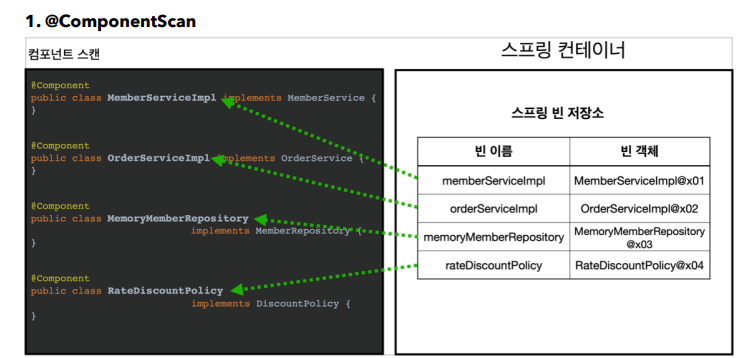
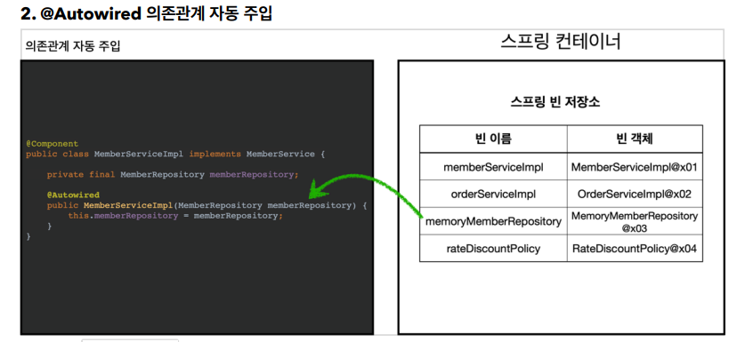

## 컴포넌트 스캔

### 컴포넌트 스캔과 의존관계 자동 주입 시작하기
* 지그맊지 스프링 빈을 등록할 때는 자바 코드의 @Bean이나 XML의 <bean>을 통해서 설정정보에 직접 등록할 스프링 빈을 나열
* 스프링은 설정 정보가 없어도 자동으로 스프링 빈을 등록하는 컴포너늩 스캔이라는 기능을 제공
* 의존관계 자동 주입해주는 @Autowiredㄷ 기능 제공

```java

    @Configuration
    @ConponentScan(
            excludeFilters = @Filter(type = FilterType.ANNOTATION, classes =
            Configuration.class)
    )
    pubic class AutoAppConfig{
        ...
    }
```
* 컴포넌스 스캔을 사용하려면 먼저 @ComponentScan을 설정 정보에 붙여주면 됨
* 기존의 AppConfig와는 다르게 @Bean으로 등록한 클래스가 하나도 없음
* 컴포넌트 스캔은 이름 그대로 @Component 에노테이션이 붙은 클래스를 스프링 빈으로 등록함

참고: @Configuration이 컴포넌트 스캔의 대상이 된 이유도 @Configuration 소스코드를 열어보면 @Component 에노테이션이 붙어있음

```java
@Component
public class MemberServiceImpl implements MemberService {
    private final MemberRepository memberRepository;

    @Autowired
    public MemberServiceImpl(MemberRepository memberRepository) {
        this.memberRepository = memberRepository;
    }
}
```
* @Autowired 로 의존관계 자동으로 주입


* @ComponentScan은 @Component가 붙은 모든 클래스를 스프링 빈으로 등록함
* 이때 스프링 빈의 기본 이름은 클래스명을 사용하되 맨 앞글자만 소문자를 사용
  * 빈 이름 기본 전략: MemberServiceImpl 클래스 -> memberServiceImpl
    * 빈 이름 직접 설정: 만약 스프링 빈의 이름을 직접 지정하고 싶으면 <br> @Component("memberService2") 이런식으로 이름 지정


* 생성자에 @Autowired를 지정하면, 스프링 컨테이너가 자동으로 해당 스프링 빈을 찾아서 주입함
* 이때 기본 조회 전략은 타입이 같은 빈을 찾아서 주입.
  * getBean(MemberRepository.class)와 동일

## 탐색 위치와 기본 스캔 대상
##### 탐색할 패키지의 시작 위치 지정
필요한 위치부터 탐색하도록 시작 위치를 지정할 수 있음
```java
    @ComponentScan(
            basePackages = "hello.core",
)
```
* basePackages: 탐색할 패키지의 시작위치를 지정, 이 패키지를 포함한 하위 패키지 모두 탐색
* 지정하지 안흥면 @ComponentScan이 붙은 설정 정보 클래스의 패키지가 시작 위치가 됨
* 권장 방법 : 설정 정보 클래스의 위치를 프로젝트 최상단에 위치

### 컴포넌트 스캔 기본 대상
* 컴포넌트 스캔은 @Component뿐만 아니라 다음과 같은 내용도 추가로 대상에 포함
  * @Component: 컴포넌트 스캔에서 사용
  * @Controller: 스프링 MVC 컨트롤러에서 사용
  * @Service : 스프링 비즈니스 로직에서 사용
  * @Repository: 스프링 데이터 접근 계층에서 사용
  * @Configuration: 스프링 설정 정보에서 사용

참고: 에노테이션에는 상속관계라는 것이 없음. 그래서 이렇게 애노테이션이 특정 에노테이션을 들고 있는 것을 인식할 수 있는 것은 자바가 지원하는 기능이 아니고, 스프링이 지원하는 긴으

### 필터
* includeFilters: 컴포넌트 스캔 대상을 추가로 지정
* excludeFilters: 컴포넌트 스캔에서 제외할 대상을 지정
```java

    스캔 대상에 추가할 에노테이션
    @Target(ElementType.TYPE)
    @Retention(RetentionPolicy.RUNTIME)
    @Documented
    public @interface MyIncludeComponent {
    }

    스캔 대상에 제외할 에노테이션
    @Target(ElementType.TYPE)
    @Retention(RetentionPolicy.RUNTIME)
    @Documented
    public @interface MyIncludeComponent {
    } 
    
    
    ....
    @Configuration
    @ComponentScan(
            includeFilters = @Filter(type = FilterType.ANNOTATION, classes =
                    MyIncludeComponent.class),
            excludeFilters = @Filter(type = FilterType.ANNOTATION, classes =
                    MyExcludeComponent.class)
    )
    static class ComponentFilterAppConfig {
        ...
    }

```

#### 중복 등록과 충돌

#### 자동 빈 등록 vs 자동 빈 등록
* 컴포넌트 스캔에 의해 자동으로 스프링 빈이 등록되는데, 그 이름이 같은 경우 스프링은 오류를 발생시킴
  * ConflictingbeanDefinitionException 예외 발생

#### 수동 빈 등록 vs 자동 빈 등록
* 수동빈 등록이 우선권을 가짐
  * 수동빈이 자동빈을 오버라이딩
