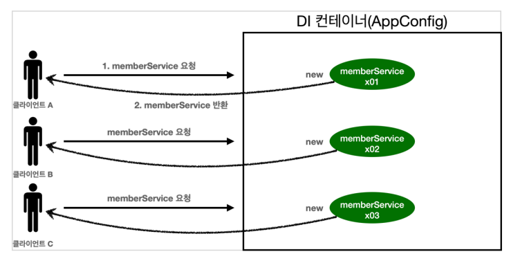
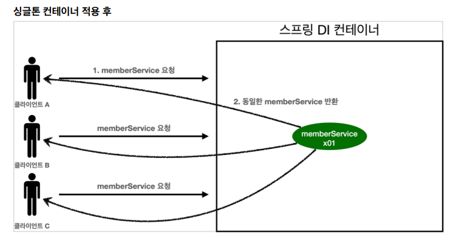
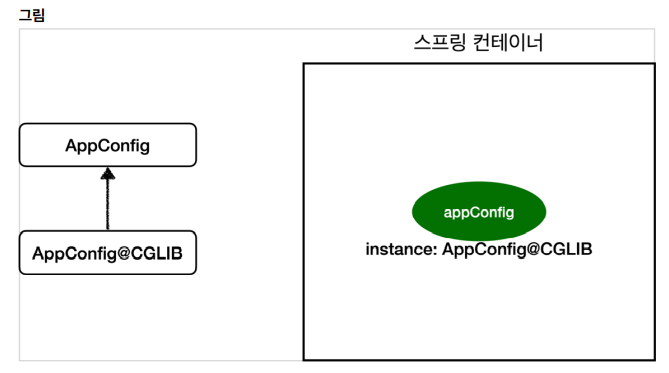

## 싱글톤 컨테이너

## 웹 어플리에키션과 싱글톤
* 대부분의 스프링 애플리케이션은 웹 어플리케이션, 물론 웹이 아닌 애플리케이션 개발도 얼마든지 가능
* 웹 어플리케이션은 보통 여러 고객이 동시에 요청함



* 스프링 없는 순순한 DI 컨테이너인 AppConfig는 요청을 할때마다 객체를 새로 생성
  * 메모리 낭비가 심함
* 해당 객객체가 딱 1개만 생성되고, 공유하도록 설계 -> 싱글톤 패턴

## 싱글톤 패턴
* 클래스와 인스턴스가 딱 1개만 생성되는 것을 보장하는 디자인 패턴
* 그래서 객체 인스턴스를 2개 이상 생성하지 못하도록 막아야 함
  * private 생성자를 사용해서 외부에서 임의로 new 키워드를 사용하지 못하도록 막아야 함

```java
    public class SingletonService{
    
        private static final SingletonService instance = new SingltonService();
        
        public SingletonService getInstance(){
            return instance;
        }
        
        // private을 외부에서 new 키웓를 사용한 객체 생성 못하게 막음
        private SingletonService(){
            
        }
    
        }

```
1. static영역에 객체 instance를 미리 하나 생성해서 올려둠
2. 이 객체 인스턴스가 필요하면 오직 getInstacne() 메서드를 통해서만 조회할 수 있음. 이 메서드를 호출하면 항상 같은 인스턴스를 반환
3. 딱 1개의 객체 인스턴스만 존재하야 하므로, 생성자를 private으로 막아서 외부에서 new 키워드로 객체 인스턴스가 생성되는 것을 막음

```java

        ...
            SingletoneService singletonService1 = SingletonService.getInstacne();
            SingletoneService singletonService2 = SingletonService.getInstacne();

                ...
            
            Assertions.assertThat(singletonService1).isSanceAs(singletonServcie2);    
                
        ...
```

## 싱글톤 패턴 문제점
* 싱글톤 패턴을 구현하는 코드 자체가 많이 들어감
* 의존관계상 클라이언트가 구체클래스에 의존 -> DIP 위반
* 클라이언트가 구체 클래스에 의존해서 OCP 원칙을 위반할 가능성이 높음
* 테스트하기 어려움
* 내부 속성을 변경하거나 초기화 하기 어려움

## 싱글톤 컨테이너
* 스프링 컨테이너는 싱글톤 패턴의 문제점을 해결하면서, 객체 인스턴스를 싱글톤(1개만 생성)으로 관리
* 스프링 빈 -> 싱글톤으로 관리되는 빈
* 스프링 컨테이너는 싱글톤 패턴을 적용하지 않아도, 객체 인스턴스를 싱글톤으로 관리
  * 컨테이너는 객체를 하나만 생성해서 관리!
* 스프링 컨테이너는 싱글톤 컨테이너의 역할을 함, 이렇게 싱글톤 객체를 생성하고 관리하는 기능을 싱글톤 레스트리라함
* DIP, OCP, 테스트, private 생성자로부터 자유롭게 싱글톤 사용할 수 있음



* 스프링 컨테이너 덕분에 고객의 요청이 올 때마다 객체를 생성하는 것이 아니라, 이미 만들어진 객체를 공유해서 효율적으로 재사용할 수 있음


## 싱글톤 방식의 주의점

* 싱글톤 패턴이든, 스프링 같은 싱글톤 컨테이너를 사용하든, 객체 인스턴스를 하나만 생성해서 공유하는 싱글톤 방식은 여러 클라이언트가 하나의 같은 객체 인스턴스를 공유하기 때문에 싱글톤 객체는 상태를 유지(stateful)하게 설계하면 안된다.
* 무상태(stateless)로 설계해야 함
  * 특정 클라이언트에 의존적인 필드가 있으면 안된다.
  * 특정 클라이언트가 값을 변경할 수 있는 필드가 있으면 안된다
  * 필드 대신에 자바에서 공유되지 않는 지연변수, 파라미터, ThreadLocal 등을 사용해야 함
* 스프링 빈의 필드에 공유값을 설정하면 큰 장애가 발생할 수 있음

## 상태유지(stateful)할 경우 발생하는 문제점 예시
```java
    public class StatefulService {
     private int price; //상태를 유지하는 필드
     public void order(String name, int price) {
     System.out.println("name = " + name + " price = " + price);
     this.price = price; //여기가 문제!
     }
     public int getPrice() {
         return price;
     }
    }
...

        //ThreadA: A 사용자 10000원 주문
        statefulService1.order("userA", 10000);
        //ThreadB: B사용자 20000원 주문
        statefulService2.order("userB", 20000);
        //ThreadA: 사용자A 주문 금액 조회
        int price = statefulService1.getPrice();
        //ThreadA: 사용자A는 10000원을 기대했지만, 기대와 다르게 20000원 출력
        System.out.println("price = " + price);
        Assertions.assertThat(statefulService1.getPrice()).isEqualTo(20000)
...

```
* 스프링 빈은 항상 무상태(stateless)로 설계해야함!

### @Configuration과 싱글톤

AppConfig
```java
@Configuration
public class AppConfig {
    @Bean
    public MemberService memberService() {
        return new MemberServiceImpl(memberRepository());
    }

    @Bean
    public OrderService orderService() {
        return new OrderServiceImpl(
                memberRepository(),
                discountPolicy());
    }

    @Bean
    public MemberRepository memberRepository() {
        return new MemoryMemberRepository();
    }
 ...
}
```
* memberService빈과 orderService빈을 만드는 코드에서 동일하게 memberRepository()를 호출
  * 각기 다른 2개의 MemoryMemberRepository가 생성되면서 싱글톤이 깨지는 것 처럼 보임


### @Configuation과 바이트 코드 조작
* 스프링 컨테이너는 싱글톤 레지스트리 -> 스프링 빈이 싱글톤이 되도록 보장해주어야함
* 스프리잉 클래스의 바이트코드를 조작하는 라이브러리를 사용

* 스플링이 CGLIB라는 바이트코드 조작 라이브러리를 사용해서 AppConfig클래스르 상속받은 임의의 다른 클래스를 만듬
  * 상속받은 클래스를 스프링 빈으로 등록
  * 이 임의의 클래스가 바로 싱글톤이 보장되도록 해줌


## 정리
* @Bean만 사용해도 스프링 빈으로 등록되지만, 싱글톤을 보장하진 않음
  * memberRepository()처럼 의존관계 주입이 필요해서 메서드를 직접 호출할 때 싱글톤을 보장하지 않음
* 스프링 설정 정보는 항상 @Configuration 을 사용
