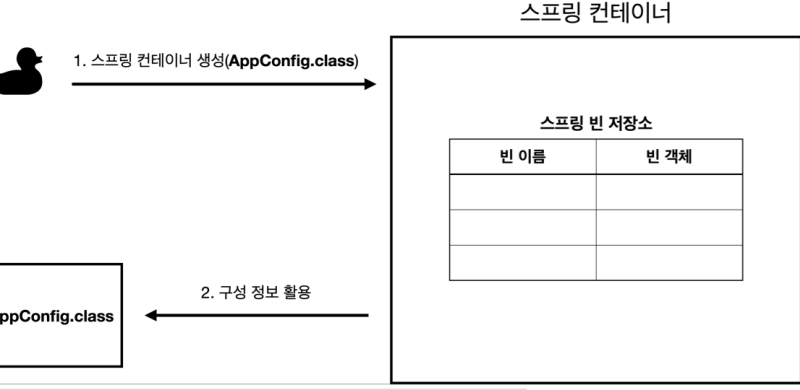
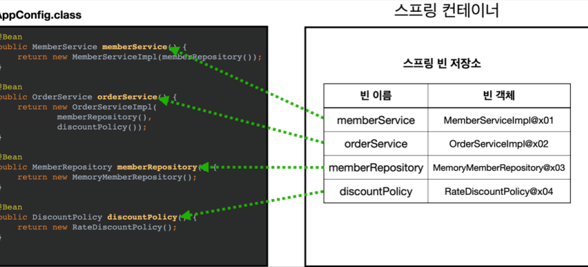
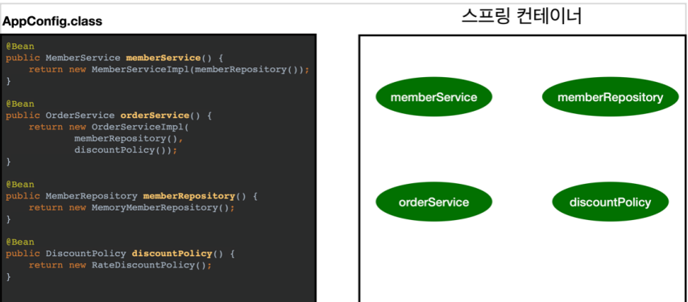
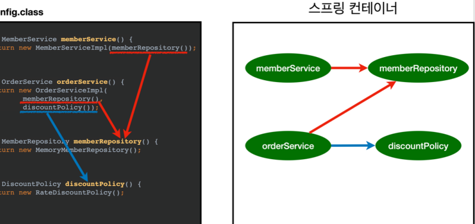
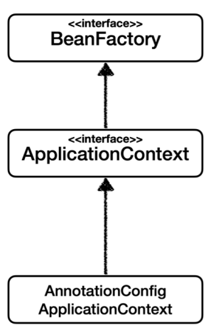
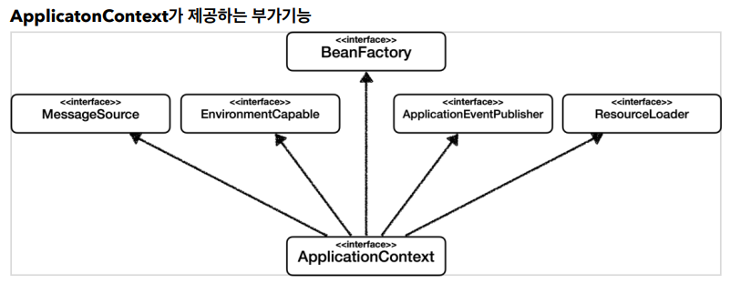

## 스프링 컨테이너와 스프링 빈

### 스프링 컨테이너 생성

```java
    ApplicationContext applicationContext = new AnnotationConfigApplicationContext(AppConfig.class);
```

* ApplicationContext를 스프링 컨테이너라 한다.
* ApplicationContext는 인터페이스이다.
* 스프링 컨테이너는 XML을 기반으로 만들 수 있고, 에노테이션 기반의 자바 설정 클래스로 만들 수 있따.
* 직전에 AppConfig를 사용했던 방식이 에노테이션 기반의 자바 설정 클래스로 스프링 컨테이너를 만든 것

### 스프링 컨테이너 생성 과정

1. 스프링 컨테이너 생성

   1. new AnnotationConfigApplicationContext(AppConfig.class)
   2. 스프링 컨테이너를 생성할 때는 구성 정보를 지정해주어야 함
   3. 여기서는 AppConfig.class를 구성 정보로 저장
2. 스프링 빈 등록

   1. 스프링 컨테이너는 파라미터로 넘어온 설정 클래스 정보를 사용해서 스프링 빈을 등록
   * 빈 이름
     * 빈 이름은 <strong>메서드 이름</strong>을 사용
     * 빈 이름을 직접 부여할 수도 있음.
     * @Bean(name="memberService2")
     * 주의: 빈 이름은 항상 다른 이름을 부여해야 함
3. 스프링 빈 의존관계 설정 - 준비


4. 스프링 빈 의존관계 설정 - 완료

   * 스프링 컨테이너는 설정 정보를 참고해서 의존관계를 주입(DI)함
   * 단순히 자바 코드를 호출하는 것 같지만, 차이가 있음

#### 정리
스프링 컨테이너를 생성하고, 설정(구성) 정보를 참고해서 스프링 빈도 등록하고, 의존관계도 설정했다. 이제 스프링 컨테이너에서 데이터를 조회해보자

##### 컨테이너에 등록된 모든 빈 조회
* 모든 빈 출력
  * 실행하면 스프링에 등로된 모든 빈 정보 출력
  * AnnotationConfigApplicationContext ac = new AnnotationConfigApplicationContext(AppConfig.class);
  * ac.getBeanDefinitionNames() : 스프링에 등록된 모든 빈 이름 조회
  * ac.getBean(): 빈 이름으로 빈 객체(인스턴스)를 조회
* 애플리케이션 빈 출력
  * 스프링이 내부에서 사용하는 빈은 getRole()로 구분
    * ROLE_APPLICATION: 일반적으로 사용자가 정의한 빈
    * ROLE_INFRASTRUCTURE: 스프링이 내부에서 사용하는 빈
```java
BeanDefinition.ROLE_APPLICATION
        ..
BeanDefinition.ROLE_INFRASTRUCTURE
```


##### 스프링 빈 조회 - 기본
#### 스프링 컨테이너에서 스프링 빈을 찾는 가장 기본적인 조회 방법
* ac.getBean("빈이름", 타입)
* ac.getBean(타입) 
  * ac.getBean(MemberRepository.class);

##### 스프링 빈 조회 - 동일한 타입이 둘 이상
* 타입으로 조회시 같은 타입의 스프링 빈이 둘 이상이면 오류가 발생. 이때는 빈 이름을 지정
* ac.getBeanOfType()을 사용하면 해당 타입의 모든 빈을 조회 가능
```java
Map<String, MemberRepository> beansOfType =
ac.getBeansOfType(MemberRepository.class);
 for (String key : beansOfType.keySet()){
        System.out.println("key = "+key+" value = "+
        beansOfType.get(key));
        }
```

#### 스프링 빈 조회 - 상속 관계
* 부모 타입으로 조회하면, 자식 타입도 함꼐 조회
* 그래서 모든 자바 객체의 최고 부모인 Object 타입으로 조회하면, 모든 스프링 빈을 조회함

##### BeanFactory와 ApplicationContext


##### BeanFactory
* 스프링 컨테이너의 최상위 인터페이스
* 스프링 빈을 관리하고 조회하는 역할
* getBean()을 제공

##### ApplicationContext
* BeanFactory 기능을 모두 상속받아서 제공
* 애플리케이션을 개발할 때는 빈을 관리하고 조회하는 기능은 물론이고, 수 많은 부가기능이 필요


##### 정리
* ApplicationContext는 BeanFactory의 기능을 상속받음
* ApplicationContext는 빈 관리기능 + 편리한 부가 기능을 제공
* BeanFactory를 직접 사용할 일은 거의 없음, 부가기능이 포함된 AppliationContext를 사용
* BeanFactory나 ApplicationContext를 스프링 컨테어나라 함

