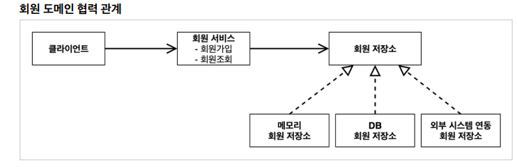
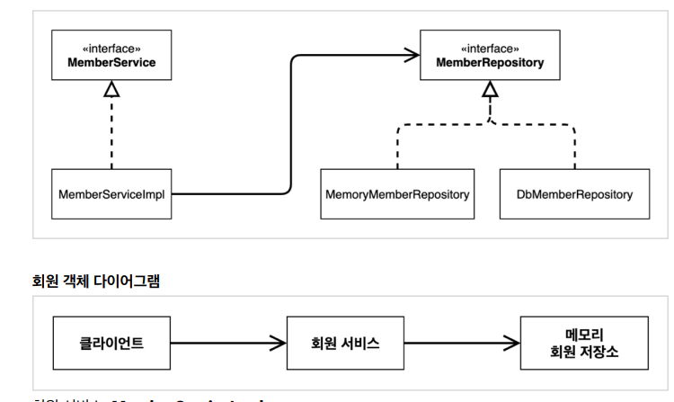
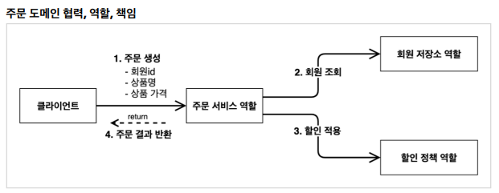
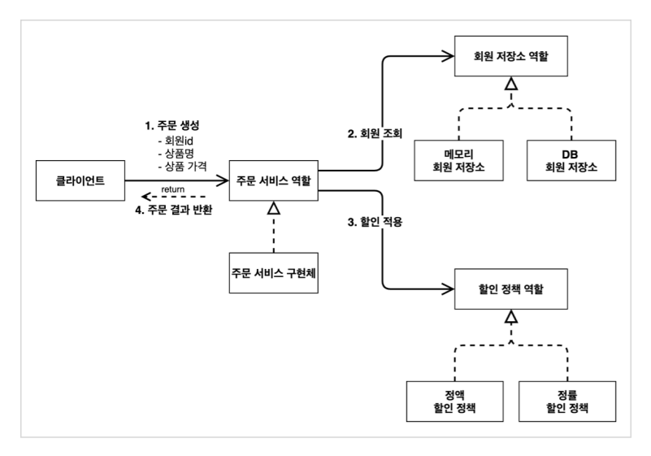
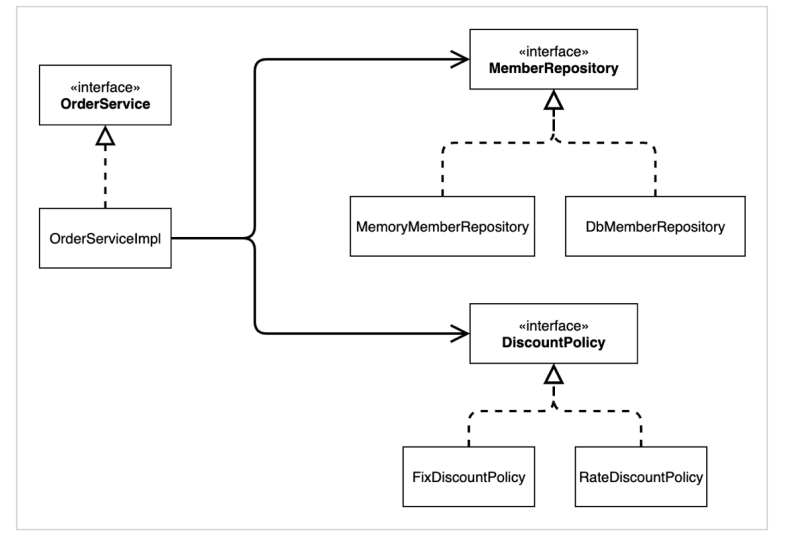

## 비즈니스 요구사항과 설계

* 회원
  * 회원은 가입하고 조회할 수 있다.
  * 회원은 일반과 VIP 두 가지 등급 존재
  * 회원 데이터는 자체 DB를 구축할 수 있고, 외부 시스템과 연동가능(미정)
* 주문과 할인 정책 
  * 회원은 상품을 주문할 수 있다. 
  * 회원 등급에 따라 할인 정책을 적용할 수 있다. 
  * 할인 정책은 모든 VIP는 1000원을 할인해주는 고정 금액 할인을 적용해달라. (나중에 변경 될 수
      있다.)
  * 할인 정책은 변경 가능성이 높다. 회사의 기본 할인 정책을 아직 정하지 못했고, 오픈 직전까지 고민을 
  * 미루고 싶다. 최악의 경우 할인을 적용하지 않을 수 도 있다. (미확정)

## 회원 도메인 설계

* 회원 도메인 요구사항
  * 회원을 가입하고 조회할 수 있음
  * 회원은 일반과 VIP 두 가지 등급이 있음
  * 회원 데이터는 자체 DB를 구추할 수 있고, 외부 시스템과 연동할 수 있다.



#### 회원 도메인 개발

#### 회원 엔티티

##### 회원 등급

```java
    package hello.core.member;
    public enum Grade {
        BASIC,
        VIP
    }
```

##### 회원 엔티티
```java
    package hello.core.member;
public class Member {
    private Long id;
    private String name;
    private Grade grade;

    public Member(Long id, String name, Grade grade) {
        this.id = id;
        this.name = name;
        this.grade = grade;
    }

    public Long getId() {
        return id;
    }

    public void setId(Long id) {
        this.id = id;
    }

    public String getName() {
        return name;
    }

    public void setName(String name) {
        this.name = name;
    }

    public Grade getGrade() {
        return grade;
    }

    public void setGrade(Grade grade) {
        this.grade = grade;
    }
}
}
```

#### 회원 저장소
##### 회원 저장소 인터페이스
```java
    package hello.core.member;
    public interface MemberRepository {
        void save(Member member);
        Member findById(Long memberId);
}
```
#### 메모리회원 저장소 구현체
```java
    package hello.core.member;
    import java.util.HashMap;
    import java.util.Map;
    public class MemoryMemberRepository implements MemberRepository {
        private static Map<Long, Member> store = new HashMap<>();

        @Override
        public void save(Member member) {
            store.put(member.getId(), member);
        }

        @Override
        public Member findById(Long memberId) {
            return store.get(memberId);
        }
    }
```

#### 회원 서비스 인터페이스
```java
    package hello.core.member;
    public interface MemberService {
    void join(Member member);
    Member findMember(Long memberId);
}
}
```
##### 회원 서비스 구현체
```java
    package hello.core.member;
    public class MemberServiceImpl implements MemberService {
     private final MemberRepository memberRepository = new
    MemoryMemberRepository();
     public void join(Member member) {
     memberRepository.save(member);
     }
     public Member findMember(Long memberId) {
     return memberRepository.findById(memberId);
     }

```

#### 회원 도메인 실행과 테스트

##### 애플리케이션 로직으로 테스트
```java
package hello.core;
import hello.core.member.Grade;
import hello.core.member.Member;
import hello.core.member.MemberService;
import hello.core.member.MemberServiceImpl;
public class MemberApp {
    public static void main(String[] args) {
        MemberService memberService = new MemberServiceImpl();
        Member member = new Member(1L, "memberA", Grade.VIP);
        memberService.join(member);
        Member findMember = memberService.findMember(1L);
        System.out.println("new member = " + member.getName());
        System.out.println("find Member = " + findMember.getName());
    }
}
```


##### JUnit 테스트
```java
package hello.core.member;
import org.assertj.core.api.Assertions;
import org.junit.jupiter.api.Test;
import static org.junit.jupiter.api.Assertions.*;
class MemberServiceTest {
    MemberService memberService = new MemberServiceImpl();

    @Test
    void join() {
        //given
        Member member = new Member(1L, "memberA", Grade.VIP);
        //when
        memberService.join(member);
        Member findMember = memberService.findMember(1L);
        //then
        Assertions.assertThat(member).isEqualTo(findMember);
    }
}

```

### 회원 도메인 설계의 문제점
* 다른 저장소로 변경할 때 OCP(개방-폐쇄원칙) 준수 x
* DIP 준수 x
* 의존관계가 인터페이스 뿐만 아니라 구현까지 모두 의존하는 문제점이 있음

#### 주문과 할인 도메인 설계

* 주문과 할인 정책  
  * 회원은 상품을 주문할 수 있다. 
  * 회원 등급에 따라 할인 정책을 적용할 수 있다. 
  * 할인 정책은 모든 VIP는 1000원을 할인해주는 고정 금액 할인을 적용해달라. (나중에 변경 될 수
  있다.)
  * 할인 정책은 변경 가능성이 높다. 회사의 기본 할인 정책을 아직 정하지 못했고, 오픈 직전까지 고민을
  미루고 싶다. 최악의 경우 할인을 적용하지 않을 수 도 있다. (미확정

1. 주문 생성: 클라이언트는 주문 서비스에 주문 생성을 요청
2. 회원 조회: 할인을 위해서는 회원 등급이 필요, 그래서 주문 서비스는 회원 저장소에서 회원을 조회
3. 할인 적용: 주문 서비스는 회원 등급에 따른 할인 여부를 할인 정책에 위임
4. 주문 결과 반환: 주문 서비스는 할인 결과를 포함한 주문 결과를 반환

역할과 구현을 분리해서 자유롭게 구현 객체를 조립할 수 있게 설계, 덕분에 회원 저장소는 물론이고, 할인 정책도 유연하게 변경할 수 있음

