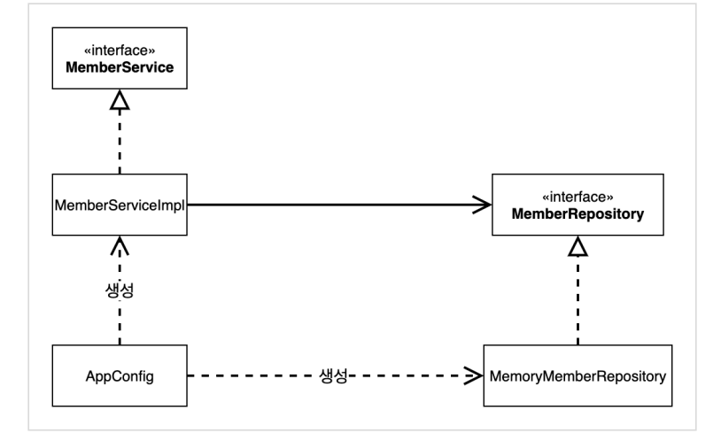
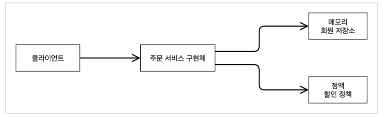

## 스프링 핵심 원리 이해2 - 객체 지향 원리 적용

### 새로운 할인 정책 개발

#### RateDiscountPolicy 추가


#### 새로운 할인 정책 적용과 문제점

##### 할인 정책을 애플리케이션에 적용
할인 정책을 적용하려면 클랑이언트인 OrderServiceImpl 코드를 고쳐야함
```java
public class OrderServiceImpl implements OrderService {
    // private final DiscountPolicy discountPolicy = new FixDiscountPolicy();
    private final DiscountPolicy discountPolicy = new RateDiscountPolicy();

    public class OrderServiceImpl implements OrderService {
        // private final DiscountPolicy discountPolicy = new FixDiscountPolicy();
        private final DiscountPolicy discountPolicy = new RateDiscountPolicy();
    }
}
```
##### 문제점
* OCP, DIP 같은 객체지향 설계 원칙을 준수한 거 같지만 아님
* 추상(인터페이스) 뿐만 아니라 구체(구현) 클래스에도 의존하고 있음
  * 추상(인터페이스)의존할 뿐만 아니라 구체(구현) 클래스에도 의존하고 있음
    * 추상(인터페이스) 의존:  DiscountPolicy
    * 구체(구현) 클래스 의존 : FixDiscountPolicy, RateDiscountPolicy
  * OCP: 변경하지 않고 확장할 수 있다고 했는데
    * -> 지금 코드는 기능을 확장해서 변경하면, 클라이언트 코드에 영향을 준다! 따라서 OCP 위반!

#### 문제 해결
* 클라이언트 코드인 OrderServiceImpl은 DiscountPolicy 인터페이스뿐만 아니라 구체 클래스도 함께 의존
* 구체 클래스를 변경할 때 클라이언트 코드도 함꼐 변경해야 함
* DIP 위반 -> 추상에만 의존하도록 변경
* DIP를 위반하지 않도록 인터페이스에만 의존하도록 의존관계 변경하면 됨
* 클라이언트에 OrderServiceImpl에 DiscountPolicy의 구현 객체를 대신 생성하고 주입

### 관심사의 분리

#### AppConfig 등장
* 애플리케이션의 전체 동작 방식을 구성(Config)하기 위해, <strong>구현 객체<strong>를 생성하고, <strong>연결<strong>하는 책임을 가지는 별도의 설정 클래스
```java
package hello.core;
import hello.core.discount.FixDiscountPolicy;
import hello.core.member.MemberService;
import hello.core.member.MemberServiceImpl;
import hello.core.member.MemoryMemberRepository;
import hello.core.order.OrderService;
import hello.core.order.OrderServiceImpl;
public class AppConfig {
    public MemberService memberService() {
        return new MemberServiceImpl(new MemoryMemberRepository());
    }

    public OrderService orderService() {
        return new OrderServiceImpl(
                new MemoryMemberRepository(),
                new FixDiscountPolicy());
    }
}
```
* AppConfig는 애플리케이션읭 실제 동작에 필요한 구현 객체를 생성
  * MemberServiceImpl
  * MemoryMemberRepository
  * OrderServiceImpl
  * FixDisocuntPoilcy
* AppConfig는 생성한 객체 인스턴스의 참조(레퍼런스)를 생성자를 통해서 주입(연결)해줌.
  * MemberServiceImpl -> MemoryMemberRepository
  * OrderServiceImpl -> MemoryMemberRepository, FixDiscountPolicy
```java
package hello.core.member;
public class MemberServiceImpl implements MemberService {
    private final MemberRepository memberRepository;

    public MemberServiceImpl(MemberRepository memberRepository) {
        this.memberRepository = memberRepository;
    }

    public void join(Member member) {
        memberRepository.save(member);
    }

    public Member findMember(Long memberId) {
        return memberRepository.findById(memberId);
    }
}
```
* MemberServiceImpl 은 MemberRepository(인터페이스)에만 의존하게 됨
* MemberServiceImpl입장에서 생성자를 통해 어떤 구현 객체가 들어올지는 알 수 없음
* MemberServiceImpl의 생성자를 톻해서 어떤 구현 객체를 주입할지는 오직 외부(AppConfig)에서 결정됨
* MemberServiceImpl은 이제부터 의존관계에 대한 고민은 외부에 맡기고 실행에만 집중하면 됨.

* 객체의 생성과 연결은 AppConfig가 담담
* DIP 완성:MemberServiceImpl은 MemberRepository인 추상에만 의존
* 관심사의 분리: 객체를 생성하고 연결하는 역할과 실행하는 역할이 명확히 분리

#### AppConfig 리팩토링
현재 AppConfig를 보면 중복이 있고, 역할에 따른 구현이 잘 안보임
```java
public class AppConfig {
    public MemberService memberService() {
        return new MemberServiceImpl(memberRepository());
    }

    public OrderService orderService() {
        return new OrderServiceImpl(
                memberRepository(),
                discountPolicy());
    }

    public MemberRepository memberRepository() {
        return new MemoryMemberRepository();
    }

    public DiscountPolicy discountPolicy() {
        return new FixDiscountPolicy();
    }
}
```
##### 리팩토링 후
* new MemoryMemberRepository()이 중복 부분이 젝됨, 이제 MemoryMemberRepository를 다른 구현체로 변경할 때 한 부분만 변경하면 됨
* AppConfig를 보면 역할과 구현 클래스가 한눈에 들어옴

#### 좋은 객체지향 설계 5가지 원칙 정용
###### 역시ㅓ 3가지 SRP, DIP, OCP 적용

#### SRP 단일 책임 원칙
#### 한 클래스는 하나의 책임만 ㄱ자ㅕ아함
* 클라이언트 객체는 직접 구현 객체를 생성하고, 연결하고 실행하는, 다양한 책임을 가지고 있음
* SRP 단일 책임 원칙을 따르면서 관심사를 분리
* 구현 객체를 생성하고 연결하는 부분은 AppConfig가 담당
* 클라이언트 객체는 실행하는 책임만 담당

#### DIP 의존관계 역전 원칙
#### 추상화에 의존, 구체화 의존 x
* 클라이언트 코드가 DiscountPolicy 추상화 인터페이스에만 의존하도록 코드 변경
* AppConfig가 FixDiscountPolicy 객체 인스턴스를 클라이언트 코드 대신 생성해서 클라이언트 코드에 의존관계를 주입함.

#### OCP
#### 소프트웨어 요소는 확장에는 열려 있으나 변경에는 닫혀 있어야 한다.
* 다형성 사용하고 클라이언트가 DIP를 지킴
* 애플리케이션을 사용 영역과 구성 영역으로 나눔
* AppConfig가 의존관계를 FisDiscountPolicy -> RateDiscountPolicy로 변경해서 클라이언트 코드에 주입하므로 클라이언트 코드는 변경x
* 소프트웨어 요소를 새롭게 확장해도 사용 영역의 변경은 닫혀 있다.

#### Ioc
* 프로그램의 제어 흐름을 직접 제어하는 것이 아니라 외부에서 관리하는 것을 제어의 역전(IoC)이라 함
* 프로그램의 흐름은 APpConfig가 가져감

### 의존관계 주입DI(Dependency Injection)
* 의존관계는 정적인 클래스 의존관계와 실행 시점에 결정되는 객체(인스턴스)의존 관계 둘을 분리해서 생각해야 함.

##### 정적인 클래스 의존관계
* 클래스가 사용하는 import코드만 보고 의존관계 파악 가능
* 정적인 의존관계는 애플리케이션 실행 전에도 분서 가능

##### 동적인 객체 인스턴스 의존 관계
* 애플리케이션 실행 시점에 실제 생성된 객체 인스턴스의 참조가 연결된 의존관계

* 애플리케이션 실행 시점(런타임)에 외부(AppConfig)에서 실제 구현 객체를 생성하고 클라이언트에 전달해서 클라이언트와 서버의 실제 의존관계가 연결 되는 것을 의존관계 주입이라고 함
* 객체 인스턴스를 생성하고, 그 참조값을 전달해서 연결됨
* 의존관계 주입을 사용하면 클라이언트 코드를 변경하지 않고, 클라이언트가 호출하는 대상의 타입 인스턴스르 변경할 수 있음

### IoC컨테이너, DI 컨테이너
* AppConfig 처럼 객체를 생성하고 관리하면서 의존관계를 연결해 주는 것을 IoC컨테이너 또는 DI컨테이너라 부름

#### 스프링으로 전환
* AppConfig에 설정을 구성한다는 뜼의 @Configuration을 붙여줌
* 각 메ㅅ드에 @Bean을 붙여줌, 스프링 컨테이너에 스프링 빈으로 등록

#### 적용
```java
    ApplicationContext applicationContext = new AnnotationConfigApplicationContext(Appconfig.class);
    MemberService memberService = applictaionContext.getBean("memberService", MemberService.class);  // 이름, class type
```

##### 스프링 컨테이너
* ApplicationContext를 스프링 컨테이너라고 함
* 스프링 컨테이너를 통해서 객체를 생성하고 사용
